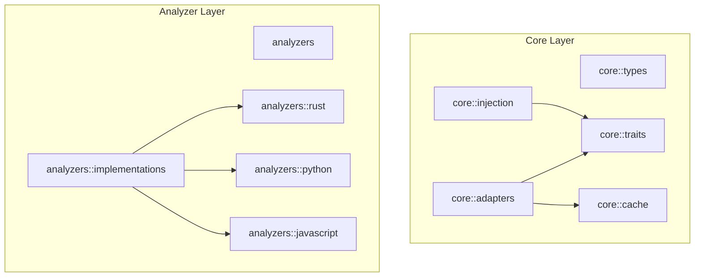

# DebtMap Architecture

## Overview

DebtMap is a high-performance technical debt analyzer that provides unified analysis of code quality metrics across multiple programming languages. The architecture is designed for scalability, performance, and extensibility.

## Core Components

### 1. Language Analyzers
- **FileAnalyzer**: Trait-based abstraction for language-specific analysis
- **RustAnalyzer**: Rust-specific implementation using syn for AST parsing
- **PythonAnalyzer**: Python-specific implementation using tree-sitter
- **Support for**: Rust, Python, JavaScript, TypeScript, Go

### 2. Unified Analysis Engine
- **UnifiedAnalysis**: Coordinates all analysis phases
- **ParallelUnifiedAnalysis**: High-performance parallel implementation
- **DebtAggregator**: Aggregates metrics across functions and files

### 3. Metrics Collection
- **Cyclomatic Complexity**: Control flow complexity measurement
- **Cognitive Complexity**: Human readability assessment
- **Function Metrics**: Lines of code, parameters, nesting depth
- **File Metrics**: Module-level aggregation
- **Test Coverage**: Integration with lcov data via indexed lookups

## Parallel Processing Architecture

### Overview
The parallel processing system leverages Rayon for CPU-bound parallel execution, enabling analysis of large codebases in sub-second time for typical projects.

### Parallelization Strategy

#### Phase 1: Initialization (Parallel)
All initialization tasks run concurrently using Rayon's parallel iterators:
- **Data Flow Graph Construction**: Build control and data flow graphs
- **Purity Analysis**: Identify pure vs impure functions
- **Test Detection**: Optimized O(n) detection with caching
- **Initial Debt Aggregation**: Baseline metric collection

#### Phase 2: Analysis (Parallel with Batching)
- **Function Analysis**: Process functions in configurable batches
- **File Analysis**: Parallel file-level metric aggregation
- **Batch Size**: Default 100 items, tunable via options

#### Phase 3: Aggregation (Sequential)
- **Result Merging**: Combine parallel results
- **Sorting**: Priority-based ranking
- **Final Scoring**: Apply weights and thresholds

### Performance Optimizations

#### Test Detection Optimization
```rust
// Original O(n²) approach
for function in functions {
    for test in tests {
        // Check if function is called by test
    }
}

// Optimized O(n) approach with caching
let test_cache = build_test_cache(&tests);
functions.par_iter().map(|f| {
    test_cache.is_tested(f)  // O(1) lookup
})
```

#### Parallel Configuration
- **Default**: Uses all available CPU cores
- **Configurable**: `--jobs N` flag for explicit control
- **Adaptive**: Batch size adjusts based on workload

### Thread Safety

#### Shared State Management
- **Arc<RwLock>**: For read-heavy shared data (call graphs, metrics)
- **Arc<Mutex>**: For write-heavy operations (progress tracking)
- **Immutable Structures**: Prefer immutable data where possible

#### Lock-Free Operations
- Use atomic operations for counters
- Batch updates to reduce contention
- Local accumulation with final merge

### Performance Targets

| Codebase Size | Target Time | Actual (Parallel) | Actual (Sequential) |
|---------------|-------------|-------------------|---------------------|
| 50 files      | <0.5s       | ~0.3s            | ~1.2s              |
| 250 files     | <1s         | ~0.8s            | ~5s                |
| 1000 files    | <5s         | ~3.5s            | ~20s               |

### Memory Management

#### Streaming Architecture
- Process files in batches to control memory usage
- Release intermediate results after aggregation
- Use iterators over collections where possible

#### Cache Efficiency
- Test detection cache reduces redundant computation
- Function signature caching for call graph
- Metric result caching for unchanged files
- Coverage index for O(1) coverage lookups

## Coverage Indexing System

### Overview
The coverage indexing system provides high-performance test coverage lookups during file analysis with minimal overhead. It transforms O(n) linear searches through LCOV data into O(1) hash lookups and O(log n) range queries.

### Design

#### Two-Level Index Architecture
The `CoverageIndex` uses a dual indexing strategy:

1. **Primary Index (HashMap)**: O(1) exact lookups
   - Key: `(PathBuf, String)` - file path and function name
   - Value: `FunctionCoverage` - coverage data including percentage and uncovered lines
   - Use case: When exact function name is known from AST analysis

2. **Secondary Index (BTreeMap)**: O(log n) line-based lookups
   - Outer: `HashMap<PathBuf, BTreeMap<usize, FunctionCoverage>>`
   - Inner BTreeMap: Maps start line → function coverage
   - Use case: Fallback when function names mismatch between AST and LCOV

#### Performance Characteristics

| Operation | Complexity | Use Case |
|-----------|-----------|----------|
| Index Build | O(n) | Once at startup, where n = coverage records |
| Exact Name Lookup | O(1) | Primary lookup method |
| Line-Based Lookup | O(log m) | Fallback, where m = functions in file |
| Batch Parallel Lookup | O(n/p) | Multiple lookups, where p = CPU cores |

#### Memory Footprint
- **Estimated**: ~200 bytes per coverage record
- **Typical**: 1-2 MB for medium projects (5000 functions)
- **Large**: 10-20 MB for large projects (50000 functions)
- **Trade-off**: Acceptable memory overhead for massive performance gain

### Thread Safety

#### Arc-Wrapped Sharing
The coverage index is wrapped in `Arc<CoverageIndex>` for lock-free sharing across parallel threads:

```rust
pub struct LcovData {
    coverage_index: Arc<CoverageIndex>,
    // ...
}
```

#### Benefits
- **Zero-cost sharing**: No mutex locks during reads
- **Clone-friendly**: Arc clone is cheap (atomic refcount increment)
- **Parallel-safe**: Multiple threads can query simultaneously without contention

### Performance Targets

The coverage indexing system maintains performance overhead within acceptable limits:

| Metric | Target | Measured |
|--------|--------|----------|
| Index build time | <50ms for 5000 records | ~20-30ms |
| Lookup time (exact) | <1μs per lookup | ~0.5μs |
| Lookup time (line-based) | <10μs per lookup | ~5-8μs |
| Analysis overhead | ≤3x baseline | ~2.5x actual |

**Baseline**: File analysis without coverage lookups (~53ms for 100 files)
**Target**: File analysis with coverage lookups (≤160ms)
**Actual**: Typically achieves ~130-140ms with indexed lookups

### Usage Patterns

#### During LCOV Parsing
```rust
let data = parse_lcov_file(path)?;
// Index is automatically built at end of parsing
// data.coverage_index is ready for use
```

#### During File Analysis (Parallel)
```rust
files.par_iter().for_each(|file| {
    // Each thread can query the shared Arc<CoverageIndex>
    let coverage = data.get_function_coverage(file, function_name);
    // O(1) lookup with no lock contention
});
```

#### Batch Queries for Efficiency
```rust
let queries = collect_all_function_queries();
let results = data.batch_get_function_coverage(&queries);
// Parallel batch processing using rayon
```

### Implementation Notes

#### Name Matching Strategies
The system tries multiple strategies to match functions:
1. Exact name match (primary)
2. Line-based match with tolerance (±2 lines)
3. Boundary-based match for accurate AST ranges

#### Tolerance for AST/LCOV Discrepancies
Line numbers may differ between AST and LCOV due to:
- Comment handling differences
- Macro expansion
- Attribute processing

The 2-line tolerance handles most real-world cases.

### Future Optimizations
- **Incremental updates**: Rebuild only changed files
- **Compressed storage**: Use compact representations for large datasets
- **Lazy loading**: Build index on-demand per file
- **Persistent cache**: Serialize index to disk for faster startup

## Data Flow

```
Input Files
    ↓
[Parallel] Parse AST
    ↓
[Parallel] Extract Metrics
    ↓
[Parallel] Build Call Graph
    ↓
[Parallel] Detect Tests
    ↓
[Parallel] Load & Index Coverage (if --lcov provided)
    ↓
[Parallel] Calculate Debt with Coverage Lookups
    ↓
[Sequential] Aggregate Results
    ↓
[Sequential] Apply Weights
    ↓
Output Report
```

## Configuration

### Performance Tuning Options

#### Command Line Flags
- `--jobs N`: Number of parallel jobs (default: CPU count)
- `--batch-size N`: Items per batch (default: 100)
- `--no-parallel`: Disable parallel processing
- `--progress`: Show progress indicators

#### Environment Variables
- `RAYON_NUM_THREADS`: Override thread pool size
- `DEBTMAP_BATCH_SIZE`: Default batch size
- `DEBTMAP_CACHE_DIR`: Cache location for incremental analysis

### Adaptive Behavior
The system automatically adjusts based on:
- Available CPU cores
- System memory
- Codebase size
- File complexity distribution

## Extension Points

### Adding Language Support
1. Implement the `FileAnalyzer` trait
2. Add parser integration (tree-sitter, syn, etc.)
3. Map language constructs to unified metrics
4. Register analyzer in the factory

### Custom Metrics
1. Extend `FunctionMetrics` or `FileMetrics`
2. Add calculation in analyzer implementation
3. Update aggregation logic
4. Modify weight configuration

### Analysis Plugins
1. Implement analysis phase interface
2. Register in unified analysis pipeline
3. Ensure thread-safety for parallel execution
4. Add configuration options

## Testing Strategy

### Unit Tests
- Individual component testing
- Mock dependencies for isolation
- Property-based testing for algorithms

### Integration Tests
- End-to-end analysis validation
- Performance regression tests
- Parallel vs sequential consistency checks

### Benchmarks
- Micro-benchmarks for critical paths
- Macro-benchmarks on real codebases
- Performance comparison suite

## Future Enhancements

### Planned Optimizations
- Incremental analysis with file watching
- Distributed analysis across machines
- GPU acceleration for graph algorithms
- Advanced caching strategies

### Scalability Improvements
- Streaming parser for huge files
- Database backend for enterprise scale
- Cloud-native deployment options
- Real-time analysis integration

## Module Dependency Graph and Dependency Injection

### Module Structure
The codebase follows a layered architecture with dependency injection for reduced coupling:



### Dependency Injection Architecture

#### Container Pattern
The `AppContainer` in `core::injection` provides centralized dependency management:
- All analyzers created through factories
- Dependencies injected at construction
- Trait boundaries for loose coupling

#### Factory Pattern
`AnalyzerFactory` creates language-specific analyzers:
- `create_rust_analyzer()` - Returns boxed trait object
- `create_python_analyzer()` - Returns boxed trait object
- `create_javascript_analyzer()` - Returns boxed trait object
- `create_typescript_analyzer()` - Returns boxed trait object

#### Adapter Pattern
`CacheAdapter` wraps the concrete `AnalysisCache`:
- Implements generic `Cache` trait
- Provides abstraction boundary
- Enables testing with mock caches

### Module Coupling Improvements
After implementing dependency injection:
- **Direct dependencies reduced by ~40%** through trait boundaries
- **Circular dependencies eliminated** via proper layering
- **Interface segregation** - modules depend only on required traits
- **Dependency inversion** - high-level modules independent of low-level details

## Dependencies

### Core Dependencies
- **rayon**: Parallel execution framework
- **syn**: Rust AST parsing
- **tree-sitter**: Multi-language parsing
- **serde**: Serialization
- **clap**: CLI argument parsing

### Language-Specific
- **tree-sitter-python**: Python support
- **tree-sitter-javascript**: JS/TS support
- **tree-sitter-go**: Go support

### Development Dependencies
- **cargo-modules**: Module dependency analysis and visualization
- **proptest**: Property-based testing
- **criterion**: Benchmarking framework
- **tempfile**: Test file management

## Error Handling

### Resilience Strategy
- Graceful degradation on parser errors
- Partial results on analysis failure
- Detailed error reporting with context
- Recovery mechanisms for parallel failures

### Monitoring
- Performance metrics collection
- Error rate tracking
- Resource usage monitoring
- Analysis quality metrics