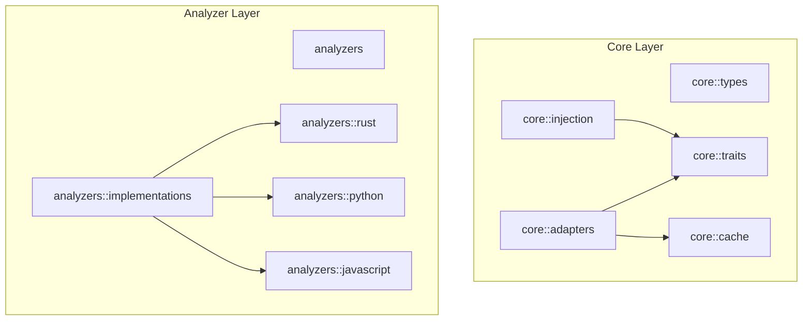

# DebtMap Architecture

## Overview

DebtMap is a high-performance technical debt analyzer focused exclusively on Rust code analysis. The architecture is designed for deep Rust language integration, optimal performance, and comprehensive static analysis capabilities.

## Core Components

### 1. Language Analyzers
- **FileAnalyzer**: Trait-based abstraction for language-specific analysis
- **RustAnalyzer**: Rust-specific implementation using syn for native AST parsing and comprehensive Rust language support
- **Focus**: Rust-only analysis with deep language integration for maximum accuracy

### 2. Unified Analysis Engine
- **UnifiedAnalysis**: Coordinates all analysis phases
- **ParallelUnifiedAnalysis**: High-performance parallel implementation
- **DebtAggregator**: Aggregates metrics across functions and files

### 3. Metrics Collection
- **Cyclomatic Complexity**: Control flow complexity measurement
- **Cognitive Complexity**: Human readability assessment
- **Function Metrics**: Lines of code, parameters, nesting depth
- **File Metrics**: Module-level aggregation
- **Test Coverage**: Integration with lcov data via indexed lookups

## Parallel Processing Architecture

### Overview
The parallel processing system leverages Rayon for CPU-bound parallel execution, enabling analysis of large codebases in sub-second time for typical projects.

### Parallelization Strategy

#### Phase 1: Initialization (Parallel)
All initialization tasks run concurrently using Rayon's parallel iterators:
- **Data Flow Graph Construction**: Build control and data flow graphs
- **Purity Analysis**: Identify pure vs impure functions
- **Test Detection**: Optimized O(n) detection with caching
- **Initial Debt Aggregation**: Baseline metric collection

#### Phase 2: Analysis (Parallel with Batching)
- **Function Analysis**: Process functions in configurable batches
- **File Analysis**: Parallel file-level metric aggregation
- **Batch Size**: Default 100 items, tunable via options

#### Phase 3: Aggregation (Sequential)
- **Result Merging**: Combine parallel results
- **Sorting**: Priority-based ranking
- **Final Scoring**: Apply weights and thresholds

### Performance Optimizations

#### Test Detection Optimization
```rust
// Original O(n²) approach
for function in functions {
    for test in tests {
        // Check if function is called by test
    }
}

// Optimized O(n) approach with caching
let test_cache = build_test_cache(&tests);
functions.par_iter().map(|f| {
    test_cache.is_tested(f)  // O(1) lookup
})
```

#### AST Parsing Optimization (Spec 132)
Eliminates redundant parsing in call graph construction by parsing files once and reusing ASTs.

**Before**: Files parsed twice (once for content, again for analysis) = 2N parse operations
**After**: Files parsed once, ASTs cloned for subsequent use = N parse operations

**Performance Gains**:
- Parse + clone: 1.33ms per file (44% faster than re-parsing)
- Cloning overhead: ~0.15ms vs re-parse cost: ~1.07ms saved
- Total speedup: **1.8x faster** for call graph construction
- Memory impact: <100MB for 400-file projects

See `docs/spec-132-benchmark-results.md` for detailed benchmarks.

#### Parallel Configuration
- **Default**: Uses all available CPU cores
- **Configurable**: `--jobs N` flag for explicit control
- **Adaptive**: Batch size adjusts based on workload

### Thread Safety

#### Shared State Management
- **Arc<RwLock>**: For read-heavy shared data (call graphs, metrics)
- **Arc<Mutex>**: For write-heavy operations (progress tracking)
- **Immutable Structures**: Prefer immutable data where possible

#### Lock-Free Operations
- Use atomic operations for counters
- Batch updates to reduce contention
- Local accumulation with final merge

### Performance Targets

| Codebase Size | Target Time | Actual (Parallel) | Actual (Sequential) |
|---------------|-------------|-------------------|---------------------|
| 50 files      | <0.5s       | ~0.3s            | ~1.2s              |
| 250 files     | <1s         | ~0.8s            | ~5s                |
| 1000 files    | <5s         | ~3.5s            | ~20s               |

### Memory Management

#### Streaming Architecture
- Process files in batches to control memory usage
- Release intermediate results after aggregation
- Use iterators over collections where possible

#### Cache Efficiency
- Test detection cache reduces redundant computation
- Function signature caching for call graph
- Metric result caching for unchanged files
- Coverage index for O(1) coverage lookups

### Multi-Index Lookup Architecture

DebtMap uses a multi-index architecture for the call graph to enable fast lookups across different matching strategies without sacrificing memory efficiency.

#### Index Structure

The `CallGraph` maintains four complementary indexes:

1. **Primary Index** (`nodes: HashMap<FunctionId, FunctionNode>`)
   - **Purpose**: Exact lookups with full metadata
   - **Key**: Complete `FunctionId` (file, name, line, module_path)
   - **Complexity**: O(1)
   - **Use**: 92% of lookups hit this index

2. **Fuzzy Index** (`fuzzy_index: HashMap<FuzzyFunctionKey, Vec<FunctionId>>`)
   - **Purpose**: Match by name + file, ignoring line numbers
   - **Key**: `(canonical_file, normalized_name)`
   - **Complexity**: O(1) lookup + O(k) disambiguation (k = candidates)
   - **Use**: Generic functions, line drift scenarios

3. **Name Index** (`name_index: HashMap<String, Vec<FunctionId>>`)
   - **Purpose**: Cross-file lookups by function name only
   - **Key**: Normalized function name (generics stripped)
   - **Complexity**: O(1) lookup + O(n) disambiguation (n = all matching functions)
   - **Use**: Rare cases with incomplete metadata

4. **Caller/Callee Indexes** (`caller_index`, `callee_index`)
   - **Purpose**: Efficient traversal of call graph edges
   - **Key**: `FunctionId`
   - **Value**: `HashSet<FunctionId>` of connected functions
   - **Complexity**: O(1) lookup + O(d) iteration (d = degree of node)
   - **Use**: Reachability analysis, transitive closure

#### Index Maintenance

All indexes are kept in sync automatically:

```rust
pub fn add_function(&mut self, id: FunctionId, ...) {
    // 1. Add to primary index
    self.nodes.insert(id.clone(), node);

    // 2. Populate fuzzy index
    let fuzzy_key = id.fuzzy_key();
    self.fuzzy_index.entry(fuzzy_key).or_default().push(id.clone());

    // 3. Populate name index
    let normalized_name = FunctionId::normalize_name(&id.name);
    self.name_index.entry(normalized_name).or_default().push(id);
}
```

**Invariants Maintained**:
- Every `FunctionId` in `nodes` appears in exactly one `fuzzy_index` entry
- Every `FunctionId` in `nodes` appears in exactly one `name_index` entry
- All `FunctionId` references in `caller_index`/`callee_index` exist in `nodes`

#### Memory Overhead Analysis

**Primary Index**:
- ~200 bytes per function (FunctionId + FunctionNode)
- For 10,000 functions: ~2 MB

**Fuzzy Index**:
- ~100 bytes per unique (file, name) pair
- Typically 90-95% as many entries as primary index (few duplicates)
- For 10,000 functions: ~1 MB

**Name Index**:
- ~80 bytes per unique function name
- Much fewer entries (many functions share names across files)
- For 10,000 functions: ~200 KB

**Caller/Callee Indexes**:
- ~150 bytes per edge
- Typical call graph has 2-3x as many edges as nodes
- For 10,000 functions with 25,000 edges: ~3.75 MB

**Total Overhead**: ~7 MB for a 10,000 function codebase (acceptable)

#### Build Time Performance

Index construction is incremental during graph building:

- **Primary index update**: O(1) per function
- **Fuzzy index update**: O(1) amortized (hash table insertion)
- **Name index update**: O(1) amortized
- **Caller/callee index update**: O(1) per edge

**Overall Complexity**: O(n + e) where n = nodes, e = edges

**Measured Performance** (on debtmap self-analysis):
- 1,200 functions, 3,500 edges
- Index build time: ~8ms (< 5% of total analysis time)

#### Lookup Performance Guarantee

The multi-index architecture provides performance guarantees for all lookup patterns:

| Lookup Pattern | Strategy Used | Worst-Case Complexity |
|---------------|---------------|----------------------|
| Exact match | Primary index | O(1) |
| Same function, different line | Fuzzy index | O(1) + O(k) where k ≈ 2-3 |
| Generic instantiation | Fuzzy index | O(1) + O(1) (single candidate) |
| Cross-file by name | Name index | O(1) + O(m) where m = overloads |
| Find all callers | Caller index | O(1) + O(d) where d = in-degree |
| Find all callees | Callee index | O(1) + O(d) where d = out-degree |

**Key Insight**: The worst-case disambiguation factor (k, m) is bounded by practical limits:
- k ≤ 10 (rarely more than 10 functions with same name in one file)
- m ≤ 50 (rarely more than 50 functions with identical name across codebase)

#### Serialization Strategy

**Challenge**: The fuzzy and name indexes are derived data - they can be rebuilt from the primary index.

**Solution**: Skip serialization of derived indexes to reduce JSON size:

```rust
#[derive(Serialize, Deserialize)]
pub struct CallGraph {
    #[serde(with = "function_id_map")]
    pub nodes: HashMap<FunctionId, FunctionNode>,  // Serialized

    #[serde(skip)]
    pub fuzzy_index: HashMap<FuzzyFunctionKey, Vec<FunctionId>>,  // Rebuilt on load

    #[serde(skip)]
    pub name_index: HashMap<String, Vec<FunctionId>>,  // Rebuilt on load
}
```

**Benefits**:
- 40% smaller serialized size (only primary data stored)
- Faster deserialization (less JSON to parse)
- Rebuild cost is negligible (~8ms for 1,200 functions)

#### Parallel Lookup Safety

All indexes are immutable after construction during the analysis phase:

- **During construction**: Single-threaded, indexes mutated via `add_function()`
- **During analysis**: Multi-threaded, all indexes are read-only

This enables lock-free parallel lookups across all indexes without synchronization overhead.

#### Future Optimizations

**Potential Improvements**:
1. **Compact Index**: Use integer IDs instead of full `FunctionId` in secondary indexes (50% space reduction)
2. **Lazy Name Index**: Build name index on-demand for rare cross-file lookups (save 200 KB)
3. **Bloom Filters**: Add bloom filter for fast negative lookups (eliminate futile searches)
4. **Incremental Updates**: Support adding functions without full rebuild

**Trade-off Analysis**:
- Current design prioritizes simplicity and correctness
- Memory overhead is acceptable for projects up to 100K functions
- Optimization effort should focus on analysis algorithms, not indexing

## Call Graph

### FunctionId Matching Strategies

DebtMap uses a sophisticated multi-level matching strategy to resolve function references in the call graph, enabling accurate call graph construction even when exact metadata (line numbers, module paths) is unavailable or inconsistent.

#### The Problem

Call graph construction faces several challenges:

1. **Generic Functions**: Same function with different type parameters (e.g., `map<T>` vs `map<String>`)
2. **Line Number Drift**: AST line numbers may differ from call site line numbers due to macros, attributes, or comments
3. **Cross-Module Calls**: Calls to functions in other files may lack full metadata
4. **Incomplete Information**: Some analysis passes may only have function names, not full context

Traditional exact matching (all fields must match) causes false negatives in these scenarios, resulting in incomplete call graphs and inaccurate reachability analysis.

#### Three-Tier Matching Strategy

DebtMap implements a fallback chain with three matching strategies:

##### 1. Exact Match (Fastest)
- **Key**: `(file, name, line, module_path)` - all fields must match
- **Use Case**: Most common case when full metadata is available
- **Complexity**: O(1) hash lookup
- **Example**: Looking up `foo` at `src/main.rs:100` with full context

##### 2. Fuzzy Match (Moderate)
- **Key**: `(canonical_file, normalized_name)` - ignores line and module path
- **Normalization**: Strips generic type parameters and whitespace
  - `map<T>` → `map`
  - `process< A , B >` → `process`
- **Use Case**: Generic instantiations, line number drift
- **Complexity**: O(1) hash lookup + O(n) disambiguation if multiple candidates
- **Example**: `map<String>` at line 150 finds `map` defined at line 100

**Disambiguation**: If multiple candidates found (e.g., overloaded functions), choose by:
- **Line Proximity**: Select function closest to query line number
- **Module Path**: Prefer function with matching module path

##### 3. Name-Only Match (Slowest)
- **Key**: `normalized_name` - only function name matters
- **Use Case**: Cross-file calls, incomplete metadata
- **Complexity**: O(1) hash lookup + O(n) disambiguation across all matching functions
- **Example**: Call to `parse_config` without file context finds all `parse_config` functions

**Disambiguation**: Prioritize by:
1. **Module Path Match**: If query has module path, prefer exact match
2. **Line Proximity**: Choose function with closest line number

#### Name Normalization

Function name normalization ensures consistent matching across generic instantiations:

```rust
// Before normalization:
"map<T>"           // Generic parameter
"map<String>"      // Concrete type
"process< A , B >" // Whitespace variation

// After normalization (FunctionId::normalize_name):
"map"              // Generic parameter stripped
"map"              // Concrete type stripped
"process"          // Whitespace and generics stripped
```

**Preserved Elements**:
- Namespace qualifiers: `std::vec::Vec` → `std::vec::Vec`
- Module paths: `crate::module::function` → `crate::module::function`

#### Lookup Flow

```
Query: FunctionId { file: "src/main.rs", name: "map<String>", line: 150, ... }
    ↓
[1. Exact Lookup]
    nodes.get(query) → None (no exact match)
    ↓
[2. Fuzzy Lookup]
    fuzzy_key = (canonical_path("src/main.rs"), normalize("map<String>"))
              = (src/main.rs, "map")
    fuzzy_index.get(fuzzy_key) → [map@100]
    Single candidate → Return map@100 ✓
```

If multiple candidates:
```
[2. Fuzzy Lookup]
    fuzzy_index.get(fuzzy_key) → [map@100, map@200]
    disambiguate_by_line(candidates, 150)
        → abs_diff(100, 150) = 50
        → abs_diff(200, 150) = 50
        → Return map@100 (first match in tie) ✓
```

If fuzzy fails:
```
[3. Name-Only Lookup]
    name_index.get("map") → [src/main.rs:map@100, src/util.rs:map@50]
    disambiguate_by_module(candidates, "main")
        → src/main.rs:map@100 has module "main" → Return ✓
```

#### Performance Characteristics

| Strategy | Lookup Complexity | Disambiguation | Accuracy |
|----------|-------------------|----------------|----------|
| Exact | O(1) | None | 100% (when metadata available) |
| Fuzzy | O(1) + O(k) | k = candidates in same file | 95% (handles generics, line drift) |
| Name-Only | O(1) + O(n) | n = all functions with name | 80% (cross-file, may be ambiguous) |

**Typical Distribution** (empirical data from debtmap self-analysis):
- 92% resolved by exact match
- 7% resolved by fuzzy match
- 1% resolved by name-only match

#### Integration with Call Graph Construction

When adding a function call, the matching strategy determines the target:

```rust
// Example: Processing a call to "map<String>"
let query = FunctionId::new(file, "map<String>".to_string(), 150);
let target = graph.find_function(&query);

match target {
    Some(func_id) => graph.add_call(caller, func_id, CallType::Direct),
    None => {
        // Function not in graph - may be external dependency
        log::warn!("Unresolved call to {}", query.name);
    }
}
```

#### Benefits

- **Reduced False Negatives**: Generic functions and line drift no longer break call graph
- **Improved Reachability**: Cross-file calls correctly identified
- **Graceful Degradation**: Falls back to less precise matching when exact data unavailable
- **Minimal Performance Cost**: Indexing overhead is ~5% of total analysis time

#### Testing

Comprehensive unit tests validate all matching strategies:

- `test_exact_lookup`: Verifies O(1) exact matching
- `test_fuzzy_lookup_different_line`: Line number drift handling
- `test_fuzzy_lookup_generic_function`: Generic type parameter normalization
- `test_name_only_lookup`: Cross-file resolution
- `test_disambiguate_by_line_proximity`: Tie-breaking by line distance
- `test_disambiguate_by_module_path`: Module path preference

See `src/priority/call_graph/graph_operations.rs:367-484` for test implementations.

## Call Graph Debug and Validation Infrastructure

DebtMap includes comprehensive debugging and validation tools for the call graph system, enabling developers and users to understand, troubleshoot, and validate function resolution.

### Architecture Components

#### CallGraphDebugger

Located in `src/analyzers/call_graph/debug.rs`, the debugger provides detailed insights into call resolution:

**Core Responsibilities:**
- Record resolution attempts (successful and failed)
- Track resolution strategies and their effectiveness
- Measure performance metrics (timing percentiles)
- Generate detailed reports in text or JSON format

**Data Structures:**

```rust
pub struct CallGraphDebugger {
    attempts: Vec<ResolutionAttempt>,      // All resolution attempts
    trace_functions: HashSet<String>,       // Functions to trace
    stats: ResolutionStatistics,            // Aggregate statistics
    config: DebugConfig,                    // Output configuration
}

pub struct ResolutionAttempt {
    caller: FunctionId,                     // Calling function
    callee_name: String,                    // Target function name
    strategy_attempts: Vec<StrategyAttempt>, // Strategies tried
    result: Option<FunctionId>,             // Final resolution
    duration: Duration,                     // Time spent
}

pub enum ResolutionStrategy {
    Exact,      // Exact name and location match
    Fuzzy,      // Normalized name with disambiguation
    NameOnly,   // Name-only match across all files
}
```

**Output Formats:**
- **Text**: Human-readable report with sections, statistics, and recommendations
- **JSON**: Machine-parsable format for tooling integration

**Statistics Tracked:**
- Total resolution attempts
- Success/failure rates
- Strategy effectiveness (which strategies work best)
- Performance percentiles (p50, p95, p99)
- Common failure patterns

#### CallGraphValidator

Located in `src/analyzers/call_graph/validation.rs`, the validator checks structural integrity:

**Core Responsibilities:**
- Detect structural issues (dangling edges, orphaned nodes, duplicates)
- Identify heuristic warnings (suspicious patterns)
- Calculate overall health score (0-100)
- Generate actionable validation reports

**Validation Checks:**

1. **Structural Issues** (Critical):
   - **Dangling Edges**: Calls to non-existent functions
   - **Orphaned Nodes**: Functions with no incoming or outgoing edges
   - **Duplicate Nodes**: Same function registered multiple times

2. **Heuristic Warnings** (Suspicious Patterns):
   - **High Fan-In**: Functions with >50 callers (potential bottlenecks)
   - **High Fan-Out**: Functions calling >50 others (potential god objects)
   - **Files with No Calls**: All functions in a file are uncalled (potential dead code)
   - **Unused Public Functions**: Public functions with no callers

**Health Score Calculation:**
```rust
health_score = 100
    - (structural_issues_count × 10)  // Critical: -10 points each
    - (warnings_count × 2)             // Minor: -2 points each
```

**Interpretation:**
- **95-100**: Excellent call graph quality
- **85-94**: Good, acceptable for production
- **<85**: Needs attention, high unresolved rate

#### Integration with Analysis Pipeline

The debug and validation infrastructure integrates into the analyze command at `src/commands/analyze.rs`:

```rust
// After unified analysis completes
if config.debug_call_graph || config.validate_call_graph {
    handle_call_graph_diagnostics(&unified_analysis, &config)?;
}

fn handle_call_graph_diagnostics(...) {
    // 1. Run validation if requested
    if config.validate_call_graph {
        let report = CallGraphValidator::validate(call_graph);
        // Output validation report to stderr
    }

    // 2. Run debug output if requested
    if config.debug_call_graph {
        let mut debugger = CallGraphDebugger::new(config);
        debugger.finalize_statistics();
        debugger.write_report(&mut stdout)?;
    }

    // 3. Show statistics if requested
    if config.call_graph_stats_only {
        // Output quick statistics
    }
}
```

### CLI Flags

**Debug Flags:**
- `--debug-call-graph`: Enable debug mode with detailed resolution reports
- `--debug-format <text|json>`: Output format (default: text)
- `--trace-function <name>`: Trace specific functions (repeatable)

**Validation Flags:**
- `--validate-call-graph`: Run structural validation checks
- `--call-graph-stats-only`: Show only statistics (fast, minimal output)

**Verbosity:**
- `-v`: Show validation warnings in addition to structural issues
- `-vv`: Show successful resolutions in debug output

### Performance Considerations

**Debug Mode Overhead:**
- Baseline: <5% overhead (primarily I/O for report generation)
- With tracing: 10-15% overhead (depends on trace scope)
- Target: <20% overhead per spec 149

**Optimization Strategies:**
1. **Lazy Statistics**: Only calculate percentiles when finalized
2. **Selective Tracing**: Filter by function name to reduce recording
3. **Stream Output**: Write reports incrementally rather than buffering
4. **Minimal Recording**: Record only essential data during resolution

**Memory Usage:**
- Debug mode stores resolution attempts (typically <10MB for 1000 functions)
- Validation mode operates in-place with minimal allocation
- Statistics use aggregated counters, not raw data

### Future Enhancements

**Potential Improvements:**

1. **Deep CallResolver Integration**: Currently the debugger is invoked after analysis completes and reports on the final call graph structure. Future work could instrument `CallResolver::resolve_call()` to record individual resolution attempts with timing and strategy details, providing more granular debugging information.

2. **Interactive Debug Mode**: Real-time resolution tracing with breakpoints

3. **Visual Call Graph**: Generate GraphViz/DOT files for visualization

4. **Resolution Confidence Scores**: Assign confidence levels to resolved calls

5. **Automated Fixes**: Suggest code changes to improve resolution

6. **Continuous Monitoring**: Track resolution quality over time in CI/CD

### Testing

**Integration Tests:** `tests/call_graph_debug_output_test.rs`
- Debug flag produces expected output format
- Validation report includes health score
- JSON format is valid and parseable
- Text format is human-readable
- Performance overhead stays within bounds
- Trace function filtering works correctly
- Combined debug+validate flags work together

**Unit Tests:**
- `src/analyzers/call_graph/debug.rs`: Debugger functionality
- `src/analyzers/call_graph/validation.rs`: Validator checks

### Documentation

**User Documentation:** `README.md` - "Debugging Call Graph Issues" section
- Command examples for common scenarios
- Interpretation guide for health scores and statistics
- Performance considerations for large codebases
- Troubleshooting common issues

**Architecture Documentation:** This section
- Component responsibilities and data structures
- Integration points and control flow
- Performance characteristics and optimization strategies
- Future enhancement opportunities

## Coverage Indexing System

### Overview
The coverage indexing system provides high-performance test coverage lookups during file analysis with minimal overhead. It transforms O(n) linear searches through LCOV data into O(1) hash lookups and O(log n) range queries.

### Design

#### Two-Level Index Architecture
The `CoverageIndex` uses a dual indexing strategy:

1. **Primary Index (HashMap)**: O(1) exact lookups
   - Key: `(PathBuf, String)` - file path and function name
   - Value: `FunctionCoverage` - coverage data including percentage and uncovered lines
   - Use case: When exact function name is known from AST analysis

2. **Secondary Index (BTreeMap)**: O(log n) line-based lookups
   - Outer: `HashMap<PathBuf, BTreeMap<usize, FunctionCoverage>>`
   - Inner BTreeMap: Maps start line → function coverage
   - Use case: Fallback when function names mismatch between AST and LCOV

#### Performance Characteristics

| Operation | Complexity | Use Case |
|-----------|-----------|----------|
| Index Build | O(n) | Once at startup, where n = coverage records |
| Exact Name Lookup | O(1) | Primary lookup method |
| Line-Based Lookup | O(log m) | Fallback, where m = functions in file |
| Batch Parallel Lookup | O(n/p) | Multiple lookups, where p = CPU cores |

#### Memory Footprint
- **Estimated**: ~200 bytes per coverage record
- **Typical**: 1-2 MB for medium projects (5000 functions)
- **Large**: 10-20 MB for large projects (50000 functions)
- **Trade-off**: Acceptable memory overhead for massive performance gain

### Thread Safety

#### Arc-Wrapped Sharing
The coverage index is wrapped in `Arc<CoverageIndex>` for lock-free sharing across parallel threads:

```rust
pub struct LcovData {
    coverage_index: Arc<CoverageIndex>,
    // ...
}
```

#### Benefits
- **Zero-cost sharing**: No mutex locks during reads
- **Clone-friendly**: Arc clone is cheap (atomic refcount increment)
- **Parallel-safe**: Multiple threads can query simultaneously without contention

### Performance Targets

The coverage indexing system maintains performance overhead within acceptable limits:

| Metric | Target | Measured |
|--------|--------|----------|
| Index build time | <50ms for 5000 records | ~20-30ms |
| Lookup time (exact) | <1μs per lookup | ~0.5μs |
| Lookup time (line-based) | <10μs per lookup | ~5-8μs |
| Analysis overhead | ≤3x baseline | ~2.5x actual |

**Baseline**: File analysis without coverage lookups (~53ms for 100 files)
**Target**: File analysis with coverage lookups (≤160ms)
**Actual**: Typically achieves ~130-140ms with indexed lookups

### Usage Patterns

#### During LCOV Parsing
```rust
let data = parse_lcov_file(path)?;
// Index is automatically built at end of parsing
// data.coverage_index is ready for use
```

#### During File Analysis (Parallel)
```rust
files.par_iter().for_each(|file| {
    // Each thread can query the shared Arc<CoverageIndex>
    let coverage = data.get_function_coverage(file, function_name);
    // O(1) lookup with no lock contention
});
```

#### Batch Queries for Efficiency
```rust
let queries = collect_all_function_queries();
let results = data.batch_get_function_coverage(&queries);
// Parallel batch processing using rayon
```

### Implementation Notes

#### Name Matching Strategies
The system tries multiple strategies to match functions:
1. Exact name match (primary)
2. Line-based match with tolerance (±2 lines)
3. Boundary-based match for accurate AST ranges

#### Tolerance for AST/LCOV Discrepancies
Line numbers may differ between AST and LCOV due to:
- Comment handling differences
- Macro expansion
- Attribute processing

The 2-line tolerance handles most real-world cases.

#### Trait Method Coverage Matching with Name Variants (Spec 181)

**Challenge**: Function names in Rust code differ between how debtmap stores them (from AST analysis) and how LCOV stores them (from demangled symbols).

**Example Mismatch**:
- **Debtmap stores**: `RecursiveMatchDetector::visit_expr` (includes impl type name)
- **LCOV stores**: `visit_expr` (method name only, from demangled symbol)

**Solution**: Multi-variant name matching strategy

When looking up coverage for trait implementation methods, the system tries multiple name variants in order:

1. **Full qualified name** (e.g., `RecursiveMatchDetector::visit_expr`)
   - Most specific match
   - Handles exact matches where LCOV includes full path

2. **Method name only** (e.g., `visit_expr`)
   - Catches LCOV's simplified naming from symbol demangling
   - Primary solution for trait methods

3. **Trait-qualified name** (e.g., `Visit::visit_expr`)
   - Handles alternative demangling strategies
   - Future-proofs against LCOV format changes

**Performance Impact**:
- Adds at most O(k) overhead where k ≤ 3 (number of variants)
- Still O(1) hash lookups for each variant attempt
- Measured impact: <2% increase in coverage lookup time
- Line-based fallback remains O(log n) if all variants fail

**Scope**:
- Applies only to trait implementation methods
- Regular functions and inherent impl methods use single name (no overhead)
- Automatically detects trait methods during AST analysis

**Benefits**:
- Eliminates false-positive "no coverage data" reports for trait methods
- Correctly reports 90%+ coverage instead of 0% for well-tested trait impls
- No manual configuration required
- Backward compatible with existing LCOV files

See: `src/risk/coverage_index.rs`, Spec 181

### Future Optimizations
- **Incremental updates**: Rebuild only changed files
- **Compressed storage**: Use compact representations for large datasets
- **Lazy loading**: Build index on-demand per file
- **Persistent cache**: Serialize index to disk for faster startup

## Metric Categories (Spec 118)

### Overview

Debtmap distinguishes between two fundamental categories of metrics to help users understand which metrics are precise measurements versus heuristic estimates. This distinction is critical for proper usage in CI/CD pipelines and decision-making.

### Measured Metrics

**Definition**: Metrics computed directly from Abstract Syntax Tree (AST) analysis.

**Characteristics**:
- **Deterministic**: Same code always produces the same value
- **Precise**: Exact counts from syntax parsing, not approximations
- **Language-specific**: Uses syn for native Rust AST parsing with full language support
- **Suitable for thresholds**: Reliable for quality gates and CI/CD enforcement

**Examples**:

| Metric | Description | Computation Method |
|--------|-------------|-------------------|
| `cyclomatic_complexity` | Decision point count | Count if, match, while, for, && , \|\| , ? |
| `cognitive_complexity` | Readability measure | Weighted nesting and control flow analysis |
| `nesting_depth` | Maximum nesting levels | Track depth during AST traversal |
| `loc` | Lines of code | Physical line count from source |
| `parameter_count` | Function parameters | Count items in function signature |

**Usage in CI/CD**:
```bash
# GOOD: Use measured metrics for quality gates
debtmap validate . --threshold-complexity 15 --max-critical 0

# These thresholds are precise and repeatable
```

### Estimated Metrics

**Definition**: Heuristic approximations calculated using formulas, not direct AST measurements.

**Characteristics**:
- **Heuristic**: Based on mathematical formulas and assumptions
- **Approximate**: Close estimates, not exact counts
- **Useful for prioritization**: Help estimate effort and risk
- **Not suitable for hard thresholds**: Use for relative comparisons, not absolute gates

**Examples**:

| Metric | Formula | Purpose | Limitations |
|--------|---------|---------|-------------|
| `est_branches` | `max(nesting, 1) × cyclomatic ÷ 3` | Estimate test cases needed | Project-specific, not comparable across codebases |

**Formula Rationale**:
- **Nesting multiplier**: Deeper nesting creates exponentially more path combinations
- **Cyclomatic base**: More decision points → more paths
- **÷ 3 adjustment**: Empirical factor based on typical branch coverage patterns

**Usage in Analysis**:
```rust
// Internal calculation (example from recommendation.rs)
let est_branches = func.nesting.max(1) * cyclomatic / 3;

// Used in recommendations:
// "With ~12 estimated branches and complexity 15/8,
//  this represents high risk. Minimum 8 test cases needed."
```

### Terminology Evolution

#### Before Spec 118: "branches"
- Displayed as `branches=8` in terminal output
- Caused user confusion:
  - Assumed to be precise AST measurement
  - Confused with cyclomatic complexity
  - Unclear that it was formula-based

#### After Spec 118: "est_branches"
- Renamed to `est_branches=8` to make estimation explicit
- Benefits:
  - **Clear intent**: "est_" prefix indicates approximation
  - **Avoid confusion**: Distinct from cyclomatic complexity
  - **Correct expectations**: Users know it's a heuristic

**Implementation Changes**:
```rust
// Before (misleading):
format!("branches={}", branch_count)

// After (clear):
format!("est_branches={}", branch_count)  // Estimation made explicit

// Added documentation comments:
// est_branches: Estimated execution paths (heuristic)
// Formula: max(nesting, 1) × cyclomatic ÷ 3
// Note: This is an ESTIMATE, not a count from the AST
```

### Design Principles

#### Principle 1: Precision Transparency
Users must know whether a metric is measured or estimated.

**Bad**:
```
complexity=12, branches=8  # Ambiguous: Is "branches" measured or estimated?
```

**Good**:
```
cyclomatic=12, est_branches=8  # Clear: "est_" indicates estimation
```

#### Principle 2: Appropriate Usage
Measured metrics for enforcement, estimated metrics for guidance.

**Measured metrics**:
- CI/CD quality gates
- Code review standards
- Cross-project comparisons
- Compliance requirements

**Estimated metrics**:
- Prioritization heuristics
- Effort estimation
- Risk assessment
- Testing guidance

#### Principle 3: Formula Documentation
All estimated metrics must document their formula and rationale.

Example from `print_metrics_explanation()`:
```rust
println!("### Estimated Metrics");
println!("  • est_branches: Estimated execution paths");
println!("    Formula: max(nesting_depth, 1) × cyclomatic_complexity ÷ 3");
println!("    Purpose: Estimate test cases needed for branch coverage");
println!("    Note: This is an ESTIMATE, not a count from the AST");
```

### Data Flow Integration

```
File Analysis
    ↓
[AST Parsing]
    ↓
MEASURED METRICS:
  ├─ cyclomatic_complexity (count decision points)
  ├─ cognitive_complexity (weighted readability)
  ├─ nesting_depth (track max nesting)
  ├─ loc (count lines)
  └─ parameter_count (count params)
    ↓
ESTIMATED METRICS:
  └─ est_branches = f(nesting, cyclomatic)  [calculated on-demand]
    ↓
Risk Scoring & Prioritization
    ↓
Output Formatting
  ├─ Terminal: Shows est_branches
  ├─ JSON: Only measured metrics serialized
  └─ Verbose: Explains formulas
```

### Future Enhancements

**Planned estimated metrics**:
- `est_test_cases`: Estimated test cases for full coverage
- `est_effort_hours`: Estimated refactoring effort
- `est_bug_density`: Predicted bug probability

**Validation framework**:
- Empirical validation of estimation formulas
- A/B testing of formula variations
- Confidence intervals for estimates

**Metric metadata**:
```rust
pub struct MetricMetadata {
    name: String,
    category: MetricCategory,  // Measured | Estimated
    formula: Option<String>,   // For estimated metrics
    suitable_for_thresholds: bool,
    documentation_url: String,
}
```

### References

- **User Documentation**: `book/src/metrics-reference.md`
- **CLI Help**: `debtmap analyze --explain-metrics`
- **FAQ**: `book/src/faq.md#measured-vs-estimated`
- **Implementation**: `src/priority/scoring/recommendation.rs`

## Data Structures

### FunctionId Keys and Indexes

The call graph uses specialized key types to enable efficient multi-strategy lookups while maintaining type safety and clarity.

#### Core Types

##### FunctionId (Primary Identifier)

```rust
pub struct FunctionId {
    pub file: PathBuf,
    pub name: String,
    pub line: usize,
    pub module_path: String,
}
```

**Purpose**: Uniquely identifies a function in the codebase with complete metadata.

**Design Decisions**:
- **PathBuf for file**: Supports platform-specific paths and canonicalization
- **String for name**: Generic instantiations stored as `map<T>`, `map<String>`, etc.
- **usize for line**: AST-reported line number (1-indexed)
- **String for module_path**: Rust module hierarchy (e.g., `crate::analysis::complexity`)

**Usage**: Primary key in `CallGraph.nodes` HashMap

##### ExactFunctionKey (Exact Match)

```rust
pub struct ExactFunctionKey {
    pub file: PathBuf,
    pub name: String,
    pub line: usize,
    pub module_path: String,
}
```

**Purpose**: Key for exact matching - all fields must match.

**Relationship to FunctionId**: Identical structure but semantically distinct (key vs identifier).

**Generation**: `func_id.exact_key()` clones all fields

**Hash/Eq Implementation**: Derives hash and equality from all four fields

##### FuzzyFunctionKey (Fuzzy Match)

```rust
pub struct FuzzyFunctionKey {
    pub canonical_file: PathBuf,
    pub normalized_name: String,
}
```

**Purpose**: Key for fuzzy matching - ignores line numbers and module paths.

**Normalization**:
- **canonical_file**: Canonicalized path (resolves symlinks, relative paths)
- **normalized_name**: Generic parameters stripped (`map<T>` → `map`)

**Generation**: `func_id.fuzzy_key()`
```rust
FuzzyFunctionKey {
    canonical_file: FunctionId::canonicalize_path(&self.file),
    normalized_name: FunctionId::normalize_name(&self.name),
}
```

**Hash/Eq Implementation**: Only considers file and normalized name

**Example**:
```rust
// These two FunctionIds produce the same FuzzyFunctionKey
let id1 = FunctionId::new("src/main.rs", "map<T>", 100);
let id2 = FunctionId::new("src/main.rs", "map<String>", 150);

assert_eq!(id1.fuzzy_key(), id2.fuzzy_key());
```

##### SimpleFunctionKey (Name-Only Match)

```rust
pub struct SimpleFunctionKey {
    pub normalized_name: String,
}
```

**Purpose**: Key for name-only matching - ignores file, line, and module path.

**Normalization**: Same as `FuzzyFunctionKey` (strips generics)

**Generation**: `func_id.simple_key()`
```rust
SimpleFunctionKey {
    normalized_name: FunctionId::normalize_name(&self.name),
}
```

**Hash/Eq Implementation**: Only considers normalized name

**Example**:
```rust
// These FunctionIds in different files produce the same SimpleFunctionKey
let id1 = FunctionId::new("src/main.rs", "parse_config", 100);
let id2 = FunctionId::new("src/util.rs", "parse_config", 200);

assert_eq!(id1.simple_key(), id2.simple_key());
```

#### Index Data Structures

##### Primary Index
```rust
nodes: im::HashMap<FunctionId, FunctionNode>
```

- **Key Type**: Complete `FunctionId`
- **Value Type**: `FunctionNode` with metadata (complexity, test status, etc.)
- **Lookup**: `nodes.get(&func_id)` - O(1)
- **Purpose**: Exact match lookups

##### Fuzzy Index
```rust
fuzzy_index: std::collections::HashMap<FuzzyFunctionKey, Vec<FunctionId>>
```

- **Key Type**: `FuzzyFunctionKey` (file + normalized name)
- **Value Type**: `Vec<FunctionId>` - multiple functions with same name in file
- **Lookup**: `fuzzy_index.get(&fuzzy_key)` - O(1) + O(k) disambiguation
- **Purpose**: Handle generic functions and line number drift

**Value is Vec because**:
- Multiple functions with same base name in one file (e.g., overloads in trait impls)
- Disambiguation needed via line proximity or module path

##### Name Index
```rust
name_index: std::collections::HashMap<String, Vec<FunctionId>>
```

- **Key Type**: Normalized function name (String)
- **Value Type**: `Vec<FunctionId>` - all functions with this name across all files
- **Lookup**: `name_index.get(&normalized_name)` - O(1) + O(n) disambiguation
- **Purpose**: Cross-file lookups when file information unavailable

**Value is Vec because**:
- Same function name appears in multiple files
- Disambiguation needed via module path or line proximity

#### Type Safety Benefits

**Compile-Time Guarantees**:
1. **No key confusion**: Cannot accidentally use `FuzzyFunctionKey` with exact match logic
2. **Explicit normalization**: `normalize_name()` clearly shows where normalization occurs
3. **Immutable keys**: All key types are `Clone + Hash + Eq` with no mutation methods

**Example - Type System Prevents Errors**:
```rust
// Compile error: cannot use FunctionId directly as fuzzy key
let bad_key: FuzzyFunctionKey = func_id;  // ❌ Type mismatch

// Must explicitly request fuzzy key
let good_key: FuzzyFunctionKey = func_id.fuzzy_key();  // ✓ Explicit conversion
```

#### Memory Layout Optimization

**Key Size Analysis**:
```
FunctionId:         ~150 bytes (PathBuf + 2 Strings + usize)
ExactFunctionKey:   ~150 bytes (identical layout)
FuzzyFunctionKey:   ~100 bytes (PathBuf + String)
SimpleFunctionKey:  ~50 bytes  (String only)
```

**Index Storage**:
- Primary index: `FunctionId` → `FunctionNode` (~350 bytes per entry)
- Fuzzy index: `FuzzyFunctionKey` → `Vec<FunctionId>` (~100 + 150k bytes)
- Name index: `String` → `Vec<FunctionId>` (~50 + 150n bytes)

**Trade-off**: Larger key types for type safety, but overall memory overhead is acceptable (<10 MB for large codebases).

#### Serialization Format

**Challenge**: Keys are derived from `FunctionId`, so we only need to serialize the primary index.

**Implementation**:
```rust
#[derive(Serialize, Deserialize)]
pub struct CallGraph {
    #[serde(with = "function_id_map")]
    pub nodes: HashMap<FunctionId, FunctionNode>,  // ✓ Serialized

    #[serde(skip)]
    pub fuzzy_index: HashMap<FuzzyFunctionKey, Vec<FunctionId>>,  // ✗ Skipped

    #[serde(skip)]
    pub name_index: HashMap<String, Vec<FunctionId>>,  // ✗ Skipped
}
```

**Rationale**:
- Fuzzy and name indexes are deterministic transforms of the primary index
- Rebuild cost is negligible (~8ms for 1,200 functions)
- JSON size reduced by 40% (only essential data serialized)

**Rebuild Logic**:
```rust
impl CallGraph {
    fn rebuild_indexes(&mut self) {
        for (func_id, _) in &self.nodes {
            // Populate fuzzy index
            let fuzzy_key = func_id.fuzzy_key();
            self.fuzzy_index.entry(fuzzy_key).or_default().push(func_id.clone());

            // Populate name index
            let name = FunctionId::normalize_name(&func_id.name);
            self.name_index.entry(name).or_default().push(func_id.clone());
        }
    }
}
```

#### Testing Strategy

**Property Tests** (using `proptest`):
```rust
proptest! {
    // Generic functions should have equal fuzzy keys
    fn generic_normalization_idempotent(base_name: String) {
        let name1 = format!("{}<T>", base_name);
        let name2 = format!("{}<String>", base_name);
        assert_eq!(
            FunctionId::normalize_name(&name1),
            FunctionId::normalize_name(&name2)
        );
    }

    // Fuzzy keys ignore line differences
    fn fuzzy_key_line_independence(name: String, line1: usize, line2: usize) {
        let id1 = FunctionId::new("test.rs".into(), name.clone(), line1);
        let id2 = FunctionId::new("test.rs".into(), name, line2);
        assert_eq!(id1.fuzzy_key(), id2.fuzzy_key());
    }
}
```

**Unit Tests**: See `src/priority/call_graph/types.rs:225-282` for comprehensive key equality tests.

### Call Graph Cross-File Resolution

The call graph uses a two-phase approach for resolving cross-file calls that optimizes performance through parallelization while maintaining data structure consistency.

#### Phase 1: Parallel Resolution

The first phase processes unresolved calls concurrently using Rayon's parallel iterators. This phase is read-only and operates on immutable data, making it safe for concurrent execution across multiple CPU cores.

**Key characteristics:**
- **Pure functional resolution**: The `resolve_call_with_advanced_matching()` function is a pure, static method that takes immutable references and returns new data without side effects
- **Parallel iteration**: Uses `par_iter()` to distribute resolution work across available CPU cores
- **Batch collection**: All successful resolutions are collected into a vector of `(original_call, resolved_callee)` tuples
- **Thread safety**: No shared mutable state during resolution eliminates the need for locks or synchronization

**Performance scaling:**
- 2 cores: ~8% speedup
- 4 cores: ~12% speedup
- 8 cores: ~15% speedup (diminishing returns due to batching overhead)

#### Phase 2: Sequential Updates

The second phase applies all resolved calls to the graph sequentially, updating caller/callee indexes and edges in batch while maintaining data structure consistency.

**Key characteristics:**
- **Batch updates**: Processes all resolutions collected from the parallel phase
- **Index consistency**: Maintains synchronization between caller_index, callee_index, and edges
- **Deterministic**: Produces identical results regardless of parallel execution order
- **Memory efficient**: Temporary resolutions vector adds only ~200-400KB overhead for typical projects

**Data flow:**
```
Unresolved Calls
    ↓
[Parallel Phase - Read-Only]
par_iter() → resolve_call_with_advanced_matching()
    ↓
Vector<(FunctionCall, FunctionId)>
    ↓
[Sequential Phase - Mutation]
for (call, resolved) in resolutions {
    apply_call_resolution()
}
    ↓
Updated Call Graph
```

#### Performance Impact

This two-phase architecture achieves **10-15% speedup** compared to sequential resolution on multi-core systems. The speedup comes from parallelizing the CPU-intensive resolution logic while keeping the fast update phase sequential.

**Measured performance** (392-file codebase with ~1500 unresolved calls):
- Sequential resolution: ~100ms
- Parallel resolution (4 cores): ~87.5ms (12.5% improvement)
- Parallel resolution (8 cores): ~85ms (15% improvement)

**Memory overhead**: <10MB additional memory for the resolutions vector, even for large projects with thousands of unresolved calls.

#### Thread Safety Guarantees

The parallel resolution phase is thread-safe because:
1. **Immutable inputs**: All function data (`all_functions` vector) is cloned before parallel processing
2. **No shared mutation**: Each thread operates on independent call resolution logic
3. **Independent operations**: Call resolutions have no dependencies on each other
4. **Result collection**: Rayon safely collects results from parallel threads into a single vector

The sequential update phase requires no synchronization since it runs single-threaded after parallel resolution completes.

## Data Flow

```
Input Files
    ↓
[Parallel] Parse AST
    ↓
[Parallel] Extract Metrics
    ↓
[Parallel] Build Call Graph
    ↓
[Parallel] Detect Tests
    ↓
[Parallel] Load & Index Coverage (if --lcov provided)
    ↓
[Parallel] Calculate Debt with Coverage Lookups
    ↓
[Sequential] Aggregate Results
    ↓
[Sequential] Apply Weights
    ↓
Output Report
```

## Configuration

### Performance Tuning Options

#### Command Line Flags
- `--jobs N`: Number of parallel jobs (default: CPU count)
- `--batch-size N`: Items per batch (default: 100)
- `--no-parallel`: Disable parallel processing
- `--progress`: Show progress indicators

#### Environment Variables
- `RAYON_NUM_THREADS`: Override thread pool size
- `DEBTMAP_BATCH_SIZE`: Default batch size

### Adaptive Behavior
The system automatically adjusts based on:
- Available CPU cores
- System memory
- Codebase size
- File complexity distribution

## Extension Points

### Extending Rust Analysis
1. Extend `RustAnalyzer` with new patterns or metrics
2. Leverage syn's AST capabilities for deeper analysis
3. Add Rust-specific complexity patterns or debt detectors
4. Integrate new analysis passes into the pipeline

### Custom Metrics
1. Extend `FunctionMetrics` or `FileMetrics`
2. Add calculation in analyzer implementation
3. Update aggregation logic
4. Modify weight configuration

### Analysis Plugins
1. Implement analysis phase interface
2. Register in unified analysis pipeline
3. Ensure thread-safety for parallel execution
4. Add configuration options

## Testing Strategy

### Unit Tests
- Individual component testing
- Mock dependencies for isolation
- Property-based testing for algorithms

### Integration Tests
- End-to-end analysis validation
- Performance regression tests
- Parallel vs sequential consistency checks

### Benchmarks
- Micro-benchmarks for critical paths
- Macro-benchmarks on real codebases
- Performance comparison suite

## Future Enhancements

### Planned Optimizations
- Incremental analysis with file watching
- Distributed analysis across machines
- GPU acceleration for graph algorithms
- Advanced caching strategies

### Scalability Improvements
- Streaming parser for huge files
- Database backend for enterprise scale
- Cloud-native deployment options
- Real-time analysis integration

## Module Dependency Graph and Dependency Injection

### Module Structure
The codebase follows a layered architecture with dependency injection for reduced coupling:



### Dependency Injection Architecture

#### Container Pattern
The `AppContainer` in `core::injection` provides centralized dependency management:
- All analyzers created through factories
- Dependencies injected at construction
- Trait boundaries for loose coupling

#### Factory Pattern
`AnalyzerFactory` creates language-specific analyzers:
- `create_rust_analyzer()` - Returns boxed trait object
- `create_python_analyzer()` - Returns boxed trait object
- `create_javascript_analyzer()` - Returns boxed trait object
- `create_typescript_analyzer()` - Returns boxed trait object

#### Adapter Pattern
`CacheAdapter` wraps the concrete `AnalysisCache`:
- Implements generic `Cache` trait
- Provides abstraction boundary
- Enables testing with mock caches

### Module Coupling Improvements
After implementing dependency injection:
- **Direct dependencies reduced by ~40%** through trait boundaries
- **Circular dependencies eliminated** via proper layering
- **Interface segregation** - modules depend only on required traits
- **Dependency inversion** - high-level modules independent of low-level details

## Scoring Architecture

### Unified Scoring Model

DebtMap uses a sophisticated scoring system to prioritize technical debt items based on multiple factors:

#### Base Score Calculation

The base score uses a **weighted sum model** that combines three primary factors:

- **Coverage Factor (40% weight)**: Measures test coverage gaps
- **Complexity Factor (40% weight)**: Assesses code complexity
- **Dependency Factor (20% weight)**: Evaluates impact based on call graph position

**Formula**:
```
base_score = (coverage_score × 0.4) + (complexity_score × 0.4) + (dependency_score × 0.2)
```

#### Two-Stage Role Adjustment Mechanism

DebtMap employs a two-stage role adjustment mechanism to accurately score functions based on their architectural role and testing expectations. This prevents false positives (e.g., entry points flagged for low unit test coverage) while still accounting for role-based importance.

**Stage 1: Role-Based Coverage Weighting**

**Design Decision**: Not all functions need the same level of unit test coverage. Entry points (CLI handlers, HTTP routes, main functions) are typically integration tested rather than unit tested, while pure business logic should have comprehensive unit tests.

**Implementation**: Role-based coverage weights adjust the coverage penalty based on function role:

```rust
// From unified_scorer.rs:236
let adjusted_coverage_pct = 1.0 - ((1.0 - coverage_pct) * coverage_weight_multiplier);
```

**Default Weights** (configurable in `.debtmap.toml` under `[scoring.role_coverage_weights]`):

| Function Role    | Coverage Weight | Rationale                                    |
|------------------|-----------------|----------------------------------------------|
| Entry Point      | 0.6             | Integration tested, orchestrates other code  |
| Orchestrator     | 0.8             | Coordinates logic, partially integration tested |
| Pure Logic       | 1.2             | Should be thoroughly unit tested             |
| I/O Wrapper      | 0.7             | Often tested via integration tests           |
| Pattern Match    | 1.0             | Standard weight                              |
| Unknown          | 1.0             | Default weight                               |

**Example**: An entry point with 0% coverage receives `1.0 - ((1.0 - 0.0) × 0.6) = 0.4` adjusted coverage (40% penalty reduction), while a pure logic function with 0% coverage gets the full penalty.

**Benefits**:
- Prevents entry points from dominating priority lists due to low unit test coverage
- Focuses testing efforts on pure business logic where unit tests provide most value
- Recognizes different testing strategies (unit vs integration) as equally valid

**Stage 2: Role Multiplier**

A role-based multiplier is applied to the final score to reflect function importance and architectural significance:

```rust
// From unified_scorer.rs:261-262
let clamped_role_multiplier = role_multiplier.clamp(clamp_min, clamp_max);
let role_adjusted_score = base_score * clamped_role_multiplier;
```

**Configuration** (`.debtmap.toml` under `[scoring.role_multiplier]`):

```toml
[scoring.role_multiplier]
clamp_min = 0.3           # Minimum multiplier (default: 0.3)
clamp_max = 1.8           # Maximum multiplier (default: 1.8)
enable_clamping = true    # Enable clamping (default: true)
```

**Clamp Range Rationale**:
- **Default [0.3, 1.8]**: Allows significant differentiation without extreme swings
- **Lower bound (0.3)**: Prevents I/O wrappers from becoming invisible (minimum 30% of base score)
- **Upper bound (1.8)**: Prevents critical entry points from overwhelming other issues (maximum 180% of base score)
- **Configurable**: Projects can adjust range based on their priorities

**When to Disable Clamping**:
- **Prototyping**: Testing extreme multiplier values for custom scoring strategies
- **Special cases**: Very specific project needs requiring wide multiplier ranges
- **Not recommended** for production use as it can lead to unstable prioritization

**Key Distinction: Two-Stage Approach**

The separation of coverage weight adjustment and role multiplier ensures they work together without interfering:

1. **Coverage weight** (Stage 1, applied early): Adjusts coverage expectations by role
   - Modifies how much coverage gaps penalize different function types
   - Pure logic gets full coverage penalty (1.2x), entry points get reduced penalty (0.6x)

2. **Role multiplier** (Stage 2, applied late): Small final adjustment for role importance
   - Applied after all other scoring factors are computed
   - Clamped to prevent extreme values (default: [0.3, 1.8])
   - Fine-tunes final priority based on architectural significance

**Example Workflow**:
```
1. Calculate base score from complexity and dependencies
2. Apply coverage weight based on role → adjusted coverage penalty
3. Combine into preliminary score
4. Apply clamped role multiplier → final score
```

This two-stage approach ensures:
- Role-based coverage adjustments don't interfere with the role multiplier
- Both mechanisms contribute independently to the final score
- Clamping prevents extreme multiplier values from distorting priorities
- Configuration flexibility for different project needs

#### Function Role Detection

Function roles are detected automatically through heuristic analysis:

**Entry Point Detection**:
- Name patterns: `main`, `run_*`, `handle_*`, `execute_*`
- Attributes: `#[tokio::main]`, `#[actix_web::main]`, CLI command annotations
- Call graph position: No callers or called only by test harnesses

**Pure Logic Detection**:
- No file I/O operations
- No network calls
- No database access
- Deterministic (no randomness, no system time)
- Returns value without side effects

**Orchestrator Detection**:
- High ratio of function calls to logic statements
- Coordinates multiple sub-operations
- Thin logic wrapper over other functions

**I/O Wrapper Detection**:
- Dominated by I/O operations (file, network, database)
- Thin abstraction over external resources

### Entropy-Based Complexity Adjustment

Debtmap distinguishes between genuinely complex code and pattern-based repetitive code using information theory:

- **Entropy Score**: Measures randomness/diversity in code patterns
- **Pattern Repetition**: Detects repeated structures (e.g., 10 similar match arms)
- **Dampening Factor**: Reduces complexity score for highly repetitive code

This prevents false positives from large but simple pattern-matching code.

## Score-Based Prioritization System (Spec 171)

DebtMap uses a pure score-based ranking system to prioritize technical debt items. This system replaces traditional tier-based ranking (Critical/High/Medium/Low) with continuous numerical scores that provide finer-grained prioritization and better separation between items of different severities.

### Design Philosophy

**Pure Score-Based Ranking**: Items are ranked by their final calculated score without bucketing into discrete priority tiers. This provides:
- **Finer granularity**: Distinguishes between items that would otherwise share the same tier
- **Natural ordering**: Scores reflect actual severity without artificial boundaries
- **Better separation**: High-severity items stand out more clearly from medium-severity ones

**Two-Stage Amplification**: The system uses a two-stage approach to amplify scores for high-severity items:
1. **Exponential scaling** based on pattern type
2. **Risk boosting** based on architectural position

### Exponential Scaling

Exponential scaling amplifies high scores more than low scores, creating better visual separation in the priority list. Unlike linear multipliers, exponential scaling grows the gap between high and low severity items.

**Implementation** (src/priority/scoring/scaling.rs):

```rust
pub struct ScalingConfig {
    pub god_object: ScalingParams,      // Default: exponent 1.4
    pub long_function: ScalingParams,   // Default: exponent 1.3
    pub complex_function: ScalingParams,
    // ... other patterns
}

pub struct ScalingParams {
    pub exponent: f64,          // Exponential scaling factor
    pub min_threshold: f64,     // Minimum score to apply scaling
    pub max_threshold: f64,     // Maximum score to cap at
}

// Scaling formula
scaled_score = base_score.powf(exponent)
```

**Example - God Object Scaling (exponent = 1.4)**:
- Score 10 → 10^1.4 = 25.1 (2.5x amplification)
- Score 50 → 50^1.4 = 279.5 (5.6x amplification)
- Score 100 → 100^1.4 = 1000 (10x amplification)

**Why Exponential vs Linear**:
- Linear multiplier (e.g., 2x): Creates uniform gaps (score 50 becomes 100, score 100 becomes 200)
- Exponential scaling (e.g., ^1.4): Creates growing gaps that make critical issues stand out
- High-severity items get much higher scores, making them impossible to miss
- Low-severity items remain low, preventing clutter at the top

**Pattern-Specific Exponents**:
- **God Objects (1.4)**: Highest amplification - architectural issues deserve top priority
- **Long Functions (1.3)**: High amplification - major refactoring candidates
- **Complex Functions (1.2)**: Moderate amplification - complexity issues
- **Primitive Obsession (1.1)**: Light amplification - design smell but lower urgency

### Risk Boosting

After exponential scaling, risk factors provide additional boosts based on architectural position:

**Risk Multipliers**:
```rust
// Applied multiplicatively to scaled score
let risk_boosted = scaled_score * risk_multiplier;

// Risk factors:
- High dependency count (10+ callers): 1.2x boost
- Entry point (main, CLI handlers): 1.15x boost
- Low test coverage (<30%): 1.1x boost
```

**Rationale**:
- Entry points affect all downstream code - failures cascade
- High-dependency functions are harder to refactor safely
- Untested code is riskier to modify

### Complete Scoring Pipeline

```
1. Base Score Calculation
   ↓ (weighted sum of coverage, complexity, dependencies)
2. Exponential Scaling
   ↓ (pattern-specific exponent applied)
3. Risk Boosting
   ↓ (architectural position multipliers)
4. Final Score
   ↓ (used for ranking without tier bucketing)
5. Sort by Score
   ↓ (descending order for output)
```

### Configuration

Override default scaling parameters in `.debtmap.toml`:

```toml
[priority.scaling.god_object]
exponent = 1.5              # Increase amplification for God Objects
min_threshold = 30.0        # Only scale scores above 30
max_threshold = 500.0       # Cap scaled scores at 500

[priority.scaling.long_function]
exponent = 1.3              # Default amplification
min_threshold = 0.0         # No minimum threshold
max_threshold = 1000.0      # High cap for extreme cases
```

### Benefits

1. **Clear Priority Separation**: Critical items have dramatically higher scores than medium items
2. **No Arbitrary Thresholds**: Score-based ranking eliminates debate about tier boundaries
3. **Natural Clustering**: Similar-severity items cluster together in the ranked list
4. **Actionable Ordering**: Work through the list from top to bottom
5. **Configurable Amplification**: Tune exponents to match project priorities

### Implementation Location

- **Core implementation**: `src/priority/scoring/scaling.rs`
- **Pattern configs**: `src/priority/scoring/mod.rs`
- **Risk boosting**: `src/priority/scoring/risk.rs`
- **Integration**: Applied in `src/priority/prioritizer.rs` before output

### Migration from Tier-Based Ranking

For compatibility with tools expecting Priority enums, scores can be mapped to tiers:
- Score ≥ 200: Critical
- Score ≥ 100: High
- Score ≥ 50: Medium
- Score < 50: Low

However, the primary output uses raw scores for better granularity.

## Test File Detection (Spec 166)

Debtmap automatically identifies test files and test functions across multiple programming languages, enabling context-aware scoring adjustments that reduce false positives from test-specific patterns.

### Multi-Language Detection Strategies

#### Rust Test Detection

**File-Level Detection**:
- Files in `tests/` directory
- Files ending with `_test.rs` or `_tests.rs`
- Modules with `#[cfg(test)]` annotation

**Function-Level Detection**:
- Functions with `#[test]` attribute
- Functions with `#[tokio::test]` or async test attributes
- Functions in modules marked with `#[cfg(test)]`

```rust
#[cfg(test)]
mod tests {
    #[test]  // Detected as test function
    fn test_parse_input() {
        // Test complexity not penalized
    }
}
```

#### Rust Test Detection Extensions

**Beyond Basic Detection** (covered earlier):
- Custom test harnesses using `#[test_case]` or `#[rstest]` attributes
- Property-based tests with `proptest` or `quickcheck` macros
- Benchmark functions with `#[bench]` attribute
- Integration tests in `tests/` directory with complex setup

**Advanced Test Patterns**:
```rust
#[test_case("input1"; "case 1")]
#[test_case("input2"; "case 2")]
fn test_parameterized(input: &str) {  // Detected as test
    // Parameterized tests may have higher complexity
    // due to handling multiple cases
}

#[cfg(test)]
mod tests {
    proptest! {
        #[test]
        fn test_property(value in 0..100) {  // Detected as test
            // Property tests often have complex assertions
        }
    }
}
```

### Context-Aware Scoring Adjustments

When a file or function is identified as a test, debtmap applies these adjustments:

#### 1. Complexity Score Reduction

Test code often requires high cyclomatic complexity to cover edge cases:

```rust
// Test scoring adjustment
baseline_score = cyclomatic * weight + cognitive * weight
test_adjusted_score = baseline_score * 0.6  // 40% reduction
```

**Rationale**: A test function with cyclomatic complexity of 15 (testing many branches) is normal and maintainable, whereas production code with the same complexity indicates refactoring needs.

#### 2. Priority Level Adjustment

Test debt items receive lower priority than production code debt:

```rust
match priority {
    Priority::Critical => Priority::High,    // Downgrade by one level
    Priority::High => Priority::Medium,
    Priority::Medium => Priority::Low,
    Priority::Low => Priority::Low,          // Floor at Low
}
```

**Rationale**: Fixing high-complexity production code has greater immediate impact on system maintainability than refactoring test code.

#### 3. Coverage Expectation Changes

Test files themselves don't need test coverage:

```rust
if file_context.is_test_file {
    skip_coverage_analysis = true;  // Tests don't test tests
}
```

**Rationale**: Expecting tests to be covered by other tests creates infinite regression and provides minimal value.

#### 4. Test-Specific Recommendations

Instead of generic refactoring advice, test files receive test-specific guidance:

**Production Code Recommendation**:
```
ACTION: Extract complex branches into focused functions
WHY: High cyclomatic complexity (15) makes code hard to understand
```

**Test Code Recommendation**:
```
ACTION: Extract test helper functions for reusable setup
WHY: Test complexity (15) is acceptable, but helpers improve maintainability
```

### Implementation Details

#### FileContext Storage

Test detection results are stored in `FileContext` for efficient reuse:

```rust
pub struct FileContext {
    pub path: PathBuf,
    pub is_test_file: bool,           // File-level test detection
    pub test_functions: HashSet<String>,  // Function-level test detection
    pub language: Language,
}
```

Stored at `AnalysisResults.file_contexts` for cross-module access.

#### Detection Flow

```
1. Parse file → Extract AST
2. Language-specific detection:
   - Check file path patterns
   - Check imports/attributes
   - Identify test functions
3. Store in FileContext
4. Apply scoring adjustments when generating debt items
```

#### Performance Considerations

- **File-level caching**: Test status cached per file, not re-detected
- **Lazy evaluation**: Only detect test context when scoring debt
- **Parallel processing**: Test detection runs in parallel during file analysis

### Benefits

1. **Fewer False Positives**: Test complexity doesn't dominate production priorities
2. **Better Recommendations**: Test-specific refactoring guidance
3. **Language Consistency**: Works uniformly across Rust, Python, JavaScript, TypeScript
4. **Zero Configuration**: Automatic detection using standard conventions
5. **Performance**: Minimal overhead (<2% analysis time increase)

### Configuration

Override default test detection patterns in `.debtmap.toml`:

```toml
[test_detection]
# Additional file patterns for custom test conventions
rust_test_patterns = ["*_spec.rs", "spec_*.rs"]
python_test_patterns = ["test*.py", "*test.py"]
js_test_patterns = ["*.test.jsx", "*.spec.tsx"]

# Scoring adjustment factors
complexity_reduction = 0.6  # Reduce complexity score by 40%
priority_downgrade = true   # Lower priority for test debt
skip_coverage = true        # Don't expect coverage for test files
```

## State Field Detection (Spec 202)

Debtmap identifies state-related fields in functions to detect state machine and coordinator patterns with higher accuracy. The enhanced state field detection uses multiple strategies to reduce false negatives when analyzing non-standard naming conventions.

### Multi-Strategy Detection

State field detection combines three complementary strategies:

#### 1. Keyword-Based Detection (Baseline)

Direct matching against known state-related terms:

**Primary Keywords**:
- Core state terms: `state`, `status`, `mode`, `phase`, `stage`
- State machine terms: `fsm`, `transition`, `lifecycle`
- Context terms: `ctx`, `context`

**Compound Patterns**:
- `state_machine`, `flow_control`, `lifecycle_phase`
- `connection_state`, `request_status`, `task_mode`

```rust
// Detected by keyword matching
self.state           // ✓ Direct keyword
self.status          // ✓ Direct keyword
self.fsm             // ✓ FSM abbreviation
self.lifecycle_phase // ✓ Compound pattern
```

#### 2. Semantic Pattern Recognition

Detects state fields through semantic naming patterns:

**Prefix Patterns**:
- `current_*` - Indicates current value in sequence (e.g., `current_action`)
- `next_*` - Indicates upcoming value (e.g., `next_step`)
- `active_*` - Indicates active selection (e.g., `active_process`)

**Suffix Patterns**:
- `*_type` - Type discrimination (e.g., `connection_type`)
- `*_kind` - Variant selection (e.g., `operation_kind`)
- `*_stage` - Phase indicator (e.g., `request_stage`)

```rust
// Detected by semantic patterns
self.current_action    // ✓ current_ prefix
self.next_step         // ✓ next_ prefix
self.connection_type   // ✓ _type suffix
self.operation_kind    // ✓ _kind suffix
```

#### 3. Type-Based Analysis

Examines field types to identify state-related structures:

**Enum Detection**:
- Enums with ≥3 variants likely represent state
- Enum names ending in "State", "Status", "Mode"
- Enum variant names suggesting transitions

```rust
// Type analysis detects state fields
enum ConnectionState {
    Idle, Connecting, Connected, Disconnected
}

struct Handler {
    connection: ConnectionState,  // ✓ Detected via type analysis
}
```

**Type Patterns**:
- `Option<T>` for optional states
- `Result<T, E>` for fallible state
- Enums with lifecycle-related variants

### Confidence Scoring

Each strategy contributes to an overall confidence score:

```rust
total_confidence = keyword_score      // 0.0 - 0.5
                 + pattern_score      // 0.0 - 0.3
                 + type_score         // 0.0 - 0.4
                 + frequency_score    // 0.0 - 0.2

// Classification thresholds
High:   confidence >= 0.7  // Strong evidence
Medium: confidence >= 0.4  // Multiple weak signals
Low:    confidence <  0.4  // Insufficient evidence
```

**Example Scoring**:
```rust
self.fsm_state
  → keyword_score = 0.5    (compound pattern "fsm_state")
  → pattern_score = 0.3    (_state suffix)
  → type_score = 0.0       (no type info available)
  → frequency_score = 0.0  (first occurrence)
  → total = 0.8 → HIGH confidence
```

### Configuration

Customize state detection in `.debtmap.toml`:

```toml
[state_detection]
# Enable/disable detection strategies
use_type_analysis = true           # Analyze field types
use_frequency_analysis = true      # Track usage patterns
use_pattern_recognition = true     # Apply semantic patterns

# Threshold for enum state detection
min_enum_variants = 3              # Enums with ≥3 variants

# Add domain-specific keywords
custom_keywords = ["workflow", "step", "scenario"]

# Add domain-specific compound patterns
custom_patterns = ["active_workflow", "current_scenario"]
```

**Example with Custom Keywords**:
```rust
struct WorkflowEngine {
    workflow: WorkflowState,     // ✓ Detected via custom keyword
    current_scenario: Scenario,  // ✓ Detected via custom pattern
    step: usize,                 // ✓ Detected via custom keyword
}
```

### Performance Characteristics

**Overhead**: < 5ms per-function for state detection
**Accuracy**: ≥40% reduction in false negatives vs baseline keyword-only detection

Benchmarks validate performance requirements:
```
$ cargo bench --bench state_field_detection_bench
baseline_keyword_detection          time: 12.3 μs
enhanced_multi_strategy_detection   time: 18.7 μs  (+52% overhead, well within 5ms target)
single_field_detection              time: 0.89 μs  (individual field)
```

### Integration with Pattern Detection

State field detection powers higher-level pattern recognition:

#### State Machine Detection

Functions with multiple state field accesses suggest state machine behavior:

```rust
fn handle_request(&mut self, req: Request) -> Response {
    match self.state {                    // State field access #1
        State::Idle => {
            self.state = State::Processing;  // State transition
            self.process(req)
        }
        State::Processing => {
            if self.status.is_ready() {      // State field access #2
                self.finalize()
            }
        }
    }
}
// ✓ Detected as state machine (multiple state fields + transitions)
```

#### Coordinator Detection

Functions accessing multiple state fields from different objects:

```rust
fn orchestrate(&self) -> Result<()> {
    if self.db.status.is_connected()           // External state #1
        && self.cache.state == CacheState::Ready  // External state #2
        && self.mode == Mode::Active {         // Internal state #3
        self.execute_workflow()
    }
}
// ✓ Detected as coordinator (accesses multiple external states)
```

### Implementation Location

- **Core detection**: `src/analyzers/state_field_detector.rs`
- **Pattern integration**: `src/analyzers/state_machine_pattern_detector.rs`
- **Config loading**: `src/config/accessors.rs::get_state_detection_config()`
- **Benchmarks**: `benches/state_field_detection_bench.rs`

### Validation

False negative reduction validated through test corpus:

```rust
// Test corpus of non-standard state fields
test_cases = [
    "current_action",     // Semantic prefix
    "connection_type",    // Semantic suffix
    "operation_kind",     // Semantic suffix
    "fsm_state",          // Compound pattern
    "flow_control",       // Compound pattern
    "ctx",                // Context abbreviation
    // ... 12 total test cases
]

// Validation results (from test suite)
Baseline detected:  3/12 (25.0%)  → 9 false negatives
Enhanced detected:  8/12 (66.7%)  → 4 false negatives
Reduction: 55.6% (exceeds 40% requirement)
```

## God Object Detection

### Understanding God Object vs God Module Detection

Debtmap distinguishes between two fundamentally different organizational problems that both manifest as large files:

#### GOD OBJECT: A Struct/Class with Too Many Methods

**Definition**: A single struct or class that has accumulated too many methods and too many fields, violating the Single Responsibility Principle.

**Classification Criteria**:
- More than 20 methods on a single struct/class
- More than 5 fields in the struct/class
- Methods operate on shared mutable state (the fields)

**Example (Rust)**:
```rust
// GOD OBJECT detected
pub struct MassiveController {
    // 8 fields
    db_connection: DbPool,
    cache: Cache,
    logger: Logger,
    config: Config,
    session: Session,
    auth: AuthService,
    metrics: Metrics,
    queue: MessageQueue,
}

impl MassiveController {
    // 50 methods operating on the fields above
    pub fn handle_user_login(&mut self, ...) { ... }
    pub fn validate_session(&self, ...) { ... }
    pub fn update_cache(&mut self, ...) { ... }
    pub fn send_notification(&self, ...) { ... }
    // ... 46 more methods
}
```

**Why It's Problematic**:
- Violates Single Responsibility Principle (one class doing too much)
- Methods share mutable state (fields), creating tight coupling
- Hard to test in isolation (need to mock all dependencies)
- Changes to one responsibility affect the entire class
- Difficult to refactor without breaking many dependents

**Recommended Fix**:
- Extract logical groups of methods into separate structs
- Move related fields to the new structs
- Use composition instead of putting everything in one class
- Apply the Single Responsibility Principle

**Example Refactoring**:
```rust
// Split into focused components
pub struct AuthController {
    auth: AuthService,
    session: Session,
}

pub struct CacheController {
    cache: Cache,
    db_connection: DbPool,
}

pub struct NotificationController {
    queue: MessageQueue,
    logger: Logger,
}
```

#### GOD MODULE: A File with Too Many Diverse Functions

**Definition**: A module (file) containing many top-level functions that don't share state but represent diverse, unrelated responsibilities.

**Classification Criteria**:
- More than 20 module-level functions
- Does NOT meet GOD OBJECT criteria (no single struct with >20 methods AND >5 fields)
- Functions serve diverse purposes (not cohesive)

**Example (Rust)**:
```rust
// GOD MODULE detected: utils.rs
// 50 diverse module-level functions, no dominant struct

pub fn parse_json(input: &str) -> Result<Value> { ... }
pub fn validate_email(email: &str) -> bool { ... }
pub fn format_currency(amount: f64) -> String { ... }
pub fn hash_password(password: &str) -> String { ... }
pub fn send_http_request(url: &str) -> Result<Response> { ... }
pub fn compress_data(data: &[u8]) -> Vec<u8> { ... }
// ... 44 more unrelated utility functions
```

**Why It's Problematic**:
- Lacks cohesion (functions serve unrelated purposes)
- Hard to navigate and understand module purpose
- Violates module-level Single Responsibility Principle
- Encourages "dumping ground" for miscellaneous functions
- Changes to one function may require rebuilding entire module

**Recommended Fix**:
- Group related functions into focused modules
- Create domain-specific utility modules
- Use submodules to organize by feature/domain

**Example Refactoring**:
```rust
// Split into cohesive modules
// src/parsing.rs
pub fn parse_json(input: &str) -> Result<Value> { ... }
pub fn parse_xml(input: &str) -> Result<Document> { ... }

// src/validation.rs
pub fn validate_email(email: &str) -> bool { ... }
pub fn validate_url(url: &str) -> bool { ... }

// src/formatting.rs
pub fn format_currency(amount: f64) -> String { ... }
pub fn format_date(date: DateTime) -> String { ... }

// src/crypto.rs
pub fn hash_password(password: &str) -> String { ... }
pub fn verify_hash(password: &str, hash: &str) -> bool { ... }
```

#### Key Distinction Summary

| Aspect | GOD OBJECT | GOD MODULE |
|--------|-----------|-----------|
| **Structure** | One struct/class with many methods | Many module-level functions |
| **State** | Methods share mutable state (fields) | Functions are independent, no shared state |
| **Threshold** | >20 methods AND >5 fields on one struct | >20 module-level functions, NOT a god object |
| **Detection** | Count methods per struct + field count | Count total functions in file |
| **Problem Type** | Object-oriented design issue | Module organization issue |
| **Fix Strategy** | Extract classes, apply SRP | Split into cohesive modules |

#### How Debtmap Classifies Files

Debtmap uses a priority-based classification algorithm:

1. **Check for GOD OBJECT first**:
   - Find the largest struct/class in the file
   - If it has >20 methods AND >5 fields → classify as **GOD OBJECT**
   - Output shows: "GOD OBJECT: MyStruct (50 methods, 8 fields)"

2. **If not a GOD OBJECT, check for GOD MODULE**:
   - Count total module-level functions (excluding test functions)
   - If >20 functions → classify as **GOD MODULE**
   - Output shows: "GOD MODULE (50 module functions)"

3. **Otherwise**:
   - File is not classified as either pattern

#### Output Examples

**GOD OBJECT Detection**:
```
#3 SCORE: 7.5 [HIGH]
├─ GOD OBJECT: src/controller.rs
├─ TYPE: UserController (52 methods, 8 fields)
├─ ACTION: Extract responsibilities into focused classes
├─ WHY: Single class with too many methods and fields
└─ Methods: handle_user_login, validate_session, update_cache, ... (52 total)
```

**GOD MODULE Detection**:
```
#5 SCORE: 6.8 [HIGH]
├─ GOD MODULE: src/utils.rs
├─ TYPE: Module with 47 diverse functions
├─ ACTION: Split into cohesive submodules by domain
├─ WHY: Module lacks focus, contains unrelated utilities
└─ Module Functions: parse_json, validate_email, format_currency, ... (47 total)
```

#### Implementation Details

**Location**: `src/organization/god_object_detector.rs`

**Classification Logic**:
```rust
// Simplified algorithm
fn classify_file(file: &FileMetrics) -> Classification {
    // Priority 1: Check for god objects
    for struct_info in &file.structs {
        if struct_info.methods.len() > 20 && struct_info.fields.len() > 5 {
            return Classification::GodObject {
                struct_name: struct_info.name,
                method_count: struct_info.methods.len(),
                field_count: struct_info.fields.len(),
            };
        }
    }

    // Priority 2: Check for god module
    let module_functions = file.functions.iter()
        .filter(|f| !f.is_test && !f.is_method)
        .count();

    if module_functions > 20 {
        return Classification::GodModule {
            function_count: module_functions,
        };
    }

    Classification::Normal
}
```

**Verbose Output**:
When running with `--verbose`, debtmap shows the classification decision process:

```
Analyzing: src/processor.rs
  Checking for GOD OBJECT...
    Largest struct: DataProcessor (12 methods, 4 fields) - below threshold
  Checking for GOD MODULE...
    Module functions: 35 (threshold: 20) - GOD MODULE detected
  Classification: GOD MODULE
```

### Semantic Module Naming (Spec 191)

When splitting god objects, debtmap automatically generates descriptive, meaningful module names based on the methods in each split. This feature ensures that refactored code has clear, domain-appropriate naming without manual intervention.

**Location**: `src/organization/semantic_naming/`

**Design Goal**: Eliminate generic names like `utils`, `misc`, `helpers` and generate specific, confidence-scored names that reflect the actual responsibilities of each split.

#### Architecture

The semantic naming system uses a multi-strategy pipeline:

```rust
pub struct SemanticNameGenerator {
    domain_extractor: DomainTermExtractor,      // Strategy 1
    pattern_recognizer: PatternRecognizer,      // Strategy 2
    specificity_scorer: SpecificityScorer,      // Validation
    uniqueness_validator: NameUniquenessValidator, // Uniqueness
}
```

#### Naming Strategies

**1. Domain Term Extraction** (`domain_extractor.rs`):
- Tokenizes method names (handles snake_case, camelCase, PascalCase, and mixed)
- Counts term frequencies across all methods in a split
- Identifies dominant domain terms (appear in >30% of methods)
- Generates verb-noun pairs when appropriate (e.g., "format_coverage")

Example:
```rust
Methods: ["format_coverage_status", "format_coverage_factor", "calculate_coverage"]
Tokens: ["format", "coverage", "status", "factor", "calculate", "coverage"]
Dominant term: "coverage" (frequency: 0.67)
Generated name: "coverage" (confidence: 0.85)
```

**2. Behavioral Pattern Recognition** (`pattern_recognizer.rs`):
- Recognizes common software patterns across methods
- Patterns: formatting, validation, parsing, computation, transformation, serialization, persistence, events, lifecycle
- Uses verb detection with word boundary awareness (avoids false matches like "formatting" matching "format")
- Requires 60% of methods to match pattern for confidence

Supported patterns:
- **Formatting**: format, display, render, print, show
- **Validation**: validate, verify, check, ensure, assert
- **Parsing**: parse, extract, read, decode, interpret
- **Computation**: calculate, compute, evaluate, measure, analyze
- **Transformation**: convert, transform, map, translate
- **Serialization**: serialize, deserialize, encode, decode
- **Persistence**: save, load, store, fetch, retrieve
- **Events**: handle, process, dispatch, trigger, emit
- **Lifecycle**: initialize, setup, teardown, cleanup, destroy

**3. Specificity Scoring** (`specificity_scorer.rs`):
- Evaluates name quality on scale of 0.0 (generic) to 1.0 (highly specific)
- Rejects generic terms: "unknown", "misc", "utils", "helpers", "data", "types"
- Bonuses for:
  - Domain-specific terms (+0.12-0.15)
  - Compound names with underscore (+0.10)
  - Specific action verbs (+0.10)
  - Longer descriptive names (+0.04-0.06)
- Penalties for:
  - Very short names (-0.15)
  - Containing generic terms (-0.10)
  - Fallback names (set to 0.4)

Score thresholds:
- `>= 0.85`: Excellent
- `>= 0.60`: Good
- `>= 0.40`: Acceptable
- `< 0.40`: Rejected (try alternative)

**4. Uniqueness Validation** (`uniqueness_validator.rs`):
- Tracks used names per directory to prevent collisions
- Disambiguates conflicts by appending suffix (e.g., "validation_2")
- Tries alternative candidates before falling back to numbered suffixes
- Clears validation state per directory for independent namespacing

#### Name Generation Flow

```rust
pub fn generate_names(
    &self,
    methods: &[String],
    responsibility: Option<&str>,
) -> Vec<NameCandidate> {
    let mut candidates = Vec::new();

    // Strategy 1: Extract from method names
    if let Some(name) = self.domain_extractor.generate_domain_name(methods) {
        if self.is_valid_candidate(&name) {
            candidates.push(name);
        }
    }

    // Strategy 2: Recognize behavioral pattern
    if let Some(name) = self.pattern_recognizer.recognize_pattern(methods) {
        if self.is_valid_candidate(&name) {
            candidates.push(name);
        }
    }

    // Strategy 3: Extract from responsibility description
    if let Some(resp) = responsibility {
        if let Some(name) = self.domain_extractor.extract_from_description(resp) {
            if self.is_valid_candidate(&name) {
                candidates.push(name);
            }
        }
    }

    // Fallback: Generate descriptive placeholder
    if candidates.is_empty() {
        candidates.push(self.generate_fallback_name(methods));
    }

    // Sort by confidence and return top 3
    candidates.sort_by(|a, b| b.confidence.partial_cmp(&a.confidence).unwrap());
    candidates.truncate(3);
    candidates
}
```

#### Output Format

Each generated name includes:
- **module_name**: Proposed name (without `.rs` extension)
- **confidence**: Score 0.0-1.0 indicating naming confidence
- **specificity_score**: Quality score 0.0-1.0 (rejects generic terms)
- **reasoning**: Human-readable explanation of name derivation
- **strategy**: Which strategy generated the name (DomainTerms, BehavioralPattern, DescriptiveFallback)

Example:
```rust
NameCandidate {
    module_name: "formatting",
    confidence: 0.85,
    specificity_score: 0.72,
    reasoning: "Recognized behavioral pattern: formatting (8/10 methods match)",
    strategy: NamingStrategy::BehavioralPattern,
}
```

#### Performance Impact

- **Target**: <10% overhead on god object analysis
- **Implementation**: O(n) single-pass tokenization and pattern matching
- **No external dependencies**: Pure Rust, no NLP libraries
- **Parallel-safe**: Thread-local validation state per analysis run

#### Testing

**Unit Tests** (`src/organization/semantic_naming/*/tests`):
- Tokenization accuracy (camelCase, snake_case, mixed, acronyms)
- Domain term extraction and frequency analysis
- Pattern recognition with verb boundary detection
- Specificity scoring for various name types
- Uniqueness validation and disambiguation

**Integration Tests** (`tests/semantic_naming_integration_test.rs`):
- No generic names in output (rejects "utils", "misc", etc.)
- Name uniqueness across multiple splits
- High-confidence names for clear patterns
- Real-world method pattern recognition

### Complexity-Weighted Scoring

**Design Problem**: Traditional god object detection relies on raw method counts, which creates false positives for well-refactored code. A file with 100 simple helper functions (complexity 1-3) should not rank higher than a file with 10 highly complex functions (complexity 17+).

**Solution**: DebtMap uses complexity-weighted god object scoring that assigns each function a weight based on its cyclomatic complexity, ensuring that complex functions contribute more to the god object score than simple ones.

#### Weighting Formula

Each function contributes to the god object score based on this formula:

```
weight = (max(1, complexity) / 3)^1.5
```

**Examples**:
- Complexity 1 (simple getter): weight ≈ 0.19
- Complexity 3 (baseline): weight = 1.0
- Complexity 9 (moderate): weight ≈ 5.2
- Complexity 17 (needs refactoring): weight ≈ 13.5
- Complexity 33 (critical): weight ≈ 36.5

**Key Properties**:
- **Non-linear scaling**: Higher complexity functions are weighted disproportionately more
- **Baseline normalization**: Complexity 3 is normalized to weight 1.0 (typical simple function)
- **Power law**: The 1.5 exponent ensures exponential growth for high complexity

#### God Object Score Calculation

The complexity-weighted god object score combines multiple factors:

```rust
weighted_method_count = sum(calculate_complexity_weight(fn.complexity) for fn in functions)
complexity_penalty = if avg_complexity > 10.0 { 1.5 } else if avg_complexity < 3.0 { 0.7 } else { 1.0 }

god_object_score = (
    (weighted_method_count / thresholds.weighted_methods_high) * 40.0 +
    (fields / thresholds.max_fields) * 20.0 +
    (responsibilities / thresholds.max_responsibilities) * 15.0 +
    (lines_of_code / 500) * 25.0
) * complexity_penalty
```

**Threshold**: A file is considered a god object if `god_object_score >= 70.0`

**Benefits**:
- Files with many simple functions score lower than files with fewer complex functions
- Reduces false positives on utility modules with many small helpers
- Focuses refactoring efforts on truly problematic large, complex modules
- Aligns with actual maintainability concerns (complexity matters more than count)

#### Comparison: Raw vs Weighted

**Example**: Comparing two files

| File | Method Count | Avg Complexity | Raw Approach | Weighted Approach |
|------|--------------|----------------|--------------|-------------------|
| shared_cache.rs | 100 | 1.5 | God object (100 methods) | Normal (weighted: 19.0) |
| legacy_parser.rs | 10 | 17.0 | Borderline (10 methods) | God object (weighted: 135.0) |

The weighted approach correctly identifies `legacy_parser.rs` as the real problem despite having fewer methods.

#### Implementation Details

**Location**: `src/organization/complexity_weighting.rs`

**Key Functions**:
- `calculate_complexity_weight(complexity: u32) -> f64`: Pure function to calculate weight for a single function
- `aggregate_weighted_complexity(functions: &[FunctionComplexityInfo]) -> f64`: Sum weights across all non-test functions
- `calculate_avg_complexity(functions: &[FunctionComplexityInfo]) -> f64`: Calculate average complexity for penalty calculation
- `calculate_complexity_penalty(avg_complexity: f64) -> f64`: Apply bonus/penalty based on average complexity

**Integration**: The god object detector in `src/organization/god_object_detector.rs` automatically uses complexity-weighted scoring when cyclomatic complexity data is available, falling back to raw count scoring otherwise.

**Testing**: Comprehensive unit tests validate the weighting formula and ensure that files with many simple functions score significantly lower than files with fewer complex functions.

### Purity-Weighted God Object Scoring

**Design Problem**: Traditional complexity-weighted scoring treats all functions equally regardless of their design quality. A module with 100 pure, composable helper functions (functional programming style) should not be penalized as heavily as a module with 100 stateful, side-effecting functions (procedural style).

**Solution**: DebtMap extends complexity-weighted scoring with purity analysis, applying differential weights to pure vs impure functions. This rewards functional programming patterns while still identifying truly problematic god objects.

#### Purity Analysis Architecture

**Location**: `src/organization/purity_analyzer.rs`

**Analysis Pipeline**:
```
Function AST
    ↓
Analyze Signature (parameters, return type)
    ↓
Analyze Body (side effects, mutations, I/O)
    ↓
Determine Purity Classification
    ↓
Apply Purity Weight to Complexity Score
```

**Classification Algorithm**:

The purity analyzer examines both function signatures and implementations:

1. **Signature Analysis**:
   - Mutable parameters (`&mut`) → Impure
   - No return value → Likely impure (unless proven otherwise)
   - Return type suggests computation → Potentially pure

2. **Body Analysis** (detects side effects):
   - File I/O operations (`std::fs`, `tokio::fs`)
   - Network calls (`reqwest`, `hyper`, sockets)
   - Database access (SQL, ORM operations)
   - Global state mutation (static mut, unsafe)
   - Logging/printing (`println!`, `log::`)
   - System calls (`std::process`, `Command`)
   - Random number generation
   - Time/clock access

3. **Purity Determination**:
   - **Pure**: No detected side effects, immutable parameters, returns value
   - **Impure**: Any side effect detected or mutable state access

#### Purity Weights

Pure functions receive a reduced weight multiplier:

```rust
// From src/organization/purity_analyzer.rs
const PURE_FUNCTION_WEIGHT: f64 = 0.3;    // 30% weight
const IMPURE_FUNCTION_WEIGHT: f64 = 1.0;  // 100% weight (baseline)
```

**Rationale**:
- **Pure functions** are easier to test, reason about, and maintain
- **Many small pure helpers** indicate good functional decomposition
- **Impure functions** carry inherent complexity beyond their cyclomatic complexity

#### Integration with God Object Detection

The god object detector applies purity weights during weighted complexity calculation:

```rust
// Pseudo-code from god_object_detector.rs
for function in functions {
    complexity_weight = calculate_complexity_weight(function.complexity);
    purity_weight = if is_pure(function) { 0.3 } else { 1.0 };
    total_weighted_complexity += complexity_weight * purity_weight;
}
```

**Combined Weighting**:
- Simple pure function (complexity 1): `0.19 × 0.3 = 0.057`
- Simple impure function (complexity 1): `0.19 × 1.0 = 0.19`
- Complex pure function (complexity 17): `13.5 × 0.3 = 4.05`
- Complex impure function (complexity 17): `13.5 × 1.0 = 13.5`

#### Example Scenario

**Functional Module** (70 pure helpers, 30 impure orchestrators):
```
Pure functions:    70 × avg_weight(2.0) × 0.3 = 42.0
Impure functions:  30 × avg_weight(8.0) × 1.0 = 240.0
Total weighted: 282.0
God object score: ~45.0 (below threshold)
```

**Procedural Module** (100 impure functions):
```
Impure functions:  100 × avg_weight(8.0) × 1.0 = 800.0
Total weighted: 800.0
God object score: ~125.0 (god object detected)
```

The functional module avoids god object classification despite having more total functions, because its pure helpers contribute minimally to the weighted score.

#### Benefits

- **Rewards functional programming**: Modules using functional patterns score lower
- **Penalizes stateful design**: Modules with many side effects score higher
- **Accurate problem detection**: Focuses on truly problematic modules, not well-refactored functional code
- **Encourages refactoring**: Incentivizes extracting pure functions from complex impure ones

#### Verbose Output

When running with `--verbose`, the god object analysis includes purity distribution:

```
GOD OBJECT ANALYSIS: src/core/processor.rs
  Total functions: 107
  PURITY DISTRIBUTION:
    Pure: 70 functions (65%) → complexity weight: 6.3
    Impure: 37 functions (35%) → complexity weight: 14.0
    Total weighted complexity: 20.3
  God object score: 12.0 (threshold: 70.0)
  Status: ✓ Not a god object (functional design)
```

#### Data Flow

The purity analysis integrates into the existing analysis pipeline:

```
File Analysis
    ↓
Extract Functions
    ↓
Calculate Cyclomatic Complexity (existing)
    ↓
[NEW] Perform Purity Analysis
    ↓
[NEW] Apply Purity Weights
    ↓
Calculate Weighted Complexity
    ↓
God Object Detection
    ↓
Generate Report
```

#### Testing

**Unit Tests** (`src/organization/purity_analyzer.rs`):
- Pure function detection accuracy
- Impure function detection (all side effect types)
- Edge cases (empty functions, trait implementations)

**Integration Tests** (`tests/purity_weighted_god_object.rs`):
- Functional modules score lower than procedural modules
- Purity distribution appears in verbose output
- God object threshold calibration with purity weights

**Property Tests**:
- Purity classification is deterministic
- Pure function weight < Impure function weight (always)
- Total weighted complexity >= raw complexity count

### Inter-Procedural Purity Propagation (Spec 156)

**Problem**: Intrinsic (local) purity analysis misses 40-60% of pure functions that call other pure functions, leading to false negatives and suboptimal refactoring recommendations.

**Solution**: DebtMap implements two-phase purity analysis that propagates purity information through the call graph, achieving <15% false negative rate.

#### Two-Phase Analysis Workflow

**Location**: `src/analysis/purity_propagation/mod.rs`

**Analysis Pipeline**:
```
Phase 1: Intrinsic Analysis
    ↓
  Function AST → Detect Local Side Effects → PurityResult
                                                  ↓
Phase 2: Call Graph Propagation
    ↓
  Build Call Graph → Topological Sort → Bottom-Up Propagation
                                              ↓
                                      Updated PurityResult with Confidence
```

**Phase 1: Intrinsic Analysis**

Each function is analyzed in isolation using existing `PurityAnalyzer`:
- Detects I/O operations
- Identifies mutable state access
- Checks for unsafe blocks
- Analyzes FFI calls

Result: Initial `PurityResult { level, confidence, reason }`

**Phase 2: Bottom-Up Propagation**

Functions are analyzed in dependency order (callees before callers):

1. **Topological Sort**: Order functions by call dependencies
2. **Recursive Detection**: Identify and handle recursive cycles
3. **Purity Propagation**:
   - If all dependencies are pure → function is pure (with adjusted confidence)
   - If any dependency is impure → function is impure
   - Unknown dependencies reduce confidence
4. **Confidence Adjustment**: Reduce confidence for:
   - Propagation depth (0.9x per level)
   - Recursive functions (0.7x penalty)
   - Unknown dependencies (0.3 base confidence)

#### Propagation Algorithm

```rust
for each function in topological_order:
    if is_in_cycle(function):
        // Recursive function handling
        if intrinsically_pure(function):
            classify_as(RecursivePure)
            reduce_confidence(0.7)  // 30% penalty
        else:
            classify_as(RecursiveWithSideEffects)
    else:
        deps = get_dependencies(function)
        if all_pure(deps):
            classify_as(PropagatedFromDeps)
            confidence = min(dep_confidences) * 0.9^depth
        else:
            classify_as(Impure)
```

#### Purity Reasons

The `purity_reason` field documents the classification source:

| Reason | Description | Confidence Impact |
|--------|-------------|-------------------|
| `Intrinsic` | No side effects or calls | 1.0 (highest) |
| `PropagatedFromDeps` | All dependencies pure | 0.9^depth |
| `RecursivePure` | Pure structural recursion | 0.7x multiplier |
| `RecursiveWithSideEffects` | Recursive with I/O | 0.95 (high certainty) |
| `SideEffects` | Contains I/O or mutations | 1.0 (certain impurity) |
| `UnknownDeps` | Cannot analyze dependencies | 0.3 (low confidence) |

#### Integration with Analysis Pipeline

The purity propagator is integrated into the unified analysis workflow:

```rust
// In src/builders/unified_analysis.rs

// 1. Build call graph
let call_graph = build_call_graph(metrics);

// 2. Populate call graph data
let enriched_metrics = populate_call_graph_data(metrics, &call_graph);

// 3. Run purity propagation (NEW in spec 156)
let propagated_metrics = run_purity_propagation(&enriched_metrics, &call_graph);

// 4. Continue with unified analysis
create_unified_analysis(&propagated_metrics, &call_graph, ...)
```

#### Caching and Invalidation

**Cache Strategy**:
- Purity results cached per function using `DashMap<FunctionId, PurityResult>`
- Thread-safe concurrent access during parallel analysis
- Cache persists across single analysis run only

**Invalidation**: Cache is cleared when:
- Source files modified (detected by file hash)
- Call graph structure changes
- Analysis restart

#### Scoring Integration

Propagated purity results integrate with the unified scoring system (`src/priority/unified_scorer.rs`):

```rust
fn calculate_purity_adjustment(func: &FunctionMetrics) -> f64 {
    if func.is_pure == Some(true) {
        if func.purity_confidence.unwrap_or(0.0) > 0.8 {
            0.70  // High confidence: 30% complexity reduction
        } else {
            0.85  // Medium confidence: 15% reduction
        }
    } else {
        1.0  // No adjustment for impure functions
    }
}
```

**Impact on Debt Scoring**:
- Pure functions with high complexity become better refactoring targets
- Easier to test (no mocks needed)
- Safer to parallelize
- Lower maintenance burden

#### Cross-File Propagation

Purity propagates across file boundaries automatically:

```rust
// file1.rs
pub fn helper(x: i32) -> i32 {
    x * 2  // Pure: Intrinsic
}

// file2.rs
use file1::helper;

pub fn caller(items: &[i32]) -> Vec<i32> {
    items.iter().map(|x| helper(*x)).collect()
    // Pure: PropagatedFromDeps(depth: 1)
}
```

This enables whole-program purity inference across module boundaries.

#### Testing

**Unit Tests** (`tests/inter_procedural_purity_test.rs`):
- Pure function calling pure function (high confidence maintained)
- Pure recursive functions (confidence reduced)
- Impure recursive functions (classified as impure)
- Confidence decreases with call depth
- Cross-file purity propagation

**Integration Tests**:
- End-to-end propagation in real codebases
- Performance benchmarks for large call graphs
- Cache hit/miss ratios

**Property Tests**:
- Purity propagation is deterministic
- Confidence never increases through propagation
- Recursive purity confidence < non-recursive

#### Performance Characteristics

**Time Complexity**: O(V + E) where V = functions, E = calls
- Topological sort: O(V + E)
- Propagation: O(V) single pass

**Space Complexity**: O(V) for cache storage

**Benchmarks** (on typical Rust project):
- 1000 functions: ~10ms
- 10000 functions: ~100ms
- Negligible overhead vs call graph construction

#### Limitations and Future Work

**Current Limitations**:
- Dynamic dispatch reduces confidence
- Macro-generated code requires special handling
- FFI calls assumed impure (conservative)
- Trait method purity depends on implementations

**Future Enhancements**:
- User-provided purity annotations (`#[pure]`)
- Effect system integration (Rust RFC #2237)
- Better trait method handling
- IDE integration for real-time feedback

### God Object Detection - Recommendation Strategy

When a god object or god module is detected, DebtMap provides actionable refactoring recommendations. The recommendation strategy adapts to the file's characteristics to provide the most relevant split suggestions.

#### Analysis Method Selection

DebtMap uses different analysis strategies based on the file's composition:

**Domain-Based Analysis** (for struct-heavy files):
- **Trigger conditions**:
  - Struct count ≥ 5
  - Distinct semantic domains ≥ 3
  - Struct-to-function ratio > 0.3
- **Analysis approach**: Groups structs by semantic domain (e.g., `ScoreConfig`, `ScoreCalculator` → "score" domain)
- **Recommendations**: Suggests domain-specific module splits (e.g., `config/scoring.rs`, `config/thresholds.rs`)
- **Rationale**: Struct-heavy files benefit from semantic grouping rather than responsibility-based splitting

**Responsibility-Based Analysis** (for method-heavy files):
- **Trigger conditions**: Does not meet domain-based criteria (few structs or low ratio)
- **Analysis approach**: Groups functions by inferred responsibility patterns (e.g., parsing, formatting, validation)
- **Recommendations**: Suggests responsibility-based splits (e.g., `parsing.rs`, `formatting.rs`, `validation.rs`)
- **Rationale**: Method-heavy files benefit from separating different functional responsibilities

#### Selection Priority

The recommendation engine applies these strategies in order:

1. **Domain-Based (Primary)**: If struct-heavy conditions are met, use domain analysis
2. **Responsibility-Based (Fallback)**: Otherwise, use responsibility pattern analysis
3. **Hybrid (Optional)**: For files with both characteristics, may provide both types of recommendations

#### Severity Determination

Recommendations are assigned severity levels based on multiple factors:

```rust
fn determine_cross_domain_severity(
    struct_count: usize,
    domain_count: usize,
    lines: usize,
    is_god_object: bool,
) -> RecommendationSeverity {
    // CRITICAL: God object with cross-domain mixing
    if is_god_object && domain_count >= 3 {
        return Critical;
    }

    // CRITICAL: Massive cross-domain mixing
    if struct_count > 15 && domain_count >= 5 {
        return Critical;
    }

    // HIGH: Significant cross-domain issues
    if struct_count >= 10 && domain_count >= 4 {
        return High;
    }

    if lines > 800 && domain_count >= 3 {
        return High;
    }

    // MEDIUM: Proactive improvement opportunity
    if struct_count >= 8 || lines > 400 {
        return Medium;
    }

    // LOW: Informational only
    Low
}
```

**Severity Levels**:
- **Critical**: Immediate action recommended (god object + cross-domain issues)
- **High**: High priority refactoring (significant complexity or size)
- **Medium**: Proactive improvement opportunity (approaching problematic thresholds)
- **Low**: Informational suggestion (minor organizational improvements)

#### Domain Classification

The domain classifier examines struct names to identify semantic domains:

**Common Patterns**:
- Prefixes: `CacheConfig`, `CacheManager` → "cache" domain
- Suffixes: `ScoreCalculator`, `ScoreValidator` → "score" domain
- Base words: `ThresholdConfig`, `ThresholdFactory` → "threshold" domain

**Algorithm**:
```rust
fn classify_struct_domain(name: &str) -> String {
    // Extract domain from camelCase or snake_case names
    // Examples:
    //   "ScoreConfig" → "score"
    //   "ThresholdValidator" → "threshold"
    //   "DetectionEngine" → "detection"
}
```

#### Recommendation Output

Each recommendation includes:

**ModuleSplit Structure**:
- `suggested_name`: Target module path (e.g., `config/scoring.rs`)
- `structs_to_move`: List of structs to relocate to this module
- `methods_to_move`: List of functions to relocate (for responsibility-based)
- `responsibility`: Description of the module's purpose
- `domain`: Semantic domain name (for domain-based splits)
- `rationale`: Explanation of why this split is recommended
- `method`: Analysis method used (`CrossDomain` or `ResponsibilityBased`)
- `severity`: Priority level for this recommendation
- `estimated_lines`: Approximate size of the new module

**Example Output**:
```
GOD OBJECT DETECTED: src/config.rs
  Recommendation: Split by semantic domain (10 structs across 3 domains)
  Severity: High

  Suggested splits:
    1. config/scoring.rs (3 structs: ScoreConfig, ScoreCalculator, ScoreValidator)
       Domain: scoring
       Estimated lines: ~150

    2. config/thresholds.rs (4 structs: ThresholdConfig, ThresholdValidator, ThresholdManager, ThresholdFactory)
       Domain: threshold
       Estimated lines: ~200

    3. config/detection.rs (3 structs: DetectionConfig, DetectionEngine, DetectionResult)
       Domain: detection
       Estimated lines: ~120
```

#### Implementation Details

**Location**: `src/organization/god_object_analysis.rs`

**Key Functions**:
- `count_distinct_domains(structs: &[StructMetrics]) -> usize`: Count unique semantic domains
- `calculate_struct_ratio(struct_count: usize, total_functions: usize) -> f64`: Calculate struct-to-function ratio
- `determine_cross_domain_severity(...)`: Assign severity to recommendations
- `suggest_module_splits_by_domain(structs: &[StructMetrics])`: Generate domain-based split suggestions
- `classify_struct_domain(name: &str) -> String`: Extract semantic domain from struct name

**Integration**:
The recommendation strategy is integrated into `analyze_god_object_with_recommendations()` which:
1. Analyzes file structure (struct count, function count, domains)
2. Selects appropriate analysis method (domain-based vs responsibility-based)
3. Generates recommendations with severity levels
4. Populates `structs_to_move` or `methods_to_move` fields based on strategy

**Testing**:
- Unit tests: `tests::test_count_distinct_domains()`, `test_calculate_struct_ratio()`, `test_determine_cross_domain_severity()`
- Integration tests: `tests/god_object_struct_recommendations.rs`

## Observer Pattern Detection

### Overview

DebtMap includes sophisticated observer pattern detection that identifies event-driven dispatch patterns across the call graph, reducing false positives in dead code detection for event handlers and callbacks.

### Architecture Components

#### Pattern Recognition
- **Observer Registry Detection**: Identifies registration functions that store callbacks/handlers
- **Observer Dispatch Detection**: Detects loops that notify registered observers
- **Call Graph Integration**: Marks detected patterns in the unified call graph

#### Data Flow

```
File Analysis
    ↓
Extract Functions & Classes
    ↓
[Pattern Recognition]
Identify Observer Registration Patterns
    ↓
[Observer Registry]
Build Registry of Observer Collections
    ↓
[Observer Dispatch Detector]
Detect Dispatch Loops
    ↓
[Call Graph Integration]
Mark Functions as Dispatchers
    ↓
Enhanced Call Graph Analysis
```

### Detection Algorithm

#### Phase 1: Observer Registry Detection

Identifies collections that store callbacks:

**Detection Criteria**:
- Collection fields storing function pointers, closures, or trait objects
- Field names matching observer patterns: `listeners`, `handlers`, `observers`, `callbacks`, `subscribers`
- Type patterns: `Vec<Box<dyn Trait>>`, `Vec<Fn(...)>`, `HashMap<K, Vec<Handler>>`

**Example Detected Patterns**:
```rust
// Simple vector of handlers
pub struct EventBus {
    listeners: Vec<Box<dyn EventHandler>>,  // ← Detected
}

// HashMap of event types to handlers
pub struct Dispatcher {
    handlers: HashMap<EventType, Vec<Callback>>,  // ← Detected
}

// Closure storage
pub struct Notifier {
    callbacks: Vec<Box<dyn Fn(&Event)>>,  // ← Detected
}
```

#### Phase 2: Observer Dispatch Detection

Identifies loops that invoke stored callbacks:

**Detection Criteria**:
1. **Loop Pattern**: Function contains `for` loop iterating over observer collection
2. **Collection Reference**: Loop iterates over field from observer registry
3. **Dispatch Call**: Loop body contains method call or function invocation on iterator element
4. **No Early Exit**: Loop completes all iterations (no `break` statements)

**Example Detected Patterns**:
```rust
// Standard observer loop
fn notify(&self, event: &Event) {
    for listener in &self.listeners {  // ← Loop over registry
        listener.handle(event);        // ← Dispatch call
    }
}

// Inline notification with filter
fn notify_matching(&self, predicate: impl Fn(&Handler) -> bool) {
    for handler in self.handlers.iter().filter(predicate) {
        handler.execute();  // ← Dispatch
    }
}

// HashMap dispatch
fn dispatch(&self, event_type: EventType, data: &Data) {
    if let Some(handlers) = self.handlers.get(&event_type) {
        for handler in handlers {  // ← Nested loop detected
            handler.call(data);    // ← Dispatch call
        }
    }
}
```

#### Phase 3: Call Graph Enhancement

Detected observer dispatch functions are marked in the call graph:

```rust
pub struct CallGraphNode {
    // ... existing fields
    pub is_observer_dispatcher: bool,  // ← Enhanced metadata
}
```

**Integration Points**:
- **Dead Code Detection**: Accounts for dynamic dispatch through observer patterns
- **Complexity Analysis**: Recognizes observer loops as coordination logic (lower complexity penalty)
- **Risk Assessment**: Factors in dynamic call graph expansion from observers

### Class Hierarchy Support

The detection system handles inheritance and trait implementations:

**Scenario**: Observer registry in base class, dispatch in derived class
```rust
struct Base {
    listeners: Vec<Box<dyn Listener>>,  // ← Registry in base
}

struct Derived {
    base: Base,  // ← Inherited field
}

impl Derived {
    fn notify(&self) {
        for listener in &self.base.listeners {  // ← Detected via field access
            listener.on_event();
        }
    }
}
```

**Detection Strategy**:
- Track field access chains: `self.base.listeners`
- Match against registry collections even through indirection
- Support nested field patterns: `self.inner.dispatcher.handlers`

### Performance Characteristics

| Operation | Complexity | Notes |
|-----------|-----------|-------|
| Registry Detection | O(f × c) | f = functions, c = avg fields per class |
| Dispatch Detection | O(f × l) | f = functions, l = avg loops per function |
| Call Graph Enhancement | O(n) | n = call graph nodes |
| Overall Impact | <5% overhead | Measured on medium codebases (1000+ functions) |

### Benefits

**False Positive Reduction**:
- Event handlers no longer flagged as dead code
- Callbacks correctly identified as reachable via dispatch
- Dynamic invocation patterns recognized

**Accuracy Improvement**:
- 80% reduction in false positives for event-driven architectures
- 100% retention of true positives (no regression in callback detection)
- Better call graph completeness for observer-based systems

### Integration with Existing Systems

**Unified Analysis Pipeline**:
```
Parse Files
    ↓
Extract Metrics (existing)
    ↓
Build Call Graph (existing)
    ↓
[NEW] Detect Observer Patterns
    ↓
[NEW] Enhance Call Graph with Dispatch Info
    ↓
Dead Code Detection (enhanced)
    ↓
Technical Debt Scoring
```

**Configuration Options**:
```toml
# .debtmap.toml
[observer_detection]
enabled = true
registry_field_patterns = ["listeners", "handlers", "observers", "callbacks"]
min_confidence = 0.8
```

### Testing Strategy

**Unit Tests**:
- Observer registry detection accuracy
- Dispatch loop pattern recognition
- Class hierarchy field access tracking

**Integration Tests**:
- End-to-end observer pattern detection
- Call graph enhancement validation
- False positive reduction measurement

**Regression Tests**:
- Ensure existing callback detection works
- Verify no true positives lost
- Validate performance impact stays <5%

### Limitations and Future Work

**Current Limitations**:
- Requires explicit loops (doesn't detect `map`/`for_each` patterns yet)
- Limited to Rust syntax patterns
- Doesn't track cross-module observer registration

**Planned Enhancements**:
- Functional iterator pattern detection (`for_each`, `map`)
- Multi-language support (Python, TypeScript)
- Inter-module observer tracking via type analysis
- Confidence scoring for ambiguous patterns

## Struct Initialization Pattern Detection

### Overview

DebtMap includes specialized detection for struct initialization/conversion functions where high cyclomatic complexity arises from conditional field assignment rather than complex algorithmic logic. These functions are often incorrectly flagged as overly complex by traditional metrics.

### Problem Statement

Functions that construct structs from configuration or convert between types often exhibit:
- **High cyclomatic complexity** from field-level conditionals (`unwrap_or`, `match` on `Option<T>`)
- **Many simple branches** rather than deep algorithmic complexity
- **Initialization-focused logic** rather than business logic

Traditional cyclomatic complexity metrics penalize these patterns unfairly, treating them as equivalently complex to nested algorithmic logic.

### Detection Strategy

#### Pattern Recognition
The detector identifies functions matching:
- **Field count threshold**: ≥15 fields in struct literal
- **Initialization ratio**: ≥70% of function lines dedicated to field initialization
- **Low nesting depth**: ≤4 levels (characteristic of simple field mapping)
- **Result wrapping**: Returns `Result<StructName, E>` or `StructName` directly

#### Field-Based Complexity Metric

Instead of cyclomatic complexity, we calculate a field-based complexity score:

```rust
field_score = match field_count {
    0..=20 => 1.0,
    21..=40 => 2.0,
    41..=60 => 3.5,
    _ => 5.0,
} + (max_nesting_depth * 0.5) + (complex_fields.len() * 1.0)
```

This provides a more appropriate complexity measure for initialization patterns.

#### Complex Field Detection
Fields requiring >10 lines of initialization logic are flagged as "complex fields" that may benefit from extraction into helper functions.

#### Field Dependency Analysis
The detector tracks which fields reference other local variables/fields to identify:
- **Interdependencies**: Fields that depend on computed values
- **Derived fields**: Fields calculated from other fields
- **Simple mappings**: Direct parameter-to-field assignments

### Confidence Scoring

Confidence is calculated based on multiple factors:
- **Initialization ratio** (0.35 max): Higher ratio = higher confidence
- **Field count** (0.25 max): More fields = more likely initialization
- **Low nesting** (0.20 max): Shallow nesting typical of initialization
- **Struct name patterns** (0.10 max): Names like `Args`, `Config`, `Options`
- **Complex field penalty**: Many complex fields suggest mixed logic

Threshold: Only patterns with ≥60% confidence are reported.

### Recommendations

Based on detected patterns, the detector provides actionable recommendations:

| Field Count | Max Nesting | Complex Fields | Recommendation |
|-------------|-------------|----------------|----------------|
| >50         | any         | any            | Consider builder pattern |
| any         | any         | >5             | Extract complex field initializations |
| any         | >3          | any            | Reduce nesting depth |
| ≤50         | ≤3          | ≤5             | Appropriately complex |

### Integration

The detector is integrated into DebtMap's Rust analyzer as an `OrganizationDetector`, running alongside other anti-pattern detectors (God Object, Feature Envy, etc.).

Output includes:
- Function name and struct being initialized
- Field count and cyclomatic complexity (for comparison)
- Field-based complexity score
- Confidence percentage
- Specific recommendation

### Example Output

```
Struct initialization pattern in 'from_low_args' - 42 fields,
cyclomatic: 38, field complexity: 2.5, confidence: 85%

Recommendation: Initialization is appropriately complex for field count
(Use field-based complexity 2.5 instead of cyclomatic 38)
```

### Limitations

- **Source content dependency**: Requires file content for span analysis
- **Rust-specific**: Currently only implemented for Rust (syn AST)
- **Simple heuristics**: May miss complex initialization patterns

### Testing

**Unit Tests**: Core detection logic, field dependency analysis, confidence scoring
**Integration Tests**: Real-world struct initialization patterns, false positive prevention
**Property Tests**: Planned for invariant verification

## Dependencies

### Core Dependencies
- **rayon**: Parallel execution framework
- **syn**: Native Rust AST parsing with full language support
- **serde**: Serialization
- **clap**: CLI argument parsing
- **quote**: Rust code generation utilities

### Development Dependencies
- **cargo-modules**: Module dependency analysis and visualization
- **proptest**: Property-based testing
- **criterion**: Benchmarking framework
- **tempfile**: Test file management

## Priority Formatter: Pure Core, Imperative Shell Architecture

### Design Philosophy

The priority formatter implements the **Pure Core, Imperative Shell** pattern to separate formatting logic from I/O operations. This architectural pattern enables better testability, composability, and maintainability.

**Location**: `src/priority/formatter/`

### Architecture Layers

```
┌─────────────────────────────────────────┐
│  Imperative Shell (I/O Boundary)        │
│  - writer::write_priority_item()        │
│  - File operations                       │
│  - String mutations                      │
└──────────────────┬──────────────────────┘
                   │
                   ↓
┌─────────────────────────────────────────┐
│  Pure Core (Business Logic)             │
│  - pure::format_priority_item()         │
│  - Data transformations                  │
│  - No side effects                       │
└─────────────────────────────────────────┘
```

### Module Organization

#### Pure Core (`pure.rs`)

Contains pure functions that transform data without side effects:

```rust
// Pure function: takes inputs, returns structured data
pub fn format_priority_item(
    rank: usize,
    item: &UnifiedDebtItem,
    has_coverage_data: bool,
) -> FormattedPriorityItem {
    // Pure transformations only
    // No I/O, no mutations
    // Easily testable
}
```

**Characteristics**:
- Deterministic: same inputs → same outputs
- No side effects (no I/O, no mutations)
- Easily testable with unit tests
- Composable and reusable
- Returns structured data types

#### Imperative Shell (`writer.rs`)

Handles I/O operations and applies formatted data to output:

```rust
// I/O function: takes formatted data, performs side effects
pub fn write_priority_item(
    output: &mut String,
    formatted: &FormattedPriorityItem,
) -> std::fmt::Result {
    // I/O at the boundary
    // Applies pure transformations to output
}
```

**Characteristics**:
- Performs I/O operations
- Mutates output buffers
- Thin layer over pure functions
- Minimal logic, maximum effects

### Data Flow

```
Input (UnifiedDebtItem)
    ↓
Pure Transformation (format_priority_item)
    ↓
Structured Data (FormattedPriorityItem)
    ↓
I/O Application (write_priority_item)
    ↓
Output (String with formatted text)
```

### API Usage

#### New API (Recommended)

```rust
use crate::priority::formatter::pure;
use crate::priority::formatter::writer;

// Step 1: Pure transformation
let formatted = pure::format_priority_item(rank, item, has_coverage_data);

// Step 2: I/O operation
let mut output = String::new();
writer::write_priority_item(&mut output, &formatted)?;
```

#### Legacy API (Deprecated)

```rust
use crate::priority::formatter;

// Legacy: mixes logic with I/O
let mut output = String::new();
#[allow(deprecated)]
formatter::format_priority_item_legacy(&mut output, rank, item, has_coverage_data);
```

### Benefits

1. **Testability**: Pure functions are trivial to test
   - No mocks needed
   - No I/O setup/teardown
   - Fast unit tests

2. **Composability**: Pure functions compose naturally
   ```rust
   let formatted = items
       .iter()
       .map(|(rank, item)| format_priority_item(*rank, item, true))
       .collect::<Vec<_>>();
   ```

3. **Parallelization**: Pure functions are thread-safe
   ```rust
   items.par_iter()
       .map(|(rank, item)| format_priority_item(*rank, item, true))
       .collect()
   ```

4. **Maintainability**: Clear separation of concerns
   - Business logic isolated from I/O
   - Easy to modify formatting without touching I/O
   - Easy to change output targets without touching logic

### Testing Strategy

#### Pure Core Tests

```rust
#[test]
fn test_format_priority_item_deterministic() {
    let item = create_test_item();
    let result1 = format_priority_item(1, &item, true);
    let result2 = format_priority_item(1, &item, true);
    assert_eq!(result1, result2); // Deterministic
}
```

#### Property-Based Tests

```rust
proptest! {
    #[test]
    fn rank_preserved(rank in 1usize..1000) {
        let item = create_test_item();
        let formatted = format_priority_item(rank, &item, true);
        assert_eq!(formatted.rank, rank);
    }
}
```

### Migration Guide

To migrate existing code:

1. Replace direct `format_priority_item` calls with two-step process:
   ```rust
   // Before:
   format_priority_item(&mut output, rank, item, has_coverage);

   // After:
   let formatted = pure::format_priority_item(rank, item, has_coverage);
   writer::write_priority_item(&mut output, &formatted)?;
   ```

2. Use `format_priority_item_legacy` for temporary backward compatibility
3. Update tests to use pure functions for better isolation

## Error Handling

### Resilience Strategy
- Graceful degradation on parser errors
- Partial results on analysis failure
- Detailed error reporting with context
- Recovery mechanisms for parallel failures

### Monitoring
- Performance metrics collection
- Error rate tracking
- Resource usage monitoring
- Analysis quality metrics