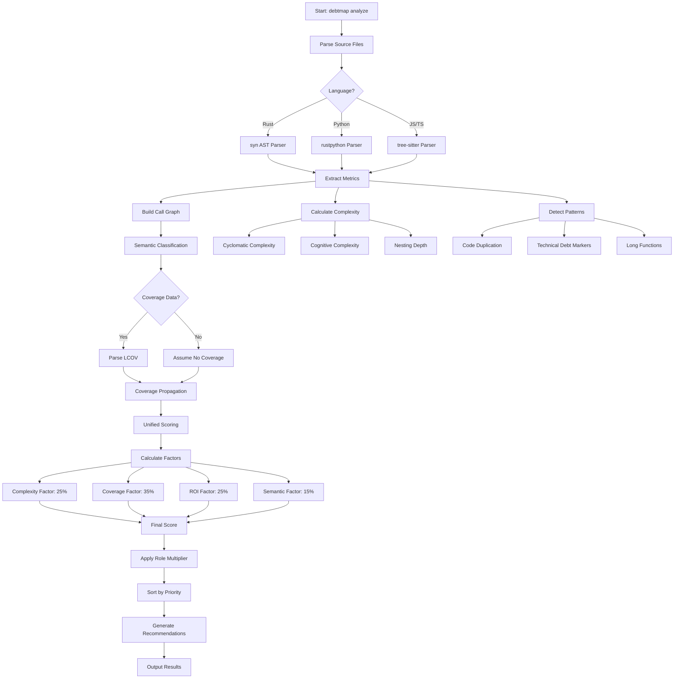

# debtmap


[](https://github.com/iepathos/debtmap/actions/workflows/ci.yml)
[](https://github.com/iepathos/debtmap/actions/workflows/security.yml)
[](https://github.com/iepathos/debtmap/actions/workflows/release.yml)
[](https://github.com/iepathos/debtmap/actions/workflows/debtmap.yml)


> 🚧 **Early Prototype** - This project is under active development and APIs may change

A fast, language-agnostic code complexity and technical debt analyzer written in Rust. Debtmap identifies which code to refactor for maximum cognitive debt reduction and which code to test for maximum risk reduction, providing data-driven ROI calculations for both.

## Why Debtmap?

### 🎯 What Makes Debtmap Different

Unlike traditional static analysis tools that simply flag complex code, debtmap answers two critical questions:
1. **"What should I refactor to reduce cognitive burden?"** - Identifies overly complex code that slows down development
2. **"What should I test first to reduce the most risk?"** - Pinpoints untested complex code that threatens stability

**Unique Capabilities:**
- **Cognitive Complexity Analysis**: Goes beyond cyclomatic complexity to measure how hard code is to understand, identifying functions that need refactoring to reduce mental load
- **Coverage-Risk Correlation**: The only tool that combines complexity metrics with test coverage to identify genuinely risky code (high complexity + low coverage = critical risk)
- **ROI-Driven Prioritization**: Calculates actual return on investment for both refactoring and testing efforts, showing which changes will have the most impact
- **Actionable Refactoring Guidance**: Provides specific recommendations like "extract nested conditions" or "split this 80-line function" rather than just flagging issues
- **Quantified Impact**: Provides concrete metrics like "refactoring this will reduce complexity by 60%" or "testing this will reduce risk by 5%"
- **Language-Agnostic Coverage Integration**: Works with any tool that generates LCOV format (Jest, pytest, cargo-tarpaulin, etc.)

**Performance:**
- Written in Rust for 10-100x faster analysis than Java/Python-based competitors
- Parallel processing with Rayon for analyzing massive codebases in seconds
- Incremental analysis caches results for lightning-fast re-runs

## Features

- **Multi-language support** - Fully supports Rust, Python, JavaScript, and TypeScript with Go support coming soon
- **Comprehensive metrics** - Analyzes cyclomatic and cognitive complexity, code duplication, and various code smells
- **Coverage-based risk analysis** - Uniquely correlates complexity with test coverage to identify truly risky code
- **ROI-driven testing recommendations** - Prioritizes testing efforts by calculating risk reduction per test case
- **Parallel processing** - Built with Rust and Rayon for blazing-fast analysis of large codebases
- **Multiple output formats** - JSON, TOML, and human-readable table formats
- **Configurable thresholds** - Customize complexity and duplication thresholds to match your standards
- **Incremental analysis** - Smart caching system for analyzing only changed files
- **Flexible suppression** - Inline comment-based suppression for specific code sections and configuration-based ignore patterns
- **Test-friendly** - Easily exclude test fixtures and example code from debt analysis

## Installation

### From Source

```bash
# Clone the repository
git clone https://github.com/iepathos/debtmap.git
cd debtmap

# Build and install
cargo install --path .
```

### Using Cargo

```bash
cargo install debtmap
```

## Quick Start

```bash
# Analyze current directory
debtmap analyze .

# Analyze with coverage data for risk scoring
debtmap analyze . --lcov target/coverage/lcov.info

# Generate coverage with cargo tarpaulin (Rust projects)
cargo tarpaulin --out lcov --output-dir target/coverage
debtmap analyze . --lcov target/coverage/lcov.info

# Analyze with custom thresholds
debtmap analyze ./src --threshold-complexity 15 --threshold-duplication 50

# Output as JSON
debtmap analyze ./src --format json --output report.json

# Analyze specific languages only
debtmap analyze . --languages rust,python

# Initialize configuration file
debtmap init

# Validate project against thresholds
debtmap validate ./src
```

## Commands

### `analyze`
Comprehensive analysis with unified prioritization that identifies the highest-value improvements for both testing and refactoring efforts.

```bash
debtmap analyze <PATH> [OPTIONS]

Options:
  -f, --format <FORMAT>              Output format [default: terminal] [possible values: json, markdown, terminal]
  -o, --output <FILE>                Output file (stdout if not specified)
  --threshold-complexity <N>         Complexity threshold [default: 10]
  --threshold-duplication <N>        Duplication threshold in lines [default: 50]
  --languages <LANGS>                Comma-separated list of languages to analyze
  --coverage-file <FILE>             LCOV coverage file for risk analysis (alias: --lcov)
  --context                          Enable context-aware risk analysis
  --context-providers <PROVIDERS>    Context providers to use (critical_path, dependency, git_history)
  --disable-context <PROVIDERS>      Disable specific context providers
  --top <N>                          Show only top N priority items
  --priorities-only                  Show priorities only (minimal output)
  --detailed                         Show detailed analysis with priority breakdown
  --semantic-off                     Disable semantic analysis (fallback mode)
  --explain-score                    Show score breakdown for debugging
```

### `init`
Initialize a configuration file for the project.

```bash
debtmap init [OPTIONS]

Options:
  -f, --force    Force overwrite existing configuration file
```

### `validate`
Validate code against configured thresholds and fail if metrics exceed limits. Supports risk-based validation with coverage data.

```bash
debtmap validate <PATH> [OPTIONS]

Options:
  -c, --config <FILE>                Configuration file to use [default: .debtmap.toml]
  -f, --format <FORMAT>               Output format for validation report
  -o, --output <FILE>                 Output file for validation results
  --coverage-file <FILE>              LCOV coverage file for risk-based validation
  --context                           Enable context-aware risk analysis
  --context-providers <PROVIDERS>     Context providers to use
  --disable-context <PROVIDERS>       Disable specific context providers
  --top <N>                           Show only top N priority items
  --priorities-only                   Show priorities only (minimal output)
  --detailed                          Show detailed analysis
  --semantic-off                      Disable semantic analysis
  --explain-score                     Show score breakdown
```

## Example Output

### Unified Priority Output (Default)
```
debtmap analyze . --lcov target/coverage/lcov.info --top 3
════════════════════════════════════════════
    PRIORITY TECHNICAL DEBT FIXES
════════════════════════════════════════════

🎯 TOP 3 RECOMMENDATIONS (by unified priority)

#1 SCORE: 8.9 [CRITICAL]
├─ TEST GAP: ./src/analyzers/rust_call_graph.rs:38 add_function_to_graph()
├─ ACTION: Add 6 unit tests for full coverage
├─ IMPACT: Full test coverage, -3.7 risk
├─ COMPLEXITY: cyclomatic=6, branches=6, cognitive=8, nesting=2, lines=32
├─ DEPENDENCIES: 0 upstream, 11 downstream
└─ WHY: Business logic with 0% coverage, manageable complexity (cyclo=6, cog=8)

#2 SCORE: 8.9 [CRITICAL]
├─ TEST GAP: ./src/debt/smells.rs:196 detect_data_clumps()
├─ ACTION: Add 5 unit tests for full coverage
├─ IMPACT: Full test coverage, -3.7 risk
├─ COMPLEXITY: cyclomatic=5, branches=5, cognitive=11, nesting=5, lines=31
├─ DEPENDENCIES: 0 upstream, 4 downstream
└─ WHY: Business logic with 0% coverage, manageable complexity (cyclo=5, cog=11)

#3 SCORE: 8.6 [CRITICAL]
├─ TEST GAP: ./src/risk/context/dependency.rs:247 explain()
├─ ACTION: Add 5 unit tests for full coverage
├─ IMPACT: Full test coverage, -3.6 risk
├─ COMPLEXITY: cyclomatic=5, branches=5, cognitive=9, nesting=1, lines=24
├─ DEPENDENCIES: 0 upstream, 1 downstream
└─ WHY: Business logic with 0% coverage, manageable complexity (cyclo=5, cog=9)


📊 TOTAL DEBT SCORE: 4907
📈 OVERALL COVERAGE: 67.12%
```

### JSON Output Format
```json
{
  "items": [
    {
      "location": {
        "file": "src/risk/priority/module_detection.rs",
        "function": "get_base_dependents",
        "line": 66
      },
      "debt_type": "TestGap",
      "unified_score": {
        "complexity_factor": 3.2,
        "coverage_factor": 10.0,
        "roi_factor": 8.5,
        "semantic_factor": 7.0,
        "role_multiplier": 1.2,
        "final_score": 9.4
      },
      "function_role": "BusinessLogic",
      "recommendation": {
        "action": "Add unit tests",
        "details": "Add 6 unit tests for full coverage",
        "effort_estimate": "2-3 hours"
      },
      "expected_impact": {
        "risk_reduction": 3.9,
        "complexity_reduction": 0,
        "coverage_improvement": 100
      },
      "upstream_dependencies": 0,
      "downstream_dependencies": 3,
      "nesting_depth": 1,
      "function_length": 13
    }
  ],
  "call_graph": {
    "total_functions": 1523,
    "entry_points": 12,
    "test_functions": 456,
    "max_depth": 8
  },
  "overall_coverage": 82.3,
  "total_impact": {
    "risk_reduction": 45.2,
    "complexity_reduction": 12.3,
    "coverage_improvement": 18.5
  }
}
```

## How Debtmap Works

### Analysis Workflow



### Unified Scoring Algorithm

Debtmap uses a sophisticated multi-factor scoring system to prioritize technical debt:

#### 1. Base Score Calculation

Each function receives a score from 0-10 based on four weighted factors:

```
Base Score = (Complexity × 0.25) + (Coverage × 0.35) + (ROI × 0.25) + (Semantic × 0.15)
```

**Factor Breakdown:**

- **Complexity Factor (25%)**: Combines cyclomatic and cognitive complexity
  - Normalized using: `min(10, (cyclomatic / 10 + cognitive / 20) × 5)`
  - Higher complexity = higher score = higher priority

- **Coverage Factor (35%)**: Urgency of adding test coverage
  - Test functions: 0 (they don't need coverage)
  - With coverage data: `10 × (1 - coverage_percentage) × complexity_weight`
  - Without coverage data: 10 (assume worst case)
  - Considers transitive coverage through call graph

- **ROI Factor (25%)**: Return on investment for fixing
  - Based on: function size, downstream dependencies, change frequency
  - Normalized to 0-10 scale
  - Higher ROI = higher priority

- **Semantic Factor (15%)**: Importance based on function role
  - Entry points: 8-10 (critical path)
  - Business logic: 6-8 (core functionality)
  - Data access: 5-7 (important but stable)
  - Utilities: 3-5 (lower priority)
  - Test helpers: 1-3 (lowest priority)

#### 2. Role Multiplier

The base score is adjusted by a role-based multiplier:

```
Final Score = Base Score × Role Multiplier
```

**Multipliers by Function Role:**
- Entry Points: 1.5× (main, handlers, API endpoints)
- Business Logic: 1.2× (core domain functions)
- Data Access: 1.0× (database, file I/O)
- Infrastructure: 0.8× (logging, configuration)
- Utilities: 0.5× (helpers, formatters)
- Test Code: 0.1× (test functions, fixtures)

#### 3. Coverage Propagation

Coverage impact flows through the call graph:

```
Transitive Coverage = Direct Coverage + Σ(Caller Coverage × Weight)
```

- Functions called by well-tested code have reduced urgency
- Functions that many others depend on have increased urgency
- Weights decrease with distance in call graph

#### 4. Priority Classification

Based on final scores:
- **CRITICAL** (9.0-10.0): Immediate action required
- **HIGH** (7.0-8.9): Should be addressed soon
- **MEDIUM** (5.0-6.9): Plan for next sprint
- **LOW** (3.0-4.9): Nice to have
- **MINIMAL** (0.0-2.9): Can be deferred

## Metrics Explained

### Cyclomatic Complexity
Measures the number of linearly independent paths through code. Higher values indicate more complex, harder-to-test code.

- **1-5**: Simple, easy to test
- **6-10**: Moderate complexity
- **11-20**: Complex, consider refactoring
- **20+**: Very complex, high risk

### Cognitive Complexity
Measures how difficult code is to understand. Unlike cyclomatic complexity, it considers nesting depth and control flow interruptions.

### Code Duplication
Identifies similar code blocks that could be refactored into shared functions.

### Technical Debt Patterns
- **Long methods/functions**: Functions exceeding recommended line counts
- **Deep nesting**: Code with excessive indentation levels
- **Large files**: Files that have grown too large to maintain easily
- **Circular dependencies**: Modules that depend on each other
- **High coupling**: Excessive dependencies between modules

### Risk Analysis (With Coverage Data)

When LCOV coverage data is provided via `--lcov`, debtmap performs sophisticated risk analysis:

#### Risk Scoring
Functions are scored based on complexity-coverage correlation:
- **Critical Risk (50+)**: High complexity + low/no coverage
- **High Risk (25-49)**: Medium-high complexity with poor coverage
- **Medium Risk (10-24)**: Moderate complexity or coverage gaps
- **Low Risk (5-9)**: Well-tested or simple functions

#### Testing Recommendations
- **ROI-based prioritization**: Functions ranked by risk reduction potential
- **Test effort estimation**: Complexity-based test case recommendations
- **Actionable insights**: Concrete steps to reduce overall codebase risk

#### Coverage Integration
Supports LCOV format from popular coverage tools:
- **Rust**: `cargo tarpaulin --out lcov`
- **JavaScript/TypeScript**: `jest --coverage --coverageReporters=lcov`
- **Python**: `pytest --cov --cov-report=lcov`
- **Go**: `go test -coverprofile=coverage.out && gocover-cobertura < coverage.out > coverage.lcov`

## Suppressing Technical Debt Detection

Debtmap provides two ways to exclude code from technical debt analysis:

### 1. Inline Suppression Comments

You can suppress debt detection for specific code sections using inline comments. This is useful for test fixtures, example code, or intentional technical debt.

#### Suppression Formats

```rust
// Rust example
// debtmap:ignore-start -- Optional reason
// TODO: This will be ignored
// FIXME: This too
// debtmap:ignore-end

// Suppress next line only
// debtmap:ignore-next-line
// TODO: Just this line is ignored

// Suppress current line
// TODO: Ignored // debtmap:ignore

// Type-specific suppression
// debtmap:ignore-start[todo] -- Only suppress TODOs
// TODO: Ignored
// FIXME: Not ignored
// debtmap:ignore-end
```

```python
# Python example
# debtmap:ignore-start
# TODO: Ignored in Python
# debtmap:ignore-end
```

```javascript
// JavaScript/TypeScript example
// debtmap:ignore-start -- Test fixture data
// TODO: Ignored in JS/TS
// HACK: This too
// debtmap:ignore-end

/* Block comments also work */
/* debtmap:ignore-start */
// TODO: Ignored
/* debtmap:ignore-end */
```

#### Suppression Types

- `debtmap:ignore` - Suppress all debt types on current line
- `debtmap:ignore-next-line` - Suppress all debt types on next line
- `debtmap:ignore-start` / `debtmap:ignore-end` - Suppress block of code
- `debtmap:ignore[todo]` - Suppress only TODO markers
- `debtmap:ignore[fixme]` - Suppress only FIXME markers
- `debtmap:ignore[hack]` - Suppress only HACK markers
- `debtmap:ignore[*]` - Suppress all types (wildcard)

### 2. Configuration File Ignores

Use the `.debtmap.toml` configuration file to ignore entire files or directories:

## Configuration

Create a `.debtmap.toml` file in your project root:

```toml
[thresholds]
complexity = 15
duplication = 25
max_file_lines = 500
max_function_lines = 50
max_nesting_depth = 4

[ignore]
# Paths to completely ignore during analysis
paths = ["target/", "node_modules/", "vendor/"]
# File patterns to ignore (glob patterns)
patterns = ["*.generated.rs", "*.pb.go", "*.min.js", "test/fixtures/**"]

[languages]
# Languages to analyze (rust, python, javascript, typescript)
enabled = ["rust", "python", "javascript"]
```

## Output Examples

### Terminal Format (Default)
```
╭─────────────────────────────────────────────────────────────╮
│                    Debtmap Analysis Report                  │
├─────────────────────────────────────────────────────────────┤
│ File                     │ Complexity │ Debt Items │ Issues │
├──────────────────────────┼────────────┼────────────┼────────┤
│ src/analyzers/rust.rs    │ 15         │ 3          │ 2      │
│ src/core/metrics.rs      │ 8          │ 1          │ 0      │
│ src/debt/patterns.rs     │ 22         │ 5          │ 3      │
╰─────────────────────────────────────────────────────────────╯
```

### JSON Format
```json
{
  "timestamp": "2024-01-09T12:00:00Z",
  "summary": {
    "total_files": 25,
    "high_complexity_files": 3,
    "high_duplication_files": 2,
    "total_issues": 8
  },
  "files": [
    {
      "path": "src/analyzers/rust.rs",
      "complexity": {
        "cyclomatic": 15,
        "cognitive": 18
      },
      "duplication_percentage": 12,
      "issues": [...]
    }
  ]
}
```

## Architecture

Debtmap is built with a functional, modular architecture designed for extensibility and performance:

### Core Modules

- **`analyzers/`** - Language-specific AST parsers and analyzers
  - Rust analyzer using `syn` for full AST parsing
  - Python analyzer using `rustpython-parser`
  - JavaScript/TypeScript analyzer using `tree-sitter`
  - Call graph extraction for dependency analysis

- **`priority/`** - Unified prioritization system
  - Call graph construction and analysis
  - Coverage propagation through dependencies
  - Semantic function classification (entry points, business logic, utilities)
  - ROI-based scoring and recommendations

- **`risk/`** - Risk analysis and coverage integration
  - LCOV parser for coverage data
  - Risk scoring based on complexity-coverage correlation
  - Context providers for enhanced risk assessment
  - Test effort estimation

- **`debt/`** - Technical debt pattern detection
  - Code duplication detection with similarity scoring
  - TODO/FIXME/HACK marker extraction
  - Complexity-based debt identification
  - Suppression comment handling

- **`core/`** - Core data structures and traits
  - Language-agnostic metrics types
  - Shared analysis results structures
  - Configuration management

- **`io/`** - File I/O and output formatting
  - Parallel file walking with ignore patterns
  - Multiple output formats (Terminal, JSON, Markdown)
  - Pretty-printing with colored output

## Contributing

We welcome contributions! This is an early-stage project, so there's plenty of room for improvement.

### Areas for Contribution

- **Language support**: Add analyzers for Go, Java, etc.
- **New metrics**: Implement additional complexity or quality metrics
- **Performance**: Optimize analysis algorithms
- **Documentation**: Improve docs and add examples
- **Testing**: Expand test coverage

### Development

This project uses [Just](https://github.com/casey/just) for task automation. Run `just` to see available commands.

```bash
# Common development tasks
just test        # Run all tests
just fmt         # Format code
just lint        # Run clippy linter
just check       # Quick syntax check
just dev         # Run in development mode
just watch       # Run with hot reloading

# CI and quality checks
just ci          # Run all CI checks locally
just coverage    # Generate test coverage report

# See all available commands
just --list
```

### Automated Technical Debt Reduction

We use [mmm (Memento Mori)](https://github.com/iepathos/mmm) for automated technical debt reduction through AI-driven workflows. This allows us to continuously improve code quality without manual intervention.

#### Quick Start

```bash
# Run automated debt reduction (5 iterations)
mmm cook workflows/debtmap.yml -wn 5
```

This command:
- Creates an isolated git worktree for safe experimentation
- Runs up to 5 iterations of automated improvements
- Each iteration identifies and fixes the highest-risk technical debt
- Validates all changes with tests and linting
- Commits improvements with detailed metrics

#### What Gets Fixed

The workflow automatically addresses:
- High complexity functions (cyclomatic complexity > 10)
- Untested complex code (low coverage on risky functions)
- Code duplication (repeated blocks > 50 lines)
- Deep nesting and long functions
- Code style inconsistencies

#### Documentation

For detailed information on our development process:
- [MMM Workflow Guide](docs/MMM_WORKFLOW.md) - Using mmm for automated debt reduction
- [Claude Workflow Guide](docs/CLAUDE_WORKFLOW.md) - Manual debt reduction with Claude Code

#### Example Session

```bash
$ mmm cook workflows/debtmap.yml -wn 3
ℹ️  Created worktree at: /Users/glen/.mmm/worktrees/debtmap/session-abc123
🔄 Starting iteration 1/3
✅ Fixed: Reduced complexity in parse_lcov_file from 80 to 45
🔄 Starting iteration 2/3
✅ Fixed: Eliminated 120 lines of duplication in test utilities
🔄 Starting iteration 3/3
✅ Fixed: Improved test coverage for risk module from 45% to 78%
ℹ️  Total debt score reduced by 35%
```

After the workflow completes, review and merge the improvements:

```bash
# Review changes
pushd ~/.mmm/worktrees/debtmap/session-*
  git log --oneline
popd

# If satisfied, merge to main
mmm worktree merge session-abc123
```

## License

MIT License - see [LICENSE](LICENSE) file for details

### Dependency Licensing Note

Debtmap includes Python parsing functionality via `rustpython-parser`, which depends on `malachite` (LGPL-3.0 licensed) for arbitrary-precision arithmetic. This LGPL dependency is used only for Python AST parsing and does not affect the MIT licensing of debtmap itself. For use cases requiring strict MIT-only dependencies, Python support can be disabled or replaced with an alternative parser.

## Roadmap

### Language Support
- [x] Rust - Full support with AST parsing
- [x] Python - Full support via rustpython-parser
- [x] JavaScript/TypeScript - Full support via tree-sitter
- [ ] Go - In development (Q4 2025)
- [ ] Java - Planned (Q4 2025)
- [ ] C/C++ - Planned (Q4 2025)

### Core Features
- [x] Inline suppression comments
- [x] LCOV coverage integration with risk analysis
- [x] ROI-based testing prioritization
- [ ] Historical trend tracking
- [ ] Automated refactoring suggestions

### Integrations
- [ ] GitHub Actions marketplace
- [ ] GitLab CI integration
- [ ] VSCode extension
- [ ] IntelliJ plugin
- [ ] Pre-commit hooks

## Acknowledgments

Built with excellent Rust crates including:
- [syn](https://github.com/dtolnay/syn) for Rust AST parsing
- [rustpython-parser](https://github.com/RustPython/RustPython) for Python parsing
- [tree-sitter](https://github.com/tree-sitter/tree-sitter) for JavaScript/TypeScript parsing
- [rayon](https://github.com/rayon-rs/rayon) for parallel processing
- [clap](https://github.com/clap-rs/clap) for CLI parsing

---

**Note**: This is a prototype tool under active development. Please report issues and feedback on [GitHub](https://github.com/iepathos/debtmap/issues).
