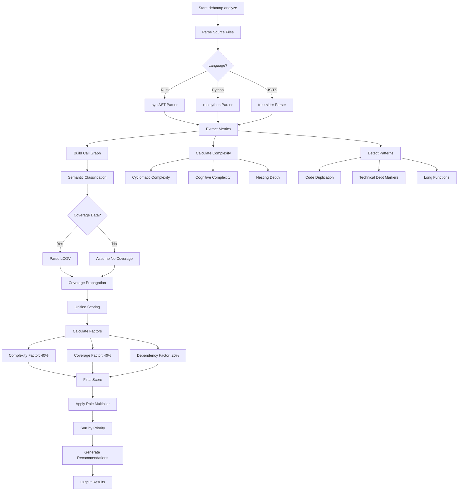

# debtmap


[](https://github.com/iepathos/debtmap/actions/workflows/ci.yml)
[](https://github.com/iepathos/debtmap/actions/workflows/security.yml)
[](https://github.com/iepathos/debtmap/actions/workflows/release.yml)
[](https://github.com/iepathos/debtmap/actions/workflows/debtmap.yml)
[](https://crates.io/crates/debtmap)
[](LICENSE)
[](https://crates.io/crates/debtmap)

> 🚧 **Early Prototype** - This project is under active development and APIs may change

A fast code complexity and technical debt analyzer written in Rust. Debtmap identifies which code to refactor for maximum cognitive debt reduction and which code to test for maximum risk reduction, providing data-driven prioritization for both.

## Why Debtmap?

### 🎯 What Makes Debtmap Different

Unlike traditional static analysis tools that simply flag complex code, debtmap answers two critical questions:
1. **"What should I refactor to reduce cognitive burden?"** - Identifies overly complex code that slows down development
2. **"What should I test first to reduce the most risk?"** - Pinpoints untested complex code that threatens stability

**Unique Capabilities:**
- **Entropy-Based Complexity Analysis**: Uses information theory to distinguish genuinely complex code from pattern-based repetitive code, reducing false positives by up to 70%
- **Advanced Token Classification**: Categorizes and weights different token types (variables, methods, literals) for more accurate complexity assessment
- **Cognitive Complexity Analysis**: Goes beyond cyclomatic complexity to measure how hard code is to understand, identifying functions that need refactoring to reduce mental load
- **Coverage-Risk Correlation**: The only tool that combines complexity metrics with test coverage to identify genuinely risky code (high complexity + low coverage = critical risk)
- **Risk-Driven Prioritization**: Prioritizes refactoring and testing efforts based on complexity, coverage, and dependency factors to show which changes will have the most impact
- **Actionable Refactoring Guidance**: Provides specific recommendations like "extract nested conditions" or "split this 80-line function" rather than just flagging issues
- **Quantified Impact**: Provides concrete metrics like "refactoring this will reduce complexity by 60%" or "testing this will reduce risk by 5%"
- **Language-Agnostic Coverage Integration**: Works with any tool that generates LCOV format (Jest, pytest, cargo-tarpaulin, etc.)
- **Context-Aware False Positive Reduction**: Intelligently reduces false positives by understanding code context and patterns (enabled by default)

**Speed:**
- Written in Rust for 10-100x faster analysis than Java/Python-based competitors
- Parallel processing with Rayon for analyzing massive codebases in seconds
- Incremental analysis caches results for lightning-fast re-runs

## Features

- **Multi-language support** - Fully supports Rust. Partial support for Python, JavaScript, and TypeScript with planned full support.
- **Entropy-based complexity analysis** - Distinguishes between genuinely complex code and pattern-based repetitive code using information theory
- **Token classification system** - Advanced token categorization with weighted entropy for more accurate complexity assessment
- **Comprehensive debt detection** - Identifies technical debt across security, organization, testing, and resource management
- **Security vulnerability detection** - Finds hardcoded secrets, weak crypto, SQL injection risks, and unsafe code patterns
- **Resource management analysis** - Identifies inefficient allocations, nested loops, and blocking I/O patterns
- **Code organization analysis** - Detects god objects, feature envy, primitive obsession, and magic values
- **God object detection** - Identifies classes/modules with too many responsibilities using method count, field count, and responsibility analysis
- **Testing quality assessment** - Analyzes test complexity, flaky patterns, and assertion quality
- **Context-aware analysis** - Reduces false positives through intelligent context detection (enabled by default)
- **Enhanced scoring system** - Advanced scoring differentiation for better prioritization
- **Macro expansion support** - Handles Rust macro expansions with configurable warnings and statistics
- **Verbosity controls** - Multiple verbosity levels (-v, -vv, -vvv) for progressive detail
- **Resource management review** - Finds async/await misuse, resource leaks, and collection inefficiencies
- **Coverage-based risk analysis** - Uniquely correlates complexity with test coverage to identify truly risky code
- **Risk-driven testing recommendations** - Prioritizes testing efforts based on complexity-coverage correlation and dependency impact
- **Parallel processing** - Built with Rust and Rayon for blazing-fast analysis of large codebases
- **Multiple output formats** - JSON, TOML, and human-readable table formats
- **Configurable thresholds** - Customize complexity and duplication thresholds to match your standards
- **Incremental analysis** - Smart caching system for analyzing only changed files
- **Flexible suppression** - Inline comment-based suppression for specific code sections and configuration-based ignore patterns
- **Test-friendly** - Easily exclude test fixtures and example code from debt analysis

## Installation

### Quick Install (Recommended)

Install the latest release with a single command:

```bash
curl -sSL https://raw.githubusercontent.com/iepathos/debtmap/master/install.sh | bash
```

Or with wget:
```bash
wget -qO- https://raw.githubusercontent.com/iepathos/debtmap/master/install.sh | bash
```

This will:
- Automatically detect your OS and architecture
- Download the appropriate pre-built binary from the latest GitHub release
- Install debtmap to `~/.cargo/bin` if it exists, otherwise `~/.local/bin` (or `$INSTALL_DIR` if set)
- Offer to automatically add the install directory to your PATH if needed

### Using Cargo

```bash
cargo install debtmap
```

### From Source

```bash
# Clone the repository
git clone https://github.com/iepathos/debtmap.git
cd debtmap

# Build and install
cargo install --path .
```

## Quick Start

```bash
# Analyze current directory
debtmap analyze .

# Analyze with coverage data for risk scoring
debtmap analyze . --lcov target/coverage/lcov.info

# Generate coverage with cargo tarpaulin (Rust projects)
cargo tarpaulin --out lcov --output-dir target/coverage
debtmap analyze . --lcov target/coverage/lcov.info

# Analyze with custom thresholds
debtmap analyze ./src --threshold-complexity 15 --threshold-duplication 50

# Output as JSON
debtmap analyze ./src --format json --output report.json

# Analyze specific languages only
debtmap analyze . --languages rust,python

# Show only top 10 high-priority issues with verbose scoring
debtmap analyze . --top 10 -vv

# Focus on security issues only
debtmap analyze . --security-enhanced

# Group results by debt category
debtmap analyze . --group-by-category --min-priority high

# Initialize configuration file
debtmap init

# Validate project against thresholds
debtmap validate ./src
```

## God Object Detection

Debtmap includes sophisticated god object detection that identifies classes and modules with too many responsibilities. A god object is detected based on:

- **Method count** - Number of methods/functions in a class/module
- **Field count** - Number of fields/attributes
- **Responsibility count** - Number of distinct responsibilities (grouped by method naming patterns)
- **Lines of code** - Overall size of the class/module

God objects are flagged in both terminal and markdown output with detailed metrics:
- Number of methods, fields, and responsibilities
- God object score (0-100%)
- Recommendations for splitting into smaller, focused modules

You can configure god object thresholds in `.debtmap.toml`:

```toml
[god_object]
enabled = true
max_methods = 20
max_fields = 15
max_responsibilities = 5
```

To disable god object detection for a specific run:
```bash
debtmap analyze . --no-god-object
```

## Commands

### `analyze`
Comprehensive analysis with unified prioritization that identifies the highest-value improvements for both testing and refactoring efforts.

```bash
debtmap analyze <PATH> [OPTIONS]

Options:
  -f, --format <FORMAT>              Output format [default: terminal] [possible values: json, markdown, terminal]
  -o, --output <FILE>                Output file (stdout if not specified)
  --threshold-complexity <N>         Complexity threshold [default: 10]
  --threshold-duplication <N>        Duplication threshold in lines [default: 50]
  --languages <LANGS>                Comma-separated list of languages to analyze
  --coverage-file <FILE>             LCOV coverage file for risk analysis (alias: --lcov)
  --context                          Enable context-aware risk analysis (alias: --enable-context)
  --context-providers <PROVIDERS>    Context providers to use (critical_path, dependency, git_history)
  --disable-context <PROVIDERS>      Disable specific context providers
  --top <N>                          Show only top N priority items (alias: --head)
  --tail <N>                         Show only bottom N priority items (lowest priority)
  --semantic-off                     Disable semantic analysis (fallback mode)
  -v, --verbose                      Increase verbosity level (can be repeated: -v, -vv, -vvv)
                                     -v: Show main score factors
                                     -vv: Show detailed calculations
                                     -vvv: Show all debug information
  --verbose-macro-warnings           Show verbose macro parsing warnings
  --show-macro-stats                 Show macro expansion statistics
  --security-enhanced                Enable enhanced security analysis with additional detectors
  --group-by-category                Group output by debt category
  --min-priority <PRIORITY>          Minimum priority to display (low, medium, high, critical)
  --filter <CATEGORIES>              Filter by debt categories (comma-separated)
  --no-context-aware                 Disable context-aware false positive reduction (enabled by default)
  --no-god-object                    Disable god object detection
```

### `init`
Initialize a configuration file for the project.

```bash
debtmap init [OPTIONS]

Options:
  -f, --force    Force overwrite existing configuration file
```

### `validate`
Validate code against configured thresholds and fail if metrics exceed limits. Supports risk-based validation with coverage data.

```bash
debtmap validate <PATH> [OPTIONS]

Options:
  -c, --config <FILE>                Configuration file to use [default: .debtmap.toml]
  -f, --format <FORMAT>               Output format for validation report
  -o, --output <FILE>                 Output file for validation results
  --coverage-file <FILE>              LCOV coverage file for risk-based validation
  --context                           Enable context-aware risk analysis
  --context-providers <PROVIDERS>     Context providers to use
  --disable-context <PROVIDERS>       Disable specific context providers
  --top <N>                           Show only top N priority items (alias: --head)
  --tail <N>                          Show only bottom N priority items (lowest priority)
  --semantic-off                      Disable semantic analysis
  -v, --verbose                       Increase verbosity level (replaces deprecated --explain-score)
  --verbose-macro-warnings            Show verbose macro parsing warnings
  --show-macro-stats                  Show macro expansion statistics
  --security-enhanced                 Enable enhanced security analysis
  --group-by-category                 Group output by debt category
  --min-priority <PRIORITY>           Minimum priority to display
  --filter <CATEGORIES>               Filter by debt categories
  --no-context-aware                  Disable context-aware false positive reduction
```

### `compare`
Compare two debtmap analysis results to track improvements and detect regressions. Ideal for validating that refactoring efforts achieved their goals.

```bash
debtmap compare --before <FILE> --after <FILE> [OPTIONS]

Options:
  --before <FILE>                     Path to baseline analysis (JSON format)
  --after <FILE>                      Path to current analysis (JSON format)
  --plan <FILE>                       Implementation plan file (extracts target from **Target:** markers)
  --target <LOCATION>                 Target location to track (format: file:function:line)
  -f, --format <FORMAT>               Output format [possible values: json, markdown, terminal]
  -o, --output <FILE>                 Output file (stdout if not specified)
```

**Example workflow:**
```bash
# Generate baseline analysis
debtmap analyze . --format json --output before.json

# Make improvements to your code
# ... refactor, add tests, etc ...

# Generate new analysis
debtmap analyze . --format json --output after.json

# Compare and verify improvements
debtmap compare --before before.json --after after.json --target src/main.rs:complex_function:100

# Or use with an implementation plan
debtmap compare --before before.json --after after.json --plan IMPLEMENTATION_PLAN.md

# Output in different formats
debtmap compare --before before.json --after after.json --format markdown --output report.md
```

**Target Location Format:**
- `file:function:line` - e.g., `src/main.rs:process_data:100`
- Can be extracted automatically from plan files containing `**Target**: file:function:line` markers
- When specified, comparison focuses on whether the target item improved

**Comparison Results:**
- **Target Status**: Resolved, Improved, Unchanged, Regressed, or Not Found
- **Overall Trend**: Improving, Stable, or Regressing
- **Regressions**: New critical debt items introduced
- **Metrics**: Complexity reduction, coverage improvement, score changes
- **Project Health**: Before/after comparison with detailed breakdowns

## Verbosity Levels

Control the amount of detail in the output using the `-v` flag:

```bash
# Standard output (no verbosity)
debtmap analyze .

# Level 1 (-v): Show main score factors
debtmap analyze . -v

# Level 2 (-vv): Show detailed calculations
debtmap analyze . -vv

# Level 3 (-vvv): Show all debug information
debtmap analyze . -vvv

# Show macro expansion warnings and statistics
debtmap analyze . --verbose-macro-warnings --show-macro-stats
```

## Example Output

### With Entropy Analysis Enabled
When entropy analysis is enabled, pattern-based complexity is automatically dampened:

```bash
# Traditional analysis (without entropy)
debtmap analyze . --no-entropy
# validate_input: Complexity: 15, Priority: HIGH

# With entropy analysis (enabled by default)
debtmap analyze .
# validate_input: Complexity: 5 (dampened by 67%), Priority: LOW
#   ├─ Token Entropy: 0.3 (repetitive patterns detected)
#   ├─ Pattern Repetition: 0.8 (high repetition)
#   └─ Branch Similarity: 0.9 (similar validation checks)
```

### Unified Priority Output (Default)
```
debtmap analyze . --lcov target/coverage/lcov.info --top 3
════════════════════════════════════════════
    PRIORITY TECHNICAL DEBT FIXES
════════════════════════════════════════════

🎯 TOP 3 RECOMMENDATIONS (by unified priority)

#1 SCORE: 8.9 [CRITICAL]
├─ TEST GAP: ./src/analyzers/rust_call_graph.rs:38 add_function_to_graph()
├─ ACTION: Add 6 unit tests for full coverage
├─ IMPACT: Full test coverage, -3.7 risk
├─ COMPLEXITY: cyclomatic=6, branches=6, cognitive=8, nesting=2, lines=32
├─ DEPENDENCIES: 0 upstream, 11 downstream
└─ WHY: Business logic with 0% coverage, manageable complexity (cyclo=6, cog=8)

#2 SCORE: 8.9 [CRITICAL]
├─ TEST GAP: ./src/debt/smells.rs:196 detect_data_clumps()
├─ ACTION: Add 5 unit tests for full coverage
├─ IMPACT: Full test coverage, -3.7 risk
├─ COMPLEXITY: cyclomatic=5, branches=5, cognitive=11, nesting=5, lines=31
├─ DEPENDENCIES: 0 upstream, 4 downstream
└─ WHY: Business logic with 0% coverage, manageable complexity (cyclo=5, cog=11)

#3 SCORE: 8.6 [CRITICAL]
├─ TEST GAP: ./src/risk/context/dependency.rs:247 explain()
├─ ACTION: Add 5 unit tests for full coverage
├─ IMPACT: Full test coverage, -3.6 risk
├─ COMPLEXITY: cyclomatic=5, branches=5, cognitive=9, nesting=1, lines=24
├─ DEPENDENCIES: 0 upstream, 1 downstream
└─ WHY: Business logic with 0% coverage, manageable complexity (cyclo=5, cog=9)


📊 TOTAL DEBT SCORE: 4907
📈 OVERALL COVERAGE: 67.12%
```

### JSON Output Format
```json
{
  "items": [
    {
      "location": {
        "file": "src/risk/priority/module_detection.rs",
        "function": "get_base_dependents",
        "line": 66
      },
      "debt_type": "TestGap",
      "unified_score": {
        "complexity_factor": 3.2,
        "coverage_factor": 10.0,
        "dependency_factor": 2.5,
        "role_multiplier": 1.2,
        "final_score": 9.4
      },
      "function_role": "BusinessLogic",
      "recommendation": {
        "action": "Add unit tests",
        "details": "Add 6 unit tests for full coverage",
        "effort_estimate": "2-3 hours"
      },
      "expected_impact": {
        "risk_reduction": 3.9,
        "complexity_reduction": 0,
        "coverage_improvement": 100
      },
      "upstream_dependencies": 0,
      "downstream_dependencies": 3,
      "nesting_depth": 1,
      "function_length": 13
    }
  ],
  "call_graph": {
    "total_functions": 1523,
    "entry_points": 12,
    "test_functions": 456,
    "max_depth": 8
  },
  "overall_coverage": 82.3,
  "total_impact": {
    "risk_reduction": 45.2,
    "complexity_reduction": 12.3,
    "coverage_improvement": 18.5
  }
}
```

## Analysis Modes

Debtmap offers several specialized analysis modes for focused technical debt assessment:

### Category-Specific Analysis
Focus on specific aspects of technical debt using the filter option:
```bash
# Architecture-focused analysis (god objects, complexity hotspots)
debtmap analyze . --filter Architecture

# Testing quality analysis (coverage gaps, untested code)
debtmap analyze . --filter Testing

# Performance analysis (resource leaks, inefficient patterns)
debtmap analyze . --filter Performance

# Code quality analysis (code smells, maintainability)
debtmap analyze . --filter CodeQuality

# Multiple categories at once
debtmap analyze . --filter Architecture,Testing
```

### Combined Filtering
Combine multiple options for precise analysis:
```bash
# High-priority issues only
debtmap analyze . --min-priority high --top 10

# Group by category with coverage data
debtmap analyze . --lcov coverage.info --group-by-category

# Filter specific debt categories with coverage
debtmap analyze . --filter Architecture,Testing --lcov coverage.info
```

## How Debtmap Works

### Analysis Workflow



### Unified Scoring Algorithm

Debtmap uses a sophisticated multi-factor scoring system to prioritize technical debt:

#### 1. Base Score Calculation

Each function receives a score from 0-10 based on three weighted factors:

```
Base Score = (Complexity × 0.40) + (Coverage × 0.40) + (Dependency × 0.20)
```

**Factor Breakdown:**

- **Complexity Factor (40%)**: Combines cyclomatic and cognitive complexity
  - Normalized using: `min(10, (cyclomatic / 10 + cognitive / 20) × 5)`
  - Higher complexity = higher score = higher priority

- **Coverage Factor (40%)**: Urgency of adding test coverage
  - Test functions: 0 (they don't need coverage)
  - With coverage data: `10 × (1 - coverage_percentage) × complexity_weight`
  - Without coverage data: 10 (assume worst case)
  - Considers transitive coverage through call graph

- **Dependency Factor (20%)**: Impact based on how many functions depend on this code
  - Based on: upstream dependencies (callers) and downstream impact
  - Normalized to 0-10 scale
  - More dependencies = higher priority
  - Entry points: 8-10 (critical path)
  - Business logic: 6-8 (core functionality)
  - Data access: 5-7 (important but stable)
  - Utilities: 3-5 (lower priority)
  - Test helpers: 1-3 (lowest priority)

#### 2. Role Multiplier

The base score is adjusted by a role-based multiplier:

```
Final Score = Base Score × Role Multiplier
```

**Multipliers by Function Role:**
- Entry Points: 1.5× (main, handlers, API endpoints)
- Business Logic: 1.2× (core domain functions)
- Data Access: 1.0× (database, file I/O)
- Infrastructure: 0.8× (logging, configuration)
- Utilities: 0.5× (helpers, formatters)
- Test Code: 0.1× (test functions, fixtures)

#### 3. Coverage Propagation

Coverage impact flows through the call graph:

```
Transitive Coverage = Direct Coverage + Σ(Caller Coverage × Weight)
```

- Functions called by well-tested code have reduced urgency
- Functions that many others depend on have increased urgency
- Weights decrease with distance in call graph

#### 4. Priority Classification

Based on final scores:
- **CRITICAL** (9.0-10.0): Immediate action required
- **HIGH** (7.0-8.9): Should be addressed soon
- **MEDIUM** (5.0-6.9): Plan for next sprint
- **LOW** (3.0-4.9): Nice to have
- **MINIMAL** (0.0-2.9): Can be deferred

### File-Level vs Function-Level Scoring

Debtmap provides both file-level and function-level scoring to help you prioritize refactoring efforts at different granularities:

#### Function-Level Scoring
Function-level scores focus on individual functions and methods:
- **Precision**: Identifies specific functions that need attention
- **Granular Metrics**: Cyclomatic complexity, cognitive complexity, nesting depth
- **Test Coverage**: Direct coverage percentage for each function
- **Dependencies**: Call graph analysis shows function relationships
- **Best For**: Targeted refactoring of specific problem areas

#### File-Level Scoring
File-level scores aggregate and analyze entire files:
- **Holistic View**: Considers overall file health and maintainability
- **Aggregated Metrics**: Total complexity, average complexity, function density
- **God Object Detection**: Identifies files with too many responsibilities
- **Function Score Aggregation**: Combines all function scores within the file
- **Size Factors**: Considers total lines and function count
- **Best For**: Architectural refactoring and module reorganization

#### How File Scores Are Calculated
File scores combine multiple factors:

```
File Score = Size × Complexity × Coverage × Density × GodObject × FunctionScores
```

- **Size Factor**: `sqrt(total_lines / 100)` - Larger files have higher impact
- **Complexity Factor**: Combines average and total complexity across all functions
- **Coverage Factor**: `(1 - coverage_percent) × 2 + 1` - Lower coverage increases score
- **Density Factor**: Penalizes files with >50 functions (possible god object)
- **God Object Multiplier**: `2.0 + god_object_score` when god object detected
- **Function Scores**: Sum of all function scores divided by 10

#### When to Use Each

**Use Function-Level Scoring When:**
- You need to identify specific hot spots in your code
- Planning sprint work for individual developers
- Writing unit tests for uncovered functions
- Doing targeted performance optimization

**Use File-Level Scoring When:**
- Planning major refactoring initiatives
- Identifying architectural issues (god objects, poor cohesion)
- Breaking up monolithic modules
- Evaluating overall codebase health

## Metrics Explained

### Cyclomatic Complexity
Measures the number of linearly independent paths through code. Higher values indicate more complex, harder-to-test code.

- **1-5**: Simple, easy to test
- **6-10**: Moderate complexity
- **11-20**: Complex, consider refactoring
- **20+**: Very complex, high risk

### Cognitive Complexity
Measures how difficult code is to understand. Unlike cyclomatic complexity, it considers nesting depth and control flow interruptions.

### Entropy-Based Complexity Analysis
Uses information theory to distinguish between genuinely complex code and pattern-based repetitive code:

- **Shannon Entropy**: Measures the variety and unpredictability of code patterns (0.0-1.0)
- **Pattern Repetition**: Detects repetitive structures in the AST (0.0-1.0)
- **Branch Similarity**: Analyzes similarity between conditional branches (0.0-1.0)
- **Effective Complexity**: Adjusts raw complexity scores based on entropy analysis
- **Token Classification**: Categorizes tokens by type (variables, methods, literals) with weighted importance

This significantly reduces false positives for:
- Validation functions with repetitive checks
- Dispatcher/command patterns with similar handlers
- Configuration parsers with uniform processing
- Switch statements with consistent case handling

Enable in `.debtmap.toml`:
```toml
[entropy]
enabled = true              # Enable entropy analysis
weight = 0.5               # Weight in complexity adjustment (0.0-1.0)
use_classification = true  # Enable advanced token classification
pattern_threshold = 0.7    # Threshold for pattern detection
```

### Code Duplication
Identifies similar code blocks that could be refactored into shared functions.

### Technical Debt Patterns

#### Core Patterns
- **Long methods/functions**: Functions exceeding recommended line counts
- **Deep nesting**: Code with excessive indentation levels
- **Large files**: Files that have grown too large to maintain easily
- **Circular dependencies**: Modules that depend on each other
- **High coupling**: Excessive dependencies between modules
- **TODO/FIXME/HACK markers**: Development debt markers requiring attention
- **Code duplication**: Similar code blocks that could be refactored
- **High complexity**: Functions with excessive cyclomatic or cognitive complexity
- **Error swallowing**: Catch blocks that suppress errors without proper handling
- **Dead code**: Unused functions and modules that can be removed
- **Testing gaps**: Complex functions lacking adequate test coverage
- **Risk hotspots**: Functions combining high complexity with low coverage

#### Security Anti-patterns
- **Hardcoded secrets**: API keys, passwords, and tokens in source code
- **Weak cryptography**: Use of deprecated or insecure cryptographic algorithms
- **SQL injection risks**: Unsafe dynamic SQL query construction
- **Unsafe code blocks**: Unnecessary or poorly justified unsafe operations
- **Input validation gaps**: Missing validation for user inputs and external data

#### Resource Management Issues
- **Inefficient allocations**: Unnecessary heap allocations and memory waste
- **String concatenation**: Inefficient string building in loops
- **Nested loops**: O(n²) and higher complexity patterns
- **Blocking I/O**: Synchronous operations in async contexts
- **Suboptimal data structures**: Using wrong collections for access patterns

#### Code Organization Issues
- **God objects**: Classes/modules with too many responsibilities
- **Feature envy**: Methods using more data from other classes than their own
- **Primitive obsession**: Overuse of basic types instead of domain objects
- **Magic numbers/strings**: Unexplained literal values throughout code

#### Testing Quality Issues
- **Complex test assertions**: Tests that are hard to understand or maintain
- **Flaky test patterns**: Non-deterministic test behaviors
- **Excessive test complexity**: Tests with high cyclomatic complexity

#### Resource Management Issues
- **Async/await misuse**: Improper handling of asynchronous operations
- **Resource leaks**: Missing cleanup for files, connections, or memory
- **Collection inefficiencies**: Suboptimal use of data collections

### Risk Analysis (With Coverage Data)

When LCOV coverage data is provided via `--lcov`, debtmap performs sophisticated risk analysis:

#### Risk Scoring
Functions are scored based on complexity-coverage correlation:
- **Critical Risk (50+)**: High complexity + low/no coverage
- **High Risk (25-49)**: Medium-high complexity with poor coverage
- **Medium Risk (10-24)**: Moderate complexity or coverage gaps
- **Low Risk (5-9)**: Well-tested or simple functions

#### Testing Recommendations
- **Risk-based prioritization**: Functions ranked by complexity-coverage correlation
- **Test effort estimation**: Complexity-based test case recommendations
- **Actionable insights**: Concrete steps to reduce overall codebase risk

#### Coverage Integration
Supports LCOV format from popular coverage tools:
- **Rust**: `cargo tarpaulin --out lcov`
- **JavaScript/TypeScript**: `jest --coverage --coverageReporters=lcov`
- **Python**: `pytest --cov --cov-report=lcov`
- **Go**: `go test -coverprofile=coverage.out && gocover-cobertura < coverage.out > coverage.lcov`

#### Coverage Performance
Debtmap uses a high-performance coverage indexing system for fast lookups with minimal overhead:

**Performance Characteristics:**
- **Index Build Time**: O(n) - Built once during LCOV parsing (~20-30ms for 5000 functions)
- **Lookup Time**: O(1) for exact name matches (~0.5μs per lookup)
- **Line-Based Lookup**: O(log n) for fallback searches (~5-8μs per lookup)
- **Memory Usage**: ~200 bytes per coverage record (~2MB for 5000 functions)

**Analysis Overhead:**
- **Target**: ≤3x baseline overhead
- **Actual**: ~2.5x in practice
- **Example**: Analysis without coverage ~53ms → with coverage ~130ms for 100 files

**Thread Safety:**
The coverage index uses `Arc<CoverageIndex>` for lock-free sharing across parallel threads, enabling thousands of concurrent coverage lookups without contention.

#### How Coverage Affects Debt Scores

When you provide coverage data via `--coverage-file` (or `--lcov`), debtmap uses it to **dampen** debt scores for well-tested code, making prioritization more accurate:

**Coverage as a Score Multiplier:**
```
Final Score = Base Score × Coverage Multiplier
where Coverage Multiplier = 1.0 - coverage_percentage
```

**What This Means:**
- **100% coverage** → Multiplier = 0.0 → Near-zero debt score (well-tested, low priority)
- **50% coverage** → Multiplier = 0.5 → Half the base score (moderate priority)
- **0% coverage** → Multiplier = 1.0 → Full base score (untested, high priority)

**Why Total Scores May Decrease:**

You might notice that adding coverage data **reduces your total debt score**. This is expected and desirable:

1. **Without coverage data**: All functions are assumed untested (worst case), resulting in higher scores
2. **With coverage data**: Well-tested functions get dampened scores, focusing attention on genuinely risky code
3. **Invariant guarantee**: Total debt score with coverage ≤ total debt score without coverage

This means coverage data helps you **focus on what actually needs attention** rather than treating all complex code equally.

**Untested Function Surfacing:**

When coverage data is available, debtmap highlights untested functions with the `[UNTESTED]` label:
- Functions with **0% coverage** and complexity ≥ 10 are marked as critical testing gaps
- These appear at the top of prioritized lists since they combine risk factors (complexity + no tests)
- The label only appears when coverage data is provided (avoiding false warnings)

**Interpreting Coverage-Adjusted Scores:**

| Score Range | Interpretation | Typical Cause |
|-------------|----------------|---------------|
| 40-100 | Critical priority | High complexity, 0% coverage, many dependencies |
| 20-39 | High priority | Moderate-high complexity with poor/no coverage |
| 10-19 | Medium priority | Moderate complexity or partial coverage gaps |
| 5-9 | Low priority | Well-tested or simple functions |
| 0-4 | Minimal priority | High coverage or test code |

**Example:**
```bash
# Without coverage (assumes worst case for all functions)
$ debtmap analyze
Total debt score: 450.5

# With coverage (dampens well-tested code)
$ debtmap analyze --coverage-file lcov.info
Total debt score: 285.3  # Lower score = more focused priorities
```

The reduction in total score indicates that ~37% of your complexity is already well-tested. Focus your efforts on the remaining high-scoring items.

## Suppressing Technical Debt Detection

Debtmap provides two ways to exclude code from technical debt analysis:

### 1. Inline Suppression Comments

You can suppress debt detection for specific code sections using inline comments. This is useful for test fixtures, example code, or intentional technical debt.

#### Suppression Formats

```rust
// Rust example
// debtmap:ignore-start -- Optional reason
// TODO: This will be ignored
// FIXME: This too
// debtmap:ignore-end

// Suppress next line only
// debtmap:ignore-next-line
// TODO: Just this line is ignored

// Suppress current line
// TODO: Ignored // debtmap:ignore

// Type-specific suppression
// debtmap:ignore-start[todo] -- Only suppress TODOs
// TODO: Ignored
// FIXME: Not ignored
// debtmap:ignore-end
```

```python
# Python example
# debtmap:ignore-start
# TODO: Ignored in Python
# debtmap:ignore-end
```

```javascript
// JavaScript/TypeScript example
// debtmap:ignore-start -- Test fixture data
// TODO: Ignored in JS/TS
// HACK: This too
// debtmap:ignore-end

/* Block comments also work */
/* debtmap:ignore-start */
// TODO: Ignored
/* debtmap:ignore-end */
```

#### Suppression Types

- `debtmap:ignore` - Suppress all debt types on current line
- `debtmap:ignore-next-line` - Suppress all debt types on next line
- `debtmap:ignore-start` / `debtmap:ignore-end` - Suppress block of code
- `debtmap:ignore[todo]` - Suppress only TODO markers
- `debtmap:ignore[fixme]` - Suppress only FIXME markers
- `debtmap:ignore[hack]` - Suppress only HACK markers
- `debtmap:ignore[*]` - Suppress all types (wildcard)

### 2. Configuration File Ignores

Use the `.debtmap.toml` configuration file to ignore entire files or directories:

#### Pattern Syntax

- `*` - Matches any sequence of characters except path separator
- `**` - Matches any sequence of characters including path separators
- `?` - Matches any single character
- `[abc]` - Matches any character in the set
- `[!abc]` - Matches any character not in the set

Examples:
- `tests/**/*` - All files under any tests directory
- `**/*.test.rs` - All files ending with .test.rs anywhere
- `src/**/test_*.py` - Python test files in any subdirectory of src
- `[!.]*.rs` - Rust files not starting with a dot

## Cache Management

Debtmap uses an intelligent cache system to speed up repeated analyses. The cache automatically manages its size and prunes old entries to prevent unbounded growth.

### Cache Configuration

Configure cache behavior through environment variables:

```bash
# Enable/disable automatic cache pruning (default: true)
export DEBTMAP_CACHE_AUTO_PRUNE=true

# Maximum cache size in bytes (default: 1GB)
export DEBTMAP_CACHE_MAX_SIZE=1073741824

# Maximum age for cache entries in days (default: 30)
export DEBTMAP_CACHE_MAX_AGE_DAYS=30

# Maximum number of cache entries (default: 10000)
export DEBTMAP_CACHE_MAX_ENTRIES=10000

# Percentage of cache to remove when limits are hit (default: 0.25 = 25%)
export DEBTMAP_CACHE_PRUNE_PERCENTAGE=0.25

# Pruning strategy (lru, lfu, fifo, age_based; default: lru)
export DEBTMAP_CACHE_STRATEGY=lru
```

### Pruning Strategies

- **LRU (Least Recently Used)**: Removes entries that haven't been accessed recently
- **LFU (Least Frequently Used)**: Removes entries with the lowest access count
- **FIFO (First In, First Out)**: Removes oldest entries based on creation time
- **Age-Based**: Only removes entries older than the configured max age

### Cache Features

- **Automatic Pruning**: Cache is automatically pruned when size or entry limits are exceeded
- **Background Processing**: Pruning runs in background threads to avoid blocking analysis
- **Orphan Cleanup**: Automatically removes index entries for deleted files
- **Smart Eviction**: Preserves frequently accessed and recently used entries

### Cache Location

The cache location follows this priority:
1. `$DEBTMAP_CACHE_DIR` environment variable (if set)
2. `$XDG_CACHE_HOME/debtmap` (on Linux/Unix)
3. `~/Library/Caches/debtmap` (on macOS)
4. `%APPDATA%/debtmap/cache` (on Windows)

### Manual Cache Management

```bash
# Clear cache for current project
debtmap cache clear

# Show cache statistics
debtmap cache stats

# Prune old entries manually
debtmap cache prune --max-age-days 7
```

## Configuration

Create a `.debtmap.toml` file in your project root:

```toml
[thresholds]
complexity = 15
duplication = 25
max_file_lines = 500
max_function_lines = 50
max_nesting_depth = 4

# Minimum thresholds for including items in debt analysis
# These help filter out trivial functions that aren't really technical debt
minimum_debt_score = 1.0              # Minimum unified score to include (0.0-10.0, default: 1.0)
minimum_cyclomatic_complexity = 2     # Skip functions with cyclomatic <= this value (default: 2)
minimum_cognitive_complexity = 3      # Skip functions with cognitive <= this value (default: 3)
minimum_risk_score = 1.0              # Minimum risk score for Risk debt types (default: 1.0)

[entropy]
enabled = true                         # Enable entropy-based complexity analysis
weight = 0.5                          # Weight of entropy in complexity adjustment (0.0-1.0)
min_tokens = 10                       # Minimum tokens required for entropy calculation
pattern_threshold = 0.7               # Pattern similarity threshold for detection
use_classification = true             # Enable advanced token classification
entropy_threshold = 0.4               # Entropy level below which dampening is applied
branch_threshold = 0.8                # Branch similarity above which dampening is applied
max_combined_reduction = 0.3          # Maximum combined complexity reduction (30%)

[scoring]
# Customize scoring weights (must sum to 1.0)
coverage = 0.40                       # Weight for coverage factor
complexity = 0.40                     # Weight for complexity factor
dependency = 0.20                     # Weight for dependency criticality

[ignore]
# File and directory patterns to ignore during analysis (glob patterns)
patterns = [
  "tests/**/*",           # Ignore all files in tests directory
  "**/*.test.rs",         # Ignore all .test.rs files
  "**/*_test.py",         # Ignore Python test files
  "**/fixtures/**",       # Ignore fixture directories
  "benches/**",           # Ignore benchmark files
  "*.generated.rs",       # Ignore generated code
  "*.pb.go",              # Ignore protobuf files
  "*.min.js",             # Ignore minified JS
  "target/**",            # Rust build directory
  "node_modules/**",      # Node dependencies
  ".venv/**",             # Python virtual environments
]

[languages]
# Languages to analyze (rust, python, javascript, typescript)
enabled = ["rust", "python", "javascript"]

[external_api]
# Control external API detection for dead code analysis
# Set to false for CLI tools and applications that don't expose a library API
detect_external_api = true  # default: true

# Explicitly mark functions as external APIs (won't be flagged as dead code)
api_functions = [
    "parse",                   # Simple function name
    "Parser::new",             # Struct method
    "client::connect",         # Module-qualified function
]

# Mark files containing external APIs (all public functions in these files are APIs)
api_files = [
    "src/lib.rs",              # Exact file path
    "src/api.rs",              # Another exact path
    "src/public/*.rs",         # Glob pattern for multiple files
    "**/api/*.rs",             # Recursive glob pattern
]
```

### Customizing Scoring Weights

You can customize how debtmap prioritizes different aspects of technical debt by adjusting the scoring weights in your configuration file. These weights must sum to 1.0:

```toml
[scoring]
# Default weights (must sum to 1.0)
coverage = 0.40      # Weight for test coverage gaps (40%)
complexity = 0.40    # Weight for code complexity (40%)
dependency = 0.20    # Weight for dependency criticality (20%)

# Example: Prioritize security and coverage
# [scoring]
# security = 0.30
# coverage = 0.30
# complexity = 0.20
# semantic = 0.10
# dependency = 0.05
# organization = 0.05
```

### Tiered Prioritization

Debtmap uses a tiered prioritization strategy to surface critical architectural issues above simple testing gaps. This prevents "walls of similar-scored items" and helps you focus on the most impactful work first.

#### Tier Hierarchy

- **Tier 1: Critical Architecture** - God Objects, God Modules, and excessive complexity
  - Must address before adding new features
  - High impact on maintainability
  - Examples: Files with 15+ responsibilities, modules with 50+ methods

- **Tier 2: Complex Untested** - Untested code with high complexity or dependencies
  - Risk of bugs in critical paths
  - Should be tested before refactoring
  - Examples: Functions with cyclomatic complexity > 15 and 0% coverage

- **Tier 3: Testing Gaps** - Untested code with moderate complexity
  - Improve coverage to prevent future issues
  - Lower priority than architectural debt
  - Examples: Functions with cyclomatic complexity 10-15 and low coverage

- **Tier 4: Maintenance** - Low-complexity issues
  - Address opportunistically
  - Minimal impact on system health
  - Examples: Simple functions with minor code quality issues

#### Using Category Filters

You can filter recommendations by category to focus on specific types of debt:

```bash
# Show only testing-related issues
debtmap analyze . --filter Testing

# Show only architectural issues (god objects, complexity)
debtmap analyze . --filter Architecture

# Show multiple categories
debtmap analyze . --filter Architecture,Testing
```

Available categories:
- `Architecture` - God objects, complexity hotspots, dead code
- `Testing` - Testing gaps, low coverage areas
- `Performance` - Resource leaks, inefficient patterns
- `CodeQuality` - Code smells, maintainability issues

#### Configuring Tier Thresholds

Customize tier classification in your `.debtmap.toml`:

```toml
[tiers]
# Complexity threshold for Tier 2 (complex untested code)
t2_complexity_threshold = 15

# Dependency threshold for Tier 2
t2_dependency_threshold = 10

# Complexity threshold for Tier 3 (testing gaps)
t3_complexity_threshold = 10

# Show Tier 4 items in main report (default: false)
show_t4_in_main_report = false

# Tier weights for score adjustment
t1_weight = 1.5  # Boost architectural issues
t2_weight = 1.0  # Standard weight for complex untested
t3_weight = 0.7  # Lower priority for testing gaps
t4_weight = 0.3  # Minimal priority for maintenance
```

The tier weights multiply the base scores to ensure higher-tier items appear first in recommendations, even if their raw complexity scores are similar to lower-tier items.

## Output Examples

### Terminal Format (Default)
```
╭─────────────────────────────────────────────────────────────╮
│                    Debtmap Analysis Report                  │
├─────────────────────────────────────────────────────────────┤
│ File                     │ Complexity │ Debt Items │ Issues │
├──────────────────────────┼────────────┼────────────┼────────┤
│ src/analyzers/rust.rs    │ 15         │ 3          │ 2      │
│ src/core/metrics.rs      │ 8          │ 1          │ 0      │
│ src/debt/patterns.rs     │ 22         │ 5          │ 3      │
╰─────────────────────────────────────────────────────────────╯
```

### JSON Format
```json
{
  "timestamp": "2024-01-09T12:00:00Z",
  "summary": {
    "total_files": 25,
    "high_complexity_files": 3,
    "high_duplication_files": 2,
    "total_issues": 8
  },
  "files": [
    {
      "path": "src/analyzers/rust.rs",
      "complexity": {
        "cyclomatic": 15,
        "cognitive": 18
      },
      "duplication_percentage": 12,
      "issues": [...]
    }
  ]
}
```

## Architecture

Debtmap is built with a functional, modular architecture designed for extensibility and speed:

### Core Modules

- **`analyzers/`** - Language-specific AST parsers and analyzers
  - Rust analyzer using `syn` for full AST parsing
  - Python analyzer using `rustpython-parser`
  - JavaScript/TypeScript analyzer using `tree-sitter`
  - Call graph extraction for dependency analysis

- **`priority/`** - Unified prioritization system
  - Call graph construction and analysis
  - Coverage propagation through dependencies
  - Semantic function classification (entry points, business logic, utilities)
  - Risk-based scoring and recommendations

- **`risk/`** - Risk analysis and coverage integration
  - LCOV parser for coverage data
  - Risk scoring based on complexity-coverage correlation
  - Context providers for enhanced risk assessment
  - Test effort estimation

- **`debt/`** - Technical debt pattern detection
  - Code duplication detection with similarity scoring
  - TODO/FIXME/HACK marker extraction
  - Complexity-based debt identification
  - Suppression comment handling

- **`security/`** - Security vulnerability detection
  - Hardcoded secret detection
  - Weak cryptography identification  
  - SQL injection risk analysis
  - Unsafe code block assessment
  - Input validation gap detection

- **`organization/`** - Code organization analysis
  - God object detection
  - Feature envy identification
  - Primitive obsession patterns
  - Magic value detection

- **`testing/`** - Testing quality assessment
  - Test assertion complexity
  - Flaky test pattern detection
  - Test complexity analysis

- **`resource/`** - Resource management review
  - Async/await pattern analysis
  - Resource leak detection
  - Collection usage efficiency

- **`core/`** - Core data structures and traits
  - Language-agnostic metrics types
  - Shared analysis results structures
  - Configuration management

- **`io/`** - File I/O and output formatting
  - Parallel file walking with ignore patterns
  - Multiple output formats (Terminal, JSON, Markdown)
  - Pretty-printing with colored output

## FAQ

### Why don't entry points need 100% unit coverage?

Entry points (like CLI command handlers, HTTP route handlers, or main functions) are typically integration tested rather than unit tested. They orchestrate calls to other functions and handle I/O operations, making isolated unit testing less valuable.

Debtmap's scoring system recognizes this distinction through **role-based coverage weighting**:

- **Entry points** receive reduced coverage weight (default: 0.6x) because they're expected to have lower direct unit test coverage
- **Pure logic functions** receive increased coverage weight (default: 1.2x) because they should be thoroughly unit tested
- Other roles (orchestrators, I/O wrappers, etc.) have weights between these extremes

This prevents entry points from dominating your priority list just because they lack direct unit tests, while ensuring core business logic gets proper test coverage.

**Configuration**: You can adjust these weights in `.debtmap.toml`:

```toml
[scoring.role_coverage_weights]
entry_point = 0.6      # Lower weight for entry points
orchestrator = 0.8     # Moderate weight for orchestration
pure_logic = 1.2       # Higher weight for pure functions
io_wrapper = 0.7       # Lower weight for I/O operations
pattern_match = 1.0    # Standard weight for pattern matching
unknown = 1.0          # Default weight
```

**Display**: When running with verbose output (`-vv`), entry points show an indicator:
```
Coverage Score: 5.0 × 40% = 2.0 (gap: 100%, coverage: 0%) (entry point - integration tested, lower unit coverage expected)
```

### How does debtmap detect function roles?

Debtmap analyzes function characteristics to automatically classify roles:

- **Entry points**: Detected by name patterns (`main`, `run_*`, `handle_*`), presence of CLI/HTTP attributes, or position in the call graph
- **Pure logic**: Functions with no I/O operations, minimal side effects, and high testability
- **Orchestrators**: Functions that primarily call other functions with minimal logic
- **I/O wrappers**: Functions dominated by file, network, or database operations

This classification happens automatically during analysis and influences prioritization scoring.

## Contributing

We welcome contributions! This is an early-stage project, so there's plenty of room for improvement.

### Areas for Contribution

- **Language support**: Add analyzers for Go, Java, etc.
- **New metrics**: Implement additional complexity or quality metrics
- **Speed**: Optimize analysis algorithms
- **Documentation**: Improve docs and add examples
- **Testing**: Expand test coverage

### Development

This project uses [Just](https://github.com/casey/just) for task automation. Run `just` to see available commands.

```bash
# Common development tasks
just test        # Run all tests
just fmt         # Format code
just lint        # Run clippy linter
just check       # Quick syntax check
just dev         # Run in development mode
just watch       # Run with hot reloading

# CI and quality checks
just ci          # Run all CI checks locally
just coverage    # Generate test coverage report

# See all available commands
just --list
```

### Documentation

For detailed documentation on specific features:
- [Entropy-Based Complexity Scoring](docs/entropy.md) - Complete guide to entropy analysis and configuration

### Automated Technical Debt Reduction

We use [prodigy](https://github.com/iepathos/prodigy) for automated technical debt reduction through AI-driven workflows. This allows us to continuously improve code quality without manual intervention. It also enables map reduce workflows where we run parallel agents to reduce many tech debt items at once in codebases.

#### Quick Start

```bash
# Run automated debt reduction (5 iterations)
prodigy run workflows/debtmap.yml -yn 5
```

This command:
- Creates an isolated git worktree for safe experimentation
- Runs up to 5 iterations of automated improvements
- Each iteration identifies and fixes the highest-risk technical debt
- Validates all changes with tests and linting
- Commits improvements with detailed metrics

#### What Gets Fixed

The workflow automatically addresses:
- High complexity functions (cyclomatic complexity > 10)
- Untested complex code (low coverage on risky functions)
- Code duplication (repeated blocks > 50 lines)
- Deep nesting and long functions
- Code style inconsistencies

#### Documentation

For detailed information on our development process:
- [Prodigy Workflow Guide](docs/PRODIGY_WORKFLOW.md) - Using prodigy for automated debt reduction
- [Claude Workflow Guide](docs/CLAUDE_WORKFLOW.md) - Manual debt reduction with Claude Code

#### Example Session

```bash
$ prodigy cook workflows/debtmap.yml -wn 3
ℹ️  Created worktree at: /Users/glen/.prodigy/worktrees/debtmap/session-abc123
🔄 Starting iteration 1/3
✅ Fixed: Reduced complexity in parse_lcov_file from 80 to 45
🔄 Starting iteration 2/3
✅ Fixed: Eliminated 120 lines of duplication in test utilities
🔄 Starting iteration 3/3
✅ Fixed: Improved test coverage for risk module from 45% to 78%
ℹ️  Total debt score reduced by 35%
```

After the workflow completes, review and merge the improvements:

```bash
# Review changes
pushd ~/.prodigy/worktrees/debtmap/session-*
  git log --oneline
popd

# If satisfied, merge to main
prodigy worktree merge session-abc123
```

## License

MIT License - see [LICENSE](LICENSE) file for details

### Dependency Licensing Note

Debtmap includes Python parsing functionality via `rustpython-parser`, which depends on `malachite` (LGPL-3.0 licensed) for arbitrary-precision arithmetic. This LGPL dependency is used only for Python AST parsing and does not affect the MIT licensing of debtmap itself. For use cases requiring strict MIT-only dependencies, Python support can be disabled or replaced with an alternative parser.

## Roadmap

### Language Support
- [x] Rust - Full support with AST parsing and macro expansion
- [x] Python - Full support via rustpython-parser
- [x] JavaScript/TypeScript - Full support via tree-sitter
- [ ] Go - Planned
- [ ] C/C++ - Planned
- [ ] C# - Planned
- [ ] Java - Planned

### Core Features
- [x] Inline suppression comments
- [x] LCOV coverage integration with risk analysis
- [x] Risk-based testing prioritization
- [x] Comprehensive debt detection (20+ pattern types)
- [x] Security vulnerability detection
- [x] Resource management analysis
- [x] Code organization assessment
- [x] Testing quality evaluation
- [x] Resource management review
- [ ] Historical trend tracking
- [ ] Automated refactoring suggestions

### Integrations
- [ ] GitHub Actions marketplace
- [ ] GitLab CI integration
- [ ] VSCode extension
- [ ] IntelliJ plugin
- [ ] Pre-commit hooks

## Acknowledgments

Built with excellent Rust crates including:
- [syn](https://github.com/dtolnay/syn) for Rust AST parsing
- [rustpython-parser](https://github.com/RustPython/RustPython) for Python parsing
- [tree-sitter](https://github.com/tree-sitter/tree-sitter) for JavaScript/TypeScript parsing
- [rayon](https://github.com/rayon-rs/rayon) for parallel processing
- [clap](https://github.com/clap-rs/clap) for CLI parsing

---

**Note**: This is a prototype tool under active development. Please report issues and feedback on [GitHub](https://github.com/iepathos/debtmap/issues).
