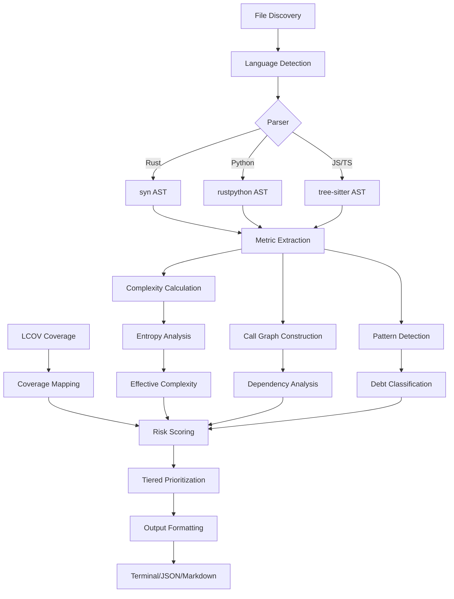

# Architecture

This chapter explains how debtmap's analysis pipeline works, from discovering files to producing prioritized technical debt recommendations.

## Analysis Pipeline Overview

Debtmap's analysis follows a multi-stage pipeline that transforms source code into actionable recommendations:



## Key Components

### 1. File Discovery and Language Detection

**Purpose:** Identify source files to analyze and determine their language.

**How it works:**
- Walks the project directory tree (respecting `.gitignore` and `.debtmapignore`)
- Detects language based on file extension (`.rs`, `.py`, `.js`, `.ts`)
- Filters out test files, build artifacts, and vendored dependencies
- Groups files by language for parallel processing

**Configuration:**
```toml
[analysis]
exclude_patterns = ["**/tests/**", "**/target/**", "**/node_modules/**"]
include_patterns = ["src/**/*.rs", "lib/**/*.py"]
```

### 2. Parser Layer

**Purpose:** Convert source code into Abstract Syntax Trees (ASTs) for analysis.

**Language-Specific Parsers:**

**Rust (syn):**
- Uses the `syn` crate for full Rust syntax support
- Extracts: functions, structs, impls, traits, macros
- Handles: async/await, generic types, lifetime annotations
- Performance: ~10-20ms per file

**Python (rustpython):**
- Uses rustpython's parser for Python 3.x syntax
- Extracts: functions, classes, methods, decorators
- Handles: comprehensions, async/await, type hints
- Performance: ~5-15ms per file

**JavaScript/TypeScript (tree-sitter):**
- Uses tree-sitter for JS/TS parsing
- Extracts: functions, classes, arrow functions, hooks
- Handles: JSX/TSX, decorators, generics
- Performance: ~8-18ms per file

**Error Handling:**
- Syntax errors logged but don't stop analysis
- Partial ASTs used when possible
- Files with parse errors excluded from final report

### 3. Metric Extraction

**Purpose:** Extract raw metrics from ASTs.

**Metrics Computed:**

**Function-Level:**
- Lines of code (LOC)
- Cyclomatic complexity (branch count)
- Nesting depth (max indentation level)
- Parameter count
- Return path count
- Comment ratio

**File-Level:**
- Total LOC
- Number of functions/classes
- Dependency count (imports)
- Documentation coverage

**Implementation:**
```rust
pub struct FunctionMetrics {
    pub name: String,
    pub location: Location,
    pub loc: u32,
    pub cyclomatic_complexity: u32,
    pub nesting_depth: u32,
    pub parameter_count: u32,
    pub return_paths: u32,
}
```

### 4. Complexity Calculation and Entropy Analysis

**Purpose:** Compute effective complexity using entropy-adjusted metrics.

**Traditional Cyclomatic Complexity:**
- Count decision points (if, match, loop, etc.)
- Each branch adds +1 to complexity
- Does not distinguish between repetitive and varied logic

**Entropy-Based Adjustment:**

Debtmap calculates pattern entropy to adjust cyclomatic complexity:

1. **Extract patterns** - Identify branch structures (e.g., all if/return patterns)
2. **Calculate variety** - Measure information entropy of patterns
3. **Adjust complexity** - Reduce score for low-entropy (repetitive) code

**Formula:**
```
Entropy = -Σ(p_i * log2(p_i))

where p_i = frequency of pattern i

Effective Complexity = Cyclomatic * (1 - (1 - Entropy/Max_Entropy) * 0.75)
```

**Example:**
```rust
// 20 similar if/return statements
// Cyclomatic: 20, Entropy: 0.3
// Effective: 20 * (1 - (1 - 0.3/4.32) * 0.75) ≈ 5.5
```

This approach reduces false positives from validation/configuration code while still flagging genuinely complex logic.

### 5. Call Graph Construction

**Purpose:** Understand function dependencies and identify critical paths.

**What's Tracked:**
- Function calls within the same file
- Cross-file calls (when possible to resolve)
- Method calls on structs/classes
- Trait/interface implementations

**Analysis:**
- **Fan-in:** How many functions call this function
- **Fan-out:** How many functions this function calls
- **Depth:** Distance from entry points (main, handlers)
- **Cycles:** Detect recursive calls

**Usage:**
- Prioritize functions called from many untested paths
- Identify central functions (high fan-in/fan-out)
- Detect test coverage gaps in critical paths

**Limitations:**
- Dynamic dispatch not fully resolved
- Cross-crate calls require additional analysis
- Closures and function pointers approximated

### 6. Pattern Detection and Debt Classification

**Purpose:** Identify specific technical debt patterns.

**Debt Categories:**

**Test Gaps:**
- Functions with 0% coverage and high complexity
- Untested error paths
- Missing edge case tests

**Complexity Issues:**
- Functions exceeding thresholds (default: 10)
- Deep nesting (3+ levels)
- Long functions (200+ LOC)

**Design Smells:**
- God functions (high fan-out)
- Unused code (fan-in = 0)
- Circular dependencies

**Implementation:**
```rust
pub enum DebtType {
    TestGap { missing_tests: u32 },
    HighComplexity { score: u32 },
    DeepNesting { depth: u32 },
    LongFunction { loc: u32 },
    TooManyParams { count: u32 },
}
```

### 7. Coverage Integration

**Purpose:** Map test coverage data to complexity metrics for risk scoring.

**Coverage Data Flow:**

1. **Read LCOV file** - Parse coverage report from test runners
2. **Map to source** - Match coverage lines to functions/branches
3. **Calculate coverage %** - For each function, compute:
   - Line coverage: % of lines executed
   - Branch coverage: % of branches taken
4. **Identify gaps** - Find untested branches in complex functions

**Coverage Scoring:**
```rust
pub struct CoverageMetrics {
    pub lines_covered: u32,
    pub lines_total: u32,
    pub branches_covered: u32,
    pub branches_total: u32,
    pub coverage_percent: f64,
}
```

**Special Cases:**
- Entry points (main, handlers) expect integration test coverage
- Generated code excluded from coverage requirements
- Test files themselves not analyzed for coverage

### 8. Risk Scoring

**Purpose:** Combine complexity and coverage into a unified risk score.

**Risk Formula:**
```
Risk Score = (Effective Complexity * Coverage Gap Weight) + (Call Graph Depth * Path Weight)

where:
- Effective Complexity: Entropy-adjusted cyclomatic complexity
- Coverage Gap Weight: 1.0 for 0% coverage, decreasing to 0.1 for 95%+
- Call Graph Depth: Distance from entry points
- Path Weight: Number of untested paths leading to this function
```

**Example Calculation:**
```rust
fn calculate_risk_score():
  Effective Complexity: 8.5
  Coverage: 30%
  Coverage Gap Weight: 0.7
  Call Graph Depth: 3
  Untested Paths: 2

  Risk = (8.5 * 0.7) + (3 * 2 * 0.3) = 5.95 + 1.8 = 7.75
```

**Risk Tiers:**
- **Critical (8.0+):** Immediate attention required
- **High (5.0-7.9):** Priority for next sprint
- **Moderate (2.0-4.9):** Address when refactoring nearby code
- **Low (<2.0):** Monitor but no immediate action

### 9. Tiered Prioritization

**Purpose:** Classify and rank technical debt items by urgency and impact.

**Prioritization Algorithm:**

1. **Calculate base risk score** (from Risk Scoring step)
2. **Apply context adjustments:**
   - Entry points: -2.0 score (lower priority for unit tests)
   - Core business logic: +1.5 score (higher priority)
   - Frequently changed files: +1.0 score (git history analysis)
   - Critical paths: +0.5 score per untested caller
3. **Classify into tiers:**
   - Critical: score >= 8.0
   - High: score >= 5.0
   - Moderate: score >= 2.0
   - Low: score < 2.0
4. **Sort within tiers by:**
   - Impact (estimated risk reduction)
   - Effort (test count or refactoring size)
   - ROI (impact / effort)

**Output:**
```rust
pub struct PrioritizedDebtItem {
    pub rank: u32,
    pub score: f64,
    pub tier: Tier,
    pub location: Location,
    pub debt_type: DebtType,
    pub action: String,
    pub impact: f64,
    pub effort: Effort,
}
```

See [Tiered Prioritization](tiered-prioritization.md) for detailed explanation of the ranking algorithm.

### 10. Output Formatting

**Purpose:** Present analysis results in user-friendly formats.

**Output Formats:**

**Terminal (default):**
- Color-coded by tier (red=critical, yellow=high, etc.)
- Hierarchical tree view with unicode box characters
- Collapsible sections for detailed recommendations
- Summary statistics at top

**JSON:**
- Machine-readable for CI/CD integration
- Full metadata for each debt item
- Structured for programmatic consumption
- Schema-versioned for compatibility

**Markdown:**
- Rendered in GitHub/GitLab for PR comments
- Embedded code blocks with syntax highlighting
- Collapsible details sections
- Linked to source code locations

**GitHub PR Comments:**
- Automated comments on pull requests
- Inline annotations at specific lines
- Comparison with base branch (new vs existing debt)
- Summary card with key metrics

See [Output Formats](output-formats.md) for examples and configuration options.

## Data Flow Example

Let's trace a single function through the entire pipeline:

**Input: Source File**
```rust
// src/handlers.rs
pub fn process_request(req: Request) -> Result<Response> {
    validate_auth(&req)?;
    let data = parse_payload(&req.body)?;
    let result = apply_business_logic(data)?;
    format_response(result)
}
```

**Stage 1: Parsing**
```rust
FunctionAst {
    name: "process_request",
    location: Location { file: "src/handlers.rs", line: 2 },
    calls: ["validate_auth", "parse_payload", "apply_business_logic", "format_response"],
    ...
}
```

**Stage 2: Metric Extraction**
```rust
FunctionMetrics {
    name: "process_request",
    cyclomatic_complexity: 4,  // 3 ?-operators + base
    nesting_depth: 1,
    loc: 5,
    ...
}
```

**Stage 3: Entropy Analysis**
```rust
// Pattern: repetitive ?-operator error handling
Entropy: 0.4 (low variety)
Effective Complexity: 4 * 0.85 = 3.4
```

**Stage 4: Call Graph**
```rust
CallGraphNode {
    function: "process_request",
    fan_in: 3,  // called from 3 handlers
    fan_out: 4,  // calls 4 functions
    depth: 1,  // direct handler (entry point)
}
```

**Stage 5: Coverage (from LCOV)**
```rust
CoverageMetrics {
    lines_covered: 5,
    lines_total: 5,
    branches_covered: 3,
    branches_total: 4,  // Missing one error path
    coverage_percent: 75%,
}
```

**Stage 6: Risk Scoring**
```rust
Risk = (3.4 * 0.25) + (1 * 1 * 0.2) = 0.85 + 0.2 = 1.05
Tier: LOW (entry point with decent coverage)
```

**Stage 7: Recommendation**
```
#23 SCORE: 1.1 [LOW]
├─ MINOR GAP: ./src/handlers.rs:2 process_request()
├─ ACTION: Add 1 test for error path at line 3
├─ IMPACT: -0.3 risk reduction
└─ WHY: Entry point with 75% branch coverage, missing error case
```

## Performance Characteristics

**Analysis Speed:**
- Small project (< 10k LOC): 1-3 seconds
- Medium project (10-50k LOC): 5-15 seconds
- Large project (50-200k LOC): 20-60 seconds
- Very large project (200k+ LOC): 1-5 minutes

**Parallelization:**
- File parsing: Parallel across all available cores
- Metric extraction: Parallel per-file
- Call graph construction: Sequential (requires cross-file state)
- Risk scoring: Parallel per-function
- Output formatting: Sequential

**Memory Usage:**
- Approx 100-200 KB per file analyzed
- Peak memory for large projects: 500 MB - 1 GB
- Streaming mode available for very large codebases

**Optimization Strategies:**
- Incremental analysis (cache previous results)
- Skip unchanged files (git diff integration)
- Parallel processing with rayon
- Efficient AST traversal (visitor pattern)

## Extension Points

**Custom Analyzers:**
Implement the `Analyzer` trait to add language support:

```rust
pub trait Analyzer {
    fn parse(&self, content: &str) -> Result<Ast>;
    fn extract_metrics(&self, ast: &Ast) -> Vec<FunctionMetrics>;
    fn detect_patterns(&self, ast: &Ast) -> Vec<DebtPattern>;
}
```

**Custom Scoring:**
Implement the `RiskScorer` trait to adjust scoring logic:

```rust
pub trait RiskScorer {
    fn calculate_risk(&self, metrics: &FunctionMetrics, coverage: &CoverageMetrics) -> f64;
    fn classify_tier(&self, score: f64) -> Tier;
}
```

**Custom Output:**
Implement the `OutputFormatter` trait for new formats:

```rust
pub trait OutputFormatter {
    fn format(&self, items: &[PrioritizedDebtItem]) -> Result<String>;
}
```

## Next Steps

- **Understand prioritization:** See [Tiered Prioritization](tiered-prioritization.md)
- **Learn scoring strategies:** See [Scoring Strategies](scoring-strategies.md)
- **Configure analysis:** See [Configuration](configuration.md)
- **View examples:** See [Examples](examples.md)
