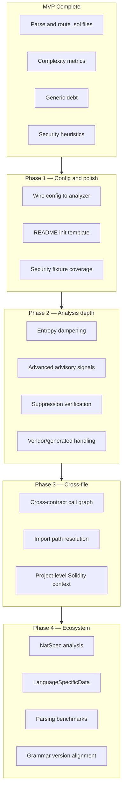

# Solidity Support — Remaining Work

This document tracks what is **done**, what is **partially implemented**, and what remains to bring Solidity analysis in debtmap to parity with mature language support (Rust/TypeScript) and the original implementation plan.

**Status as of MVP delivery:** Solidity is usable for single-file and project analysis via `--languages sol`. The analyzer produces `FunctionMetrics`, `FileMetrics`, complexity debt, generic smells, and heuristic security advisories. Everything below builds on that foundation.

---

## Current State Summary

### Implemented

| Area | Location | Notes |
|------|----------|-------|
| Language routing | `src/core/mod.rs`, `src/utils/language_parser.rs`, `src/io/walker.rs` | `.sol` extension, CLI aliases `solidity` / `sol` |
| Parser | `src/analyzers/solidity/parser.rs` | `tree-sitter-solidity` 1.2.13, `tree-sitter` 0.25 |
| Analyzer trait | `src/analyzers/solidity/analyzer.rs` | Registered in `get_analyzer()` |
| Complexity | `src/analyzers/solidity/complexity.rs`, `visitor.rs` | Cyclomatic, cognitive, nesting, function length |
| Callable extraction | `src/analyzers/solidity/visitor.rs` | Functions, modifiers, constructor, fallback, receive |
| Generic debt | `src/analyzers/solidity/debt/mod.rs` | Threshold complexity, nesting, length, TODO/FIXME, smells |
| Security advisories | `src/analyzers/solidity/debt/security_patterns.rs` | 11 heuristic patterns (see below) |
| Dependencies | `src/analyzers/solidity/dependencies.rs` | Imports + inheritance (`DependencyKind::Inheritance`) |
| Test detection | `src/analyzers/solidity/test_detection.rs` | Foundry `*.t.sol`, `forge-std/Test.sol` |
| Batch / validation | `src/analyzers/batch.rs`, `src/builders/validated_analysis.rs` | Parse validation wired |
| Config schema | `src/config/languages.rs` | `SolidityLanguageConfig`, `SoliditySecurityConfig` (schema only) |
| LOC counting | `src/metrics/loc_counter.rs` | `LocLanguage::Solidity` |
| Tests | `src/analyzers/solidity/*`, `tests/solidity_analyzer_tests.rs` | 15 unit + 10 integration tests |
| Book docs | `book/src/configuration/languages.md`, etc. | Partial updates |

### Security patterns currently detected

| Pattern ID | Priority (typical) |
|------------|-------------------|
| `tx-origin-usage` | High |
| `unchecked-low-level-call` | High |
| `external-call-before-state-update` | High |
| `delegatecall-usage` | Medium |
| `selfdestruct-usage` | Medium |
| `assembly-block` | Medium |
| `unbounded-loop` | Medium |
| `missing-access-control` | Medium |
| `large-contract` | Medium |
| `hardcoded-address` | Low |
| `floating-pragma` | Low |

All advisories use “review recommended” wording — not formal verification.

---

## Gap Overview



---

## Phase 1: Config Wiring and User-Facing Polish

**Goal:** Make existing behavior configurable and visible. Low risk, high user value.

### 1.1 Wire `SolidityLanguageConfig` into the analyzer

**Problem:** Config structs exist in [`src/config/languages.rs`](../src/config/languages.rs) but [`SolidityAnalyzer`](../src/analyzers/solidity/analyzer.rs) ignores them. Security checks are always on; `large_contract_threshold` is hardcoded to `20` in [`security_patterns.rs`](../src/analyzers/solidity/debt/security_patterns.rs).

**Tasks:**

1. Add config accessor in [`src/config/accessors.rs`](../src/config/accessors.rs):
   ```rust
   pub fn get_solidity_config() -> SolidityLanguageConfig
   ```

2. Extend `SolidityAnalyzer` (mirror [`GoAnalyzer`](../src/analyzers/go/analyzer.rs)):
   - `with_config(SolidityLanguageConfig)` or load from `get_solidity_config()` in `new()`
   - Pass config through `orchestration.rs` → `debt/` → `security_patterns.rs`

3. Gate each security pattern on its config flag:
   - Extend `SoliditySecurityConfig` with toggles for **all** patterns (today only 4 flags exist; add the rest or group them logically)
   - Respect `detect_complexity`, `detect_duplication`, `detect_dead_code` from flattened `LanguageFeatures`

4. Pass `large_contract_threshold` into `detect_contract_patterns()` instead of literal `20`.

5. Wire batch analysis in [`src/analyzers/batch.rs`](../src/analyzers/batch.rs):
   - Add `solidity_config_from_debtmap(config)` similar to `go_generated_code_mode()`
   - Optionally pass global complexity threshold from `DebtmapConfig` (today hardcoded default `10`)

**Files to touch:**

- `src/config/accessors.rs`
- `src/analyzers/solidity/analyzer.rs`
- `src/analyzers/solidity/orchestration.rs`
- `src/analyzers/solidity/debt/mod.rs`
- `src/analyzers/solidity/debt/security_patterns.rs`
- `src/analyzers/batch.rs`
- `src/config/languages.rs` (expand `SoliditySecurityConfig` if needed)

**Tests:**

- Config disables `tx_origin` → no `tx-origin-usage` debt
- `large_contract_threshold = 5` triggers advisory on smaller contract
- Config test in `src/config/mod.rs` (follow Go config test pattern)

**Estimated effort:** 1–2 days

---

### 1.2 README and init template

**Problem:** User-facing entry points still list five languages.

**Tasks:**

1. Update [`README.md`](../README.md):
   - Supported languages list
   - Example: `debtmap analyze ./contracts --languages sol`
   - Roadmap checkbox for Solidity

2. Update [`src/commands/init.rs`](../src/commands/init.rs) default template:
   ```toml
   enabled = ["rust", "python", "solidity"]
   # or include all six — decide product default
   [languages.solidity]
   detect_complexity = true
   ```

3. Align [`book/src/configuration/languages.md`](../book/src/configuration/languages.md) — ensure all `enabled` examples include `solidity` consistently.

**Estimated effort:** 0.5 day

---

### 1.3 Security pattern test coverage

**Problem:** Only `tx-origin-usage` has a dedicated positive test. Plan called for positive + negative fixture per pattern.

**Tasks:**

1. Expand `tests/fixtures/solidity/security/`:
   ```
   security/
   ├── tx_origin_positive.sol / tx_origin_negative.sol
   ├── unchecked_call_positive.sol / unchecked_call_negative.sol
   ├── reentrancy_positive.sol / reentrancy_negative.sol
   ├── assembly_positive.sol / assembly_negative.sol
   ├── access_control_positive.sol / access_control_negative.sol
   └── ...
   ```

2. Add parametrized integration tests in `tests/solidity_analyzer_tests.rs` asserting pattern presence/absence.

3. Add unit tests in `security_patterns.rs` for edge cases (nested assembly, `require` wrapping calls, etc.).

**Estimated effort:** 1–2 days

---

## Phase 2: Analysis Depth

**Goal:** Reduce false positives and add signals comparable to Go’s `advanced.rs`.

### 2.1 Entropy dampening

**Problem:** Repetitive Solidity patterns (similar `require` chains, boilerplate ERC hooks) inflate cognitive scores. Rust/JS/TS use [`LanguageEntropyAnalyzer`](../src/complexity/entropy_core.rs).

**Tasks:**

1. Create `src/analyzers/solidity/entropy/`:
   - `token.rs` — `SolidityEntropyToken` implementing `EntropyToken`
   - `analyzer.rs` — `SolidityEntropyAnalyzer` implementing `LanguageEntropyAnalyzer`
   - Classify: keywords, identifiers, literals, operators, `require`/`assert`/`revert`

2. Integrate in `visitor.rs` / `metrics.rs`:
   - Populate `FunctionMetrics.entropy_analysis`, `entropy_score`, `adjusted_complexity`

3. Follow [`src/analyzers/typescript/entropy/`](../src/analyzers/typescript/entropy/) as template (tree-sitter token walk).

**Tests:** Property tests for dampening on repetitive require chains vs genuinely complex control flow.

**Estimated effort:** 3–5 days

---

### 2.2 Advanced advisory signals (`advanced.rs`)

**Problem:** Go detects swallowed errors, goroutines, defer-in-loop, etc. Solidity lacks equivalent depth.

**Candidate signals:**

| Signal | Detection approach |
|--------|-------------------|
| `unchecked-arithmetic` | Pre-0.8.0 style or missing `SafeMath`/checked blocks |
| `unsafe-erc20-transfer` | `transfer`/`transferFrom` without return check (non-standard tokens) |
| `push-without-length-cap` | `.push()` in loop without max length |
| `self-assign-reentrancy` | State read after external call in same function |
| `block-timestamp-dependency` | `block.timestamp` in critical logic |
| `tx-gas-price-dependency` | `tx.gasprice` usage |
| `encode-packed-collision` | `abi.encodePacked` with dynamic types |
| `delegatecall-in-constructor` | Proxy misconfiguration heuristic |

**Tasks:**

1. Add `src/analyzers/solidity/advanced.rs` with pure detection functions
2. Merge patterns into `SolidityFunction.advisory_patterns` in visitor
3. Map to debt items in `debt/mod.rs` (reuse Go advisory pattern)

**Estimated effort:** 3–4 days

---

### 2.3 Suppression support verification

**Problem:** [`get_comment_prefix_pattern`](../src/debt/suppression.rs) maps unknown languages to `//`, which should work for Solidity — but this is **untested**.

**Tasks:**

1. Add suppression tests with `Language::Solidity` and `// debtmap:ignore` comments
2. Verify block and line suppressions filter complexity/security debt correctly
3. Document Solidity suppression syntax in book

**Estimated effort:** 0.5–1 day

---

### 2.4 Vendor and generated contract handling

**Problem:** Go suppresses `*.pb.go`, mockgen output. Solidity projects include OpenZeppelin, Foundry `out/`, Hardhat `artifacts/`.

**Tasks:**

1. Add `src/analyzers/solidity/generated.rs`:
   - Detect `@openzeppelin/contracts` imports-only vendor files (optional exclude)
   - Skip `out/`, `cache/`, `artifacts/`, `node_modules/` via existing walker ignore patterns
   - SPDX + “Automatically generated” header detection

2. Optional config (mirror Go):
   ```toml
   [languages.solidity]
   vendor_code = "suppress_debt"  # analyze | suppress_debt | exclude
   ```

3. Update default ignore patterns in config if not already covering Foundry/Hardhat dirs.

**Estimated effort:** 1–2 days

---

### 2.5 Hardhat test detection

**Problem:** Only Foundry tests are detected (`*.t.sol`, `forge-std`).

**Tasks:**

1. Extend `test_detection.rs`:
   - `@nomicfoundation/hardhat-chai-matchers` / `hardhat` import paths
   - File naming: `*.test.sol` convention (if used)
   - `contract.*Test` naming (already partial via `is_test_contract_name`)

2. Add fixtures and tests.

**Estimated effort:** 0.5 day

---

### 2.6 Heuristic quality improvements

**Problem:** Current security detectors are intentionally simple and produce false positives/negatives.

**Priority refinements:**

| Pattern | Current weakness | Improvement |
|---------|------------------|-------------|
| `external-call-before-state-update` | Flat statement order scan | Walk AST for CEI ordering; distinguish `transfer` vs internal calls |
| `unchecked-low-level-call` | Parent text `require` check | Detect `(bool success, )` destructuring and `if (!success)` |
| `missing-access-control` | String search for `onlyOwner` | Parse modifier list; detect `_checkOwner()`-style internal guards |
| `unbounded-loop` | Crude array-length heuristic | Track `storage` array `.length` vs calldata with explicit bounds |
| `hardcoded-address` | Token split | Regex with word boundaries; exclude common constants |

**Tasks:** Incremental PRs per pattern with fixture-driven tests.

**Estimated effort:** 2–4 days (ongoing)

---

## Phase 3: Cross-File and Project-Level Analysis

**Goal:** Enable architectural insights across a Solidity codebase.

### 3.1 Import path resolution

**Problem:** [`dependencies.rs`](../src/analyzers/solidity/dependencies.rs) records raw import strings (`"./Token.sol"`) but does not resolve to project files.

**Tasks:**

1. Build remapping support:
   - Foundry `remappings.txt`
   - Hardhat config paths (lower priority)

2. Resolve import paths to absolute project paths for dependency graph.

3. Feed resolved graph into [`src/debt/circular.rs`](../src/debt/circular.rs).

**Estimated effort:** 3–5 days

---

### 3.2 Cross-contract call graph

**Problem:** `FunctionMetrics.call_dependencies` contains raw call text (`token.transfer`) with no cross-file linking.

**Tasks:**

1. Add `src/analyzers/solidity/call_graph.rs`:
   - Parse `call_expression`, `member_expression` with type hints where possible
   - Link interface calls (`IERC20(token).transfer`) to imported symbols

2. Integrate with existing [`call_graph/`](../src/analyzers/call_graph/) infrastructure or add Solidity-specific project pass (like Go cross-file resolution in `batch.rs`).

3. Emit `upstream_callers` / `downstream_callees` on `FunctionMetrics`.

**Estimated effort:** 5–8 days

---

### 3.3 Contract-level project metrics

**Tasks:**

1. Populate `FileMetrics.classes` with richer `ClassDef` (method list, line numbers, abstract/interface flag)
2. Project-level aggregation: contracts per file, inheritance depth, external call surface
3. Optional: proxy pattern detection (EIP-1967 slot, `delegatecall` in constructor)

**Estimated effort:** 2–3 days

---

## Phase 4: Extended Features and Infrastructure

### 4.1 NatSpec / documentation debt

**Tasks:**

1. Parse `/// @notice`, `@dev`, `@param` NatSpec blocks (text-level or tree-sitter comment nodes)
2. Debt types:
   - Missing NatSpec on public/external functions
   - Empty or placeholder `@notice`
   - Mismatch between `@param` count and function signature

**Estimated effort:** 2–3 days

---

### 4.2 `LanguageSpecificData::Solidity(...)`

**Problem:** [`FunctionMetrics.language_specific`](../src/core/mod.rs) only has a Rust variant today.

**Tasks:**

1. Define `SolidityPatternResult` (proxy usage, upgradeable pattern, payable functions, state mutability)
2. Add enum variant and serialization tests
3. Surface in JSON/TUI output

**Estimated effort:** 1–2 days

---

### 4.3 Purity analysis (EVM-aware)

**Problem:** Deferred from MVP. Solidity “pure/view/payable” mutability exists at language level but debtmap does not use it.

**Tasks:**

1. Extract state mutability from function definition nodes
2. Detect state writes (`SSTORE` heuristic via assignment to state variables)
3. Classify `PurityLevel` for Solidity functions (ReadOnly for `view`, etc.)
4. Flag `nonReentrant` modifier absence on state-changing external calls (optional)

**Estimated effort:** 3–4 days

---

### 4.4 Single-pass extraction layer

**Problem:** Rust uses [`UnifiedFileExtractor`](../src/extraction/extractor.rs) to avoid re-parsing. Solidity re-walks the tree in visitor + debt + dependencies.

**Tasks:**

1. Add `src/extraction/solidity.rs` — one walk producing `ExtractedFileData`
2. Adapter in `src/extraction/adapters/` → `FileMetrics`
3. Benchmark parse+analyze time before/after

**Estimated effort:** 3–5 days (optimization, not blocking)

---

### 4.5 Parsing benchmarks

**Tasks:**

1. Add `benches/solidity_parsing_bench.rs` (criterion)
2. Fixtures: small contract, Uniswap-style size, deeply nested control flow
3. CI threshold or tracking only (no hard gate initially)

**Estimated effort:** 0.5–1 day

---

### 4.6 Tree-sitter grammar alignment

**Problem:** Core bumped to `tree-sitter 0.25` for Solidity ABI 15; other grammars remain on `0.23`.

**Tasks:**

1. Evaluate bumping `tree-sitter-javascript`, `tree-sitter-python`, `tree-sitter-go`, `tree-sitter-typescript` to 0.25-compatible versions
2. Run full test suite + parser smoke tests
3. Pin exact versions in `Cargo.toml`

**Risk:** ABI breakage across grammars. Do as dedicated PR with rollback plan.

**Estimated effort:** 1–2 days

---

### 4.7 External tool integration (optional, long-term)

| Tool | Integration idea |
|------|------------------|
| Slither | Feature flag to merge Slither JSON detectors into `DebtItem` |
| Mythril | Post-process symbolic findings |
| Foundry coverage | LCOV from `forge coverage` for risk scoring |

**Not recommended until core heuristics stabilize** — avoids duplicate/conflicting signals.

**Estimated effort:** 5+ days each

---

## Phase 5: AST and Pattern Extraction Gaps

### 5.1 `Ast::Solidity` node extraction

**Problem:** [`Ast::extract_nodes()`](../src/core/ast.rs) returns `vec![]` for Solidity — pattern/design extraction pipeline skips `.sol` files.

**Tasks:**

1. Implement `extract_solidity_nodes()` mapping contracts → `NodeKind::Class`, functions → `NodeKind::Function`
2. Enable architectural analysis stages that consume `AstNode` trees

**Estimated effort:** 1–2 days

---

## Recommended PR Sequence

Split work into reviewable PRs:

| PR | Scope | Depends on |
|----|-------|------------|
| **PR A** | Config wiring + security toggles + threshold | — |
| **PR B** | README, init template, book polish | — |
| **PR C** | Security fixture suite (all patterns) | — |
| **PR D** | Suppression tests for Solidity | — |
| **PR E** | Entropy dampening | — |
| **PR F** | Advanced advisory signals | PR C |
| **PR G** | Heuristic refinements (batch 1: reentrancy, unchecked calls) | PR C |
| **PR H** | Vendor/generated code handling | PR A |
| **PR I** | Import remapping + circular deps | — |
| **PR J** | Cross-contract call graph | PR I |
| **PR K** | NatSpec debt | — |
| **PR L** | `LanguageSpecificData`, mutability/purity | PR E |
| **PR M** | tree-sitter 0.25 grammar alignment | — |
| **PR N** | Benchmarks + extraction optimization | PR M |

PRs A–D can land in parallel. PR J depends on import resolution (PR I).

---

## Quality Gates (per PR)

Every Solidity PR should satisfy:

```bash
just fmt
cargo test --lib analyzers::solidity
cargo test --test solidity_analyzer_tests
cargo test --test language_tests
```

Before merge to main:

```bash
just test   # full suite
```

Add clippy clean for touched modules.

---

## Risk Register

| Risk | Mitigation |
|------|------------|
| `tree-sitter-solidity` AST instability | Pin exact version; parser regression tests on upgrade |
| Security heuristic false positives | Config opt-out per pattern; conservative defaults; clear advisory wording |
| Cross-file resolution complexity | Start with Foundry remappings only; defer Hardhat |
| Entropy token classifier accuracy | Property tests; compare adjusted scores on real fixtures |
| Grammar bump breaks JS/Python/Go | Dedicated PR, multi-platform CI, pin all grammars together |

---

## Definition of Done (Full Solidity Support)

Solidity support is **feature-complete** (beyond MVP) when:

- [ ] All config in `debtmap.toml` is honored at runtime
- [ ] Entropy dampening active for Solidity functions
- [ ] All 11+ security patterns have positive/negative fixture tests
- [ ] Suppression comments verified for `.sol` files
- [ ] Import remapping resolves dependencies for Foundry projects
- [ ] Cross-contract call graph populated on project analysis
- [ ] README and init template list Solidity
- [ ] NatSpec missing-docs detection on public/external functions
- [ ] No known parser ABI mismatches across tree-sitter grammars

---

## Out of Scope (Explicit)

- Formal verification or symbolic execution
- Replacing Slither/Mythril/Foundry built-in linters
- Yul-only files (`.yul`) — separate grammar would be needed
- Vyper support — separate language module
- On-chain bytecode analysis

---

## References

- MVP implementation: `src/analyzers/solidity/`
- Original plan: `.cursor/plans/add_solidity_support_*.plan.md` (Cursor plan artifact)
- Go analyzer template: `src/analyzers/go/`
- TypeScript entropy template: `src/analyzers/typescript/entropy/`
- Config schema: `src/config/languages.rs`
- Integration tests: `tests/solidity_analyzer_tests.rs`
- Fixtures: `tests/fixtures/solidity/`
