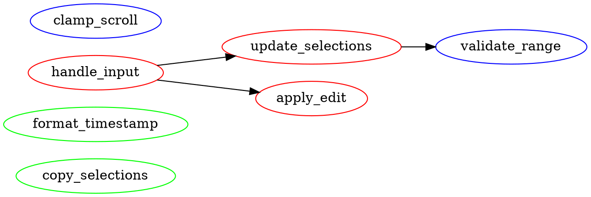

# Specification 179: Coupling and Dependency Visualization for God Objects

**Category**: foundation
**Priority**: high
**Status**: draft
**Dependencies**: [178 - Behavioral Decomposition Recommendations]

## Context

Current debtmap analysis identifies god objects and massive files but provides no visibility into **method coupling** or **dependency relationships**. This makes it difficult for developers to:

1. **Understand extraction safety**: Which methods can be safely extracted without breaking dependencies?
2. **Prioritize refactoring**: Which methods are "hub" methods vs leaf methods?
3. **Plan incremental refactoring**: What order should methods be extracted in?
4. **Assess risk**: How many other methods will be affected by extracting a method?

**Current Gap** (from Zed editor.rs analysis):
```
DEPENDENCIES: 1614 functions may have complex interdependencies
```

This vague statement provides no actionable information about:
- Which methods call which other methods
- Which methods are highly coupled vs loosely coupled
- Which methods are safe to extract first
- What the dependency graph looks like

**Real-World Impact**: Developers attempting to refactor editor.rs (675 methods) have no guidance on:
- Which 10-20 methods to extract first (lowest risk)
- Which methods form dependency clusters
- Which methods are "hubs" that many others depend on
- Which methods are "leaves" with no dependents

## Objective

Implement coupling and dependency analysis for god objects to provide:
1. **Method-level call graph** showing who calls whom
2. **Coupling metrics** for each method (fan-in, fan-out, coupling score)
3. **Extraction order recommendations** based on coupling analysis
4. **Visual or textual representation** of dependency structure
5. **Risk assessment** for extracting specific method groups

## Requirements

### Functional Requirements

1. **Method Call Graph Construction**
   - Build directed graph of method calls within god object impls
   - Track both direct calls (explicit) and indirect calls (trait methods)
   - Include calls to methods on fields (composition relationships)
   - Handle recursive calls and cycles
   - Weight edges by call frequency (if detectable from AST)

2. **Coupling Metrics Calculation**
   - **Fan-in**: Number of methods that call this method
   - **Fan-out**: Number of methods this method calls
   - **Afferent coupling (Ca)**: External callers from other modules
   - **Efferent coupling (Ce)**: External dependencies on other modules
   - **Instability**: I = Ce / (Ce + Ca), range [0,1]
   - **Coupling score**: Composite metric for extraction priority

3. **Method Classification by Coupling**
   - **Hub methods**: High fan-in (many callers), low fan-out
   - **Utility methods**: High fan-in, high fan-out
   - **Leaf methods**: Low fan-in, low fan-out (best extraction candidates)
   - **Orchestrators**: Low fan-in, high fan-out (coordinate other methods)
   - **Isolated methods**: Zero fan-in from other methods (easy extraction)

4. **Dependency Cluster Detection**
   - Identify strongly connected components (SCCs) in call graph
   - Detect cyclic dependencies between methods
   - Group methods by dependency cluster
   - Calculate cluster cohesion and coupling

5. **Extraction Safety Analysis**
   - Identify methods safe to extract (low coupling, no cycles)
   - Flag methods that require careful refactoring (hub methods, cycles)
   - Suggest extraction order based on coupling (leaf-first traversal)
   - Estimate refactoring risk: Low, Medium, High

6. **Dependency Visualization Output**
   - Generate textual dependency tree for top methods
   - Show call chains for complex dependencies
   - Display coupling metrics in recommendation output
   - Provide DOT format output for graphviz visualization (optional)

### Non-Functional Requirements

1. **Performance**: Call graph construction should add <10% to analysis time
2. **Scalability**: Handle god objects with 1000+ methods efficiently
3. **Accuracy**: Coupling metrics should reflect actual code dependencies
4. **Usability**: Visualization should be understandable without graph theory knowledge
5. **Configurability**: Allow limiting depth of dependency traversal for very large objects

## Acceptance Criteria

- [ ] Method call graph constructed for all god object impl blocks
- [ ] Coupling metrics calculated for each method in god objects
- [ ] Methods classified as Hub, Utility, Leaf, Orchestrator, or Isolated
- [ ] Extraction order recommendations provided based on coupling
- [ ] Dependency clusters identified and reported
- [ ] Strongly connected components (cycles) detected and flagged
- [ ] Recommendation output shows:
  - Top 10 safest methods to extract (lowest coupling)
  - Top 10 riskiest methods (highest coupling, hub methods)
  - Dependency clusters and their sizes
  - Suggested extraction order with risk levels
- [ ] Example dependency visualization shown for top recommendation
- [ ] When run on Zed editor.rs:
  - Identifies isolated/leaf methods safe to extract
  - Flags hub methods requiring careful handling
  - Shows dependency clusters
  - Recommends extraction order
  - Displays coupling metrics for key methods

## Technical Details

### Implementation Approach

#### 1. Call Graph Construction

```rust
use petgraph::graph::{DiGraph, NodeIndex};
use std::collections::HashMap;

struct MethodCallGraph {
    graph: DiGraph<MethodNode, CallEdge>,
    method_index: HashMap<String, NodeIndex>,
}

struct MethodNode {
    method_name: String,
    is_public: bool,
    is_mutable: bool,  // Has &mut self receiver
    line_count: usize,
    complexity: u32,
}

struct CallEdge {
    call_count: usize,  // Frequency if detectable
    is_direct: bool,    // vs trait method call
}

impl MethodCallGraph {
    fn add_method(&mut self, method: MethodNode) -> NodeIndex;
    fn add_call(&mut self, caller: &str, callee: &str, is_direct: bool);
    fn calculate_metrics(&self) -> HashMap<String, CouplingMetrics>;
    fn find_strongly_connected_components(&self) -> Vec<Vec<String>>;
    fn topological_sort(&self) -> Result<Vec<String>, Vec<String>>;
}
```

#### 2. Coupling Metrics

```rust
struct CouplingMetrics {
    method_name: String,

    // Basic coupling
    fan_in: usize,           // Methods calling this method
    fan_out: usize,          // Methods this method calls

    // External coupling
    afferent_coupling: usize,  // External callers
    efferent_coupling: usize,  // External dependencies
    instability: f64,          // Ce / (Ce + Ca)

    // Derived metrics
    coupling_score: f64,     // Composite score for prioritization
    extraction_risk: RiskLevel,
    classification: MethodClassification,
}

enum RiskLevel {
    Low,      // Coupling score < 0.3, safe to extract
    Medium,   // Coupling score 0.3-0.6, needs care
    High,     // Coupling score > 0.6, risky extraction
}

enum MethodClassification {
    Hub,          // fan_in > 10, fan_out < 5
    Utility,      // fan_in > 5, fan_out > 5
    Leaf,         // fan_in < 3, fan_out < 3
    Orchestrator, // fan_in < 3, fan_out > 10
    Isolated,     // fan_in == 0 (only called externally or not at all)
}

impl CouplingMetrics {
    fn calculate_score(&self) -> f64 {
        // Higher score = higher coupling = harder to extract
        let fan_weight = 0.4;
        let external_weight = 0.3;
        let instability_weight = 0.3;

        let normalized_fan = (self.fan_in + self.fan_out) as f64 / 20.0;
        let normalized_external = (self.afferent_coupling + self.efferent_coupling) as f64 / 10.0;

        (normalized_fan * fan_weight) +
        (normalized_external * external_weight) +
        (self.instability * instability_weight)
    }

    fn classify(&self) -> MethodClassification {
        if self.fan_in == 0 {
            return MethodClassification::Isolated;
        }

        match (self.fan_in, self.fan_out) {
            (fi, fo) if fi > 10 && fo < 5 => MethodClassification::Hub,
            (fi, fo) if fi > 5 && fo > 5 => MethodClassification::Utility,
            (fi, fo) if fi < 3 && fo > 10 => MethodClassification::Orchestrator,
            (fi, fo) if fi < 3 && fo < 3 => MethodClassification::Leaf,
            _ => MethodClassification::Utility,  // Default
        }
    }

    fn risk_level(&self) -> RiskLevel {
        if self.coupling_score < 0.3 {
            RiskLevel::Low
        } else if self.coupling_score < 0.6 {
            RiskLevel::Medium
        } else {
            RiskLevel::High
        }
    }
}
```

#### 3. Dependency Cluster Detection

```rust
use petgraph::algo::{kosaraju_scc, tarjan_scc};

struct DependencyCluster {
    methods: Vec<String>,
    internal_calls: usize,
    external_calls: usize,
    cohesion: f64,  // internal / (internal + external)
}

impl MethodCallGraph {
    fn find_clusters(&self) -> Vec<DependencyCluster> {
        let sccs = kosaraju_scc(&self.graph);

        sccs.into_iter()
            .filter(|scc| scc.len() > 1)  // Ignore trivial SCCs
            .map(|scc| self.analyze_cluster(scc))
            .collect()
    }

    fn analyze_cluster(&self, nodes: Vec<NodeIndex>) -> DependencyCluster {
        let methods: Vec<String> = nodes.iter()
            .map(|&n| self.graph[n].method_name.clone())
            .collect();

        let (internal_calls, external_calls) = self.count_calls(&nodes);
        let cohesion = internal_calls as f64 / (internal_calls + external_calls) as f64;

        DependencyCluster {
            methods,
            internal_calls,
            external_calls,
            cohesion,
        }
    }
}
```

#### 4. Extraction Order Recommendation

```rust
struct ExtractionPlan {
    phases: Vec<ExtractionPhase>,
}

struct ExtractionPhase {
    phase_number: usize,
    description: String,
    methods: Vec<String>,
    risk_level: RiskLevel,
    rationale: String,
}

impl MethodCallGraph {
    fn generate_extraction_plan(&self, metrics: &HashMap<String, CouplingMetrics>) -> ExtractionPlan {
        let mut phases = Vec::new();

        // Phase 1: Isolated methods (zero internal fan-in)
        let isolated: Vec<_> = metrics.iter()
            .filter(|(_, m)| matches!(m.classification, MethodClassification::Isolated))
            .map(|(name, _)| name.clone())
            .collect();

        if !isolated.is_empty() {
            phases.push(ExtractionPhase {
                phase_number: 1,
                description: "Extract isolated methods (no internal callers)".to_string(),
                methods: isolated,
                risk_level: RiskLevel::Low,
                rationale: "These methods are only called from outside the impl or not at all".to_string(),
            });
        }

        // Phase 2: Leaf methods (low coupling)
        let leaves: Vec<_> = metrics.iter()
            .filter(|(_, m)| matches!(m.classification, MethodClassification::Leaf))
            .filter(|(_, m)| matches!(m.extraction_risk, RiskLevel::Low))
            .map(|(name, _)| name.clone())
            .collect();

        if !leaves.is_empty() {
            phases.push(ExtractionPhase {
                phase_number: 2,
                description: "Extract leaf methods (low coupling)".to_string(),
                methods: leaves,
                risk_level: RiskLevel::Low,
                rationale: "Low fan-in and fan-out makes these safe to extract".to_string(),
            });
        }

        // Phase 3: Behavioral clusters (from Spec 178)
        // ... integrate with behavioral decomposition

        // Phase N: Hub methods (defer to end)
        let hubs: Vec<_> = metrics.iter()
            .filter(|(_, m)| matches!(m.classification, MethodClassification::Hub))
            .map(|(name, _)| name.clone())
            .collect();

        if !hubs.is_empty() {
            phases.push(ExtractionPhase {
                phase_number: phases.len() + 1,
                description: "Refactor hub methods (high risk)".to_string(),
                methods: hubs,
                risk_level: RiskLevel::High,
                rationale: "Many callers depend on these; requires careful interface design".to_string(),
            });
        }

        ExtractionPlan { phases }
    }
}
```

### Output Format Enhancement

```
#1 SCORE: 25904 [CRITICAL]
└─ ./crates/editor/src/editor.rs (24902 lines, 1614 functions)
└─ WHY THIS MATTERS: This struct violates single responsibility principle...
└─ ACTION: URGENT: 24902 lines, 1614 functions! ...

└─ COUPLING ANALYSIS:
   - 675 methods analyzed
   - 15 isolated methods (0 internal callers) - SAFE EXTRACTION
   - 89 leaf methods (low coupling score <0.3) - LOW RISK
   - 234 utility methods (medium coupling) - MEDIUM RISK
   - 52 hub methods (high fan-in >10) - HIGH RISK
   - 12 dependency clusters detected (largest: 23 methods)
   - 3 cyclic dependencies detected - REFACTOR REQUIRED

└─ EXTRACTION PRIORITY ORDER:

   [PHASE 1] Extract isolated methods (15 methods) - Risk: LOW
   └─ Methods: copy_selections(), clipboard_content(),
               get_syntax_theme(), format_timestamp(), ... +11 more
   └─ Rationale: No internal callers; safe to move to utility module
   └─ Suggested module: editor_utils.rs

   [PHASE 2] Extract leaf methods (89 methods) - Risk: LOW
   └─ Methods: validate_selection_range(), normalize_coordinates(),
               clamp_scroll_position(), ... +86 more
   └─ Rationale: Low coupling (fan-in <3, fan-out <3)
   └─ Suggested modules: validation.rs, coordinates.rs, scroll.rs

   [PHASE 3] Extract rendering cluster (42 methods) - Risk: MEDIUM
   └─ Methods: render(), paint_text(), draw_cursor(), render_gutter(),
               paint_highlights(), layout_inlays(), ... +36 more
   └─ Coupling: High internal cohesion (0.78), 8 external dependencies
   └─ Dependency cycle: render() -> layout_inlays() -> compute_layout() -> render()
   └─ Suggested: Extract as trait with careful cycle breaking

   [PHASE 4] Hub methods - DEFER (52 methods) - Risk: HIGH
   └─ Methods: update_selections(), handle_input(), apply_edit(), ... +49 more
   └─ Warning: High fan-in (avg 12.4 callers per method)
   └─ Recommendation: Refactor last after reducing overall complexity

└─ DEPENDENCY CLUSTERS:

   Cluster 1: Rendering (42 methods, cohesion: 0.78)
   └─ Internal calls: 156, External calls: 44
   └─ Core methods: render, paint_text, draw_cursor
   └─ Cycle detected: render -> layout_inlays -> compute_layout -> render

   Cluster 2: Selection Management (23 methods, cohesion: 0.82)
   └─ Internal calls: 89, External calls: 20
   └─ Core methods: update_selections, move_cursor, select_range

   Cluster 3: Scrolling (18 methods, cohesion: 0.71)
   └─ Internal calls: 34, External calls: 14
   └─ Core methods: scroll_to, clamp_scroll, autoscroll

└─ TOP METHODS BY COUPLING:

   Highest coupling (hardest to extract):
   1. update_selections() - Fan-in: 24, Fan-out: 8, Score: 0.89 [Hub]
   2. handle_input() - Fan-in: 18, Fan-out: 12, Score: 0.82 [Hub]
   3. apply_edit() - Fan-in: 15, Fan-out: 9, Score: 0.76 [Hub]

   Lowest coupling (easiest to extract):
   1. copy_selections() - Fan-in: 0, Fan-out: 1, Score: 0.05 [Isolated]
   2. format_timestamp() - Fan-in: 1, Fan-out: 0, Score: 0.08 [Leaf]
   3. clamp_value() - Fan-in: 2, Fan-out: 0, Score: 0.11 [Leaf]
```

### Visualization Options

#### Option 1: Textual Dependency Tree

```
editor::render()
├─ layout_inlays() [CYCLE DETECTED]
│  ├─ compute_layout()
│  │  └─ render() [CYCLE]
│  └─ apply_fold()
├─ paint_text()
│  ├─ get_syntax_highlighting()
│  └─ compute_glyph_positions()
└─ draw_cursor()
   └─ cursor_position()
```

#### Option 2: DOT Format (Optional)



Users can generate visualization:
```bash
debtmap analyze . --output-dot god-objects.dot
dot -Tpng god-objects.dot -o god-objects.png
```

## Dependencies

- **Prerequisites**:
  - [178] Behavioral decomposition recommendations
  - Existing call graph infrastructure
- **Affected Components**:
  - `god_object_detector.rs` - Add coupling analysis
  - `recommendations/god_object.rs` - Add extraction order
  - Call graph analysis module
- **External Dependencies**:
  - `petgraph` - Graph algorithms (already dependency)
  - Consider: `graphviz-rust` for DOT output (optional)

## Testing Strategy

### Unit Tests

1. **Call graph construction**:
   - Test with simple impl (10 methods, known dependencies)
   - Verify edges are created correctly
   - Test cycle detection
   - Test with recursive methods

2. **Coupling metrics**:
   - Test fan-in/fan-out calculation
   - Test coupling score formula
   - Test method classification logic
   - Verify risk level assignment

3. **Cluster detection**:
   - Test SCC detection with known cycles
   - Test cohesion calculation
   - Test cluster filtering (size thresholds)

4. **Extraction planning**:
   - Test phase generation with isolated methods
   - Test phase ordering (low risk first)
   - Test rationale generation

### Integration Tests

1. **Real codebases**:
   - Analyze Zed editor.rs, verify coupling metrics
   - Analyze workspace.rs, verify cluster detection
   - Verify extraction order is logical

2. **Output format**:
   - Verify coupling section is generated
   - Verify extraction phases are listed
   - Verify dependency clusters are shown
   - Verify method classification is displayed

3. **Performance**:
   - Benchmark with 1000-method god object
   - Ensure <10% overhead vs baseline analysis

### Validation

- Human review of Zed editor.rs recommendations
- Verify isolated methods actually have zero internal callers
- Verify hub methods are genuinely high fan-in
- Verify recommended extraction order makes sense

## Documentation Requirements

### Code Documentation

1. Document coupling metric formulas and rationale
2. Document method classification thresholds
3. Document extraction planning algorithm
4. Add examples of interpreting coupling analysis

### User Documentation

1. Add section explaining coupling analysis output
2. Document how to interpret extraction phases
3. Explain method classifications (Hub, Leaf, etc.)
4. Show example refactoring workflow using coupling data

### Architecture Updates

1. Document coupling analysis subsystem
2. Explain integration with call graph
3. Document extraction planning algorithm
4. Add flowchart of dependency analysis

## Implementation Notes

### Performance Optimization

1. **Lazy analysis**: Only compute coupling for god objects, not all files
2. **Caching**: Cache call graph for incremental analysis
3. **Pruning**: Limit depth of transitive dependency analysis
4. **Parallel**: Analyze multiple god objects in parallel

### Edge Cases

1. **Trait methods**: Track calls through trait bounds
2. **Closures**: Handle closures capturing methods
3. **Macros**: Track calls within macro expansions
4. **Recursive methods**: Handle self-calls correctly

### Integration with Spec 178

- Coupling analysis feeds into behavioral decomposition
- Use coupling + behavioral category for optimal extraction plan
- Prefer low-coupling methods within each behavioral cluster
- Combine extraction phases from both analyses

## Migration and Compatibility

### Breaking Changes

- None - this is additive functionality

### Backwards Compatibility

- Existing god object detection unchanged
- New coupling section is optional enhancement
- Can be disabled with flag if needed: `--no-coupling-analysis`

### Configuration

```toml
[analysis.god_object]
coupling_analysis = true
max_methods_for_coupling = 1000  # Skip coupling for >1000 methods
extraction_phases = true
dependency_clusters = true
dot_output = false  # Enable with --output-dot
```

## Success Metrics

- Coupling analysis completes in <10% additional time
- Extraction phases provide actionable recommendations
- Isolated/leaf methods correctly identified (manual validation)
- Hub methods have measurably higher fan-in than leaves
- Dependency clusters correspond to actual behavioral groups
- Users report increased confidence in refactoring order

## Future Enhancements

1. **Interactive visualization**: Web-based graph explorer
2. **Simulated extraction**: Show impact of extracting method X on remaining coupling
3. **Historical analysis**: Track coupling changes over time
4. **Auto-refactoring**: Generate code for extracting isolated methods
5. **Coupling trends**: Identify methods whose coupling is increasing
