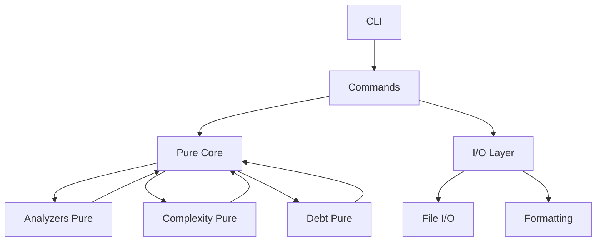

# Specification 189: Document Architectural Patterns in ARCHITECTURE.md

**Category**: documentation
**Priority**: low
**Status**: draft
**Dependencies**: Specs 181-188 (Stillwater improvements)

## Context

The debtmap codebase has undergone significant architectural improvements following the Stillwater philosophy, particularly the "Pure Core, Imperative Shell" pattern. These improvements include:

1. **Module splits** (specs 181, 186) - Breaking large files into focused modules
2. **Function refactoring** (specs 182, 187) - Extracting pure functions from complex code
3. **I/O separation** (spec 183) - Separating pure logic from side effects
4. **Validation patterns** (specs 184, 188) - Using Validation type for error accumulation
5. **Debug cleanup** (spec 185) - Removing debug output, using proper logging

However, **there is no comprehensive architecture documentation** that:
- Explains the "Pure Core, Imperative Shell" pattern
- Documents design patterns used throughout the codebase
- Links to Stillwater philosophy
- Provides examples from actual code
- Helps contributors understand architectural decisions

According to STILLWATER_EVALUATION.md (lines 708-711), we should create comprehensive `ARCHITECTURE.md` documentation that:
1. Documents the Pure Core / Imperative Shell pattern
2. Links to Stillwater philosophy
3. Includes diagrams and examples from codebase
4. Helps onboard new contributors

This documentation will serve as the architectural reference for the project, ensuring consistency and helping contributors understand and follow established patterns.

## Objective

Create comprehensive `ARCHITECTURE.md` documentation that:

1. **Explains core architectural patterns** used in debtmap
2. **Documents the Pure Core / Imperative Shell pattern** with concrete examples
3. **Links to Stillwater philosophy** and explains how it's applied
4. **Provides code examples** from the actual codebase
5. **Includes diagrams** showing module organization and data flow
6. **Guides contributors** on how to follow these patterns
7. **References specs 181-188** showing the evolution

Result: Clear, comprehensive architectural documentation that helps contributors understand and maintain the codebase's functional programming foundation.

## Requirements

### Functional Requirements

1. **Architecture Overview**
   - High-level architecture diagram
   - Key principles and patterns
   - Design philosophy (Stillwater)
   - Module organization

2. **Pure Core / Imperative Shell Pattern**
   - Detailed explanation of the pattern
   - Why we use it
   - How to identify pure vs impure code
   - Examples from codebase

3. **Module Organization**
   - Directory structure
   - Module responsibilities
   - Dependency direction
   - How to add new modules

4. **Function Design Patterns**
   - Pure function guidelines
   - I/O wrapper patterns
   - Function composition
   - Error handling

5. **Common Patterns**
   - Validation with Validation type
   - Parallel processing with rayon
   - Error accumulation
   - Progress tracking

6. **Code Examples**
   - Real examples from codebase
   - Before/after refactorings
   - Best practices
   - Anti-patterns to avoid

7. **Diagrams**
   - Architecture overview
   - Module dependency graph
   - Data flow diagrams
   - Pure/impure boundaries

8. **Contributor Guidelines**
   - How to follow patterns
   - When to extract functions
   - How to separate I/O
   - Testing strategies

### Non-Functional Requirements

1. **Clarity**
   - Clear explanations
   - Concrete examples
   - Easy to navigate
   - Accessible to new contributors

2. **Completeness**
   - Covers all major patterns
   - Links to relevant specs
   - References Stillwater docs
   - Updated regularly

3. **Maintainability**
   - Easy to update
   - Version controlled
   - Reviewed with code changes
   - Examples stay current

## Acceptance Criteria

- [ ] `ARCHITECTURE.md` file created in repository root
- [ ] Architecture overview section with high-level diagram
- [ ] Pure Core / Imperative Shell pattern documented with examples
- [ ] Module organization section with directory structure
- [ ] Function design patterns documented
- [ ] Common patterns section (validation, parallelism, etc.)
- [ ] At least 10 code examples from actual codebase
- [ ] At least 3 architecture diagrams (ASCII or Mermaid)
- [ ] Links to Stillwater philosophy and documentation
- [ ] References to specs 181-188
- [ ] Contributor guidelines section
- [ ] Anti-patterns section (what to avoid)
- [ ] Testing patterns documented
- [ ] Reviewed and approved by team

## Technical Details

### ARCHITECTURE.md Structure

```markdown
# Debtmap Architecture

## Table of Contents

1. [Overview](#overview)
2. [Core Principles](#core-principles)
3. [Stillwater Philosophy](#stillwater-philosophy)
4. [Pure Core / Imperative Shell](#pure-core--imperative-shell)
5. [Module Organization](#module-organization)
6. [Function Design Patterns](#function-design-patterns)
7. [Common Patterns](#common-patterns)
8. [Data Flow](#data-flow)
9. [Testing Architecture](#testing-architecture)
10. [Contributor Guidelines](#contributor-guidelines)
11. [Evolution](#evolution)
12. [References](#references)

## Overview

Debtmap is a code complexity and technical debt analyzer built with functional
programming principles. The architecture follows the "Pure Core, Imperative Shell"
pattern from the Stillwater philosophy, emphasizing:

- **Pure functions** for business logic
- **I/O at boundaries** (imperative shell)
- **Immutable data structures**
- **Composable operations**
- **Explicit effects**

### High-Level Architecture

```
┌─────────────────────────────────────────────────────────┐
│                     CLI Layer                           │
│  (Command parsing, validation, user interaction)        │
└───────────────┬─────────────────────────────────────────┘
                │
                ▼
┌─────────────────────────────────────────────────────────┐
│                  Commands Layer                         │
│         (Orchestration, I/O operations)                 │
└───────────────┬─────────────────────────────────────────┘
                │
                ▼
┌─────────────────────────────────────────────────────────┐
│              Analysis Core (Pure)                       │
│  ┌──────────────┐  ┌──────────────┐  ┌──────────────┐  │
│  │  Analyzers   │  │  Complexity  │  │  Debt        │  │
│  │  (Pure)      │  │  (Pure)      │  │  (Pure)      │  │
│  └──────────────┘  └──────────────┘  └──────────────┘  │
└───────────────┬─────────────────────────────────────────┘
                │
                ▼
┌─────────────────────────────────────────────────────────┐
│                  I/O Layer                              │
│  (File operations, formatting, output)                  │
└─────────────────────────────────────────────────────────┘
```

## Core Principles

### 1. Functional-First Design

Debtmap prioritizes functional programming patterns:

- **Pure functions**: No side effects, deterministic results
- **Immutability**: Data structures are immutable by default
- **Composition**: Build complex behavior from simple functions
- **Explicit effects**: Side effects clearly marked and isolated

### 2. Separation of Concerns

Clear boundaries between different responsibilities:

- **Pure calculation** (Still Water)
- **I/O operations** (Streams)
- **Configuration** and **Execution**
- **Analysis** and **Presentation**

### 3. Type-Driven Development

Use Rust's type system to enforce correctness:

- **Phantom types** for state transitions
- **Newtype wrappers** for validated data
- **Exhaustive pattern matching**
- **Result types** for error handling

## Stillwater Philosophy

Debtmap follows the [Stillwater philosophy](link-to-stillwater-docs) which
provides a mental model for managing effects in functional programs.

### The Pond Model

Imagine a pond with two parts:

**Still Water (Pure Core)**
- Calm, predictable, unchanging
- Pure functions that take data and return data
- No side effects
- Easy to test and reason about

**Streams (Effects)**
- Moving, changing, interacting with the outside world
- I/O operations
- Side effects
- Clearly marked boundaries

### In Practice

```rust
// PURE CORE (Still Water)
fn calculate_complexity(ast: &Ast) -> u32 {
    ast.functions()
        .map(|f| f.cyclomatic_complexity())
        .sum()
}

fn is_complex(complexity: u32, threshold: u32) -> bool {
    complexity > threshold
}

// IMPERATIVE SHELL (Streams)
fn analyze_file(path: &Path) -> Result<FileMetrics> {
    let content = std::fs::read_to_string(path)?;  // I/O
    let ast = parse(&content)?;                     // Pure
    let complexity = calculate_complexity(&ast);    // Pure
    Ok(FileMetrics { complexity, /* ... */ })
}
```

## Pure Core / Imperative Shell

This is the foundational pattern throughout debtmap.

### The Pattern

```
┌──────────────────────────────────────────┐
│      IMPERATIVE SHELL (I/O)              │
│  ┌────────────────────────────────────┐  │
│  │                                    │  │
│  │      PURE CORE (Logic)             │  │
│  │                                    │  │
│  │  - Calculations                    │  │
│  │  - Transformations                 │  │
│  │  - Business logic                  │  │
│  │  - Deterministic                   │  │
│  │                                    │  │
│  └────────────────────────────────────┘  │
│                                          │
│  - File I/O                              │
│  - Network calls                         │
│  - Database access                       │
│  - Logging                               │
│  - Side effects                          │
└──────────────────────────────────────────┘
```

### Identifying Pure vs Impure

**Pure Functions (Still Water):**
```rust
✓ fn calculate_total(items: &[Item]) -> u32
✓ fn filter_complex(functions: &[Function]) -> Vec<Function>
✓ fn format_message(data: &Data) -> String
✓ fn validate_config(cfg: &Config) -> Validation<ValidConfig, Error>
```

**Impure Functions (Streams):**
```rust
✗ fn read_file(path: &Path) -> Result<String>
✗ fn write_output(data: &Data, path: &Path) -> Result<()>
✗ fn log_progress(message: &str)
✗ fn fetch_from_network(url: &Url) -> Result<Response>
```

### Example: Analysis Utils (Spec 183)

**Before (Mixed):**
```rust
pub fn collect_file_metrics(files: &[PathBuf]) -> Vec<FileMetrics> {
    let max = std::env::var("MAX_FILES").ok();  // I/O!
    eprintln!("Processing {} files", files.len());  // I/O!

    let results = files.par_iter()  // Pure
        .map(|f| analyze(f))  // Mixed
        .collect();

    eprintln!("Done!");  // I/O!
    results
}
```

**After (Separated):**
```rust
// PURE: Determine files to process
fn determine_files(files: &[PathBuf], max: Option<usize>) -> &[PathBuf] {
    match max {
        Some(m) => &files[..m.min(files.len())],
        None => files,
    }
}

// PURE: Analyze files
fn analyze_files_parallel(files: &[PathBuf]) -> Vec<FileMetrics> {
    files.par_iter()
        .map(analyze_file)
        .collect()
}

// IMPURE: Read config
fn read_max_files() -> Option<usize> {
    std::env::var("MAX_FILES").ok()?.parse().ok()
}

// IMPURE: Log warning
fn warn_limiting(total: usize, limit: usize) {
    eprintln!("Limiting to {} of {} files", limit, total);
}

// COMPOSITION: Public API
pub fn collect_file_metrics(files: &[PathBuf]) -> Vec<FileMetrics> {
    let max = read_max_files();  // Effect
    let to_process = determine_files(files, max);  // Pure

    if let Some(m) = max {
        if files.len() > m {
            warn_limiting(files.len(), m);  // Effect
        }
    }

    analyze_files_parallel(to_process)  // Pure (with effect wrapper)
}
```

## Module Organization

### Directory Structure

```
src/
├── main.rs              # Entry point, CLI setup
├── lib.rs               # Library exports
├── commands/            # Command handlers (orchestration)
│   ├── analyze.rs
│   ├── compare.rs
│   └── mod.rs
├── analyzers/           # Language analyzers (pure + I/O wrappers)
│   ├── rust.rs
│   ├── python.rs
│   ├── javascript.rs
│   ├── typescript.rs
│   ├── common.rs        # Shared utilities
│   └── mod.rs
├── analysis/            # Pure analysis algorithms
│   ├── metrics.rs
│   ├── aggregation.rs
│   └── mod.rs
├── complexity/          # Complexity calculation (pure)
│   ├── cyclomatic.rs
│   ├── cognitive.rs
│   └── mod.rs
├── debt/                # Technical debt detection (pure)
│   ├── patterns.rs
│   ├── scoring.rs
│   └── mod.rs
├── format/              # Output formatting (spec 186)
│   ├── types.rs         # Data structures
│   ├── rules.rs         # Pure formatting rules
│   ├── json.rs          # JSON formatting
│   ├── yaml.rs          # YAML formatting
│   ├── text.rs          # Text formatting
│   ├── markdown.rs      # Markdown formatting
│   ├── output.rs        # I/O operations
│   └── mod.rs           # Public API
├── god_object/          # God object detection (spec 181)
│   ├── types.rs
│   ├── detector.rs      # Pure detection
│   ├── classifier.rs    # Pure classification
│   ├── recommender.rs   # Pure recommendations
│   ├── scoring.rs       # Pure scoring
│   └── mod.rs
├── io/                  # I/O utilities
│   ├── file.rs
│   ├── progress.rs
│   └── mod.rs
├── config/              # Configuration (validation with spec 184)
│   ├── types.rs
│   ├── validation.rs
│   └── mod.rs
└── testing/             # Test utilities
    └── mod.rs
```

### Module Dependency Rules

1. **Pure modules** depend only on other pure modules
2. **I/O modules** can depend on pure modules
3. **No circular dependencies**
4. **Dependency direction**: outward from pure core

```
        ┌─────────────┐
        │   main.rs   │
        └──────┬──────┘
               │
               ▼
        ┌─────────────┐
        │  commands/  │ (I/O, orchestration)
        └──────┬──────┘
               │
               ▼
    ┌──────────┴──────────┐
    │                     │
    ▼                     ▼
┌──────────┐        ┌──────────┐
│analyzers/│        │  format/ │ (I/O boundaries)
└────┬─────┘        └────┬─────┘
     │                   │
     ▼                   ▼
┌────────────────────────────┐
│    Pure Core Modules       │
│                            │
│  - analysis/               │
│  - complexity/             │
│  - debt/                   │
│  - god_object/ (pure part) │
└────────────────────────────┘
```

## Function Design Patterns

### Size Guidelines

- **Maximum function length**: 20 lines (prefer 5-10)
- **Maximum cyclomatic complexity**: 5
- **Maximum parameters**: 3-4 (use structs for more)
- **Single responsibility**: One clear purpose

### Pattern 1: Pure Calculation

```rust
/// Calculates cognitive complexity using pure algorithm.
///
/// Pure function - deterministic, no side effects.
fn calculate_cognitive_complexity(func: &Function) -> u32 {
    let base = 1;
    let nesting_penalty = calculate_nesting_penalty(&func.body);
    let branching_penalty = count_branching_statements(&func.body);
    base + nesting_penalty + branching_penalty
}

fn calculate_nesting_penalty(body: &Block) -> u32 {
    body.statements
        .iter()
        .map(|stmt| stmt.nesting_level * 2)
        .sum()
}

fn count_branching_statements(body: &Block) -> u32 {
    body.statements
        .iter()
        .filter(|stmt| is_branching(stmt))
        .count() as u32
}
```

### Pattern 2: I/O Wrapper

```rust
/// Reads and parses file (I/O wrapper).
fn read_and_parse(path: &Path) -> Result<Ast> {
    let content = read_file(path)?;  // I/O
    parse_content(&content)          // Pure (or mostly pure)
}

fn read_file(path: &Path) -> Result<String> {
    std::fs::read_to_string(path)
        .with_context(|| format!("Failed to read {}", path.display()))
}

fn parse_content(content: &str) -> Result<Ast> {
    // Parsing logic (mostly pure, some error handling)
    parser::parse(content)
}
```

### Pattern 3: Validation Composition (Spec 184)

```rust
/// Validates configuration using Validation type.
fn validate_config(cfg: &Config) -> Validation<ValidConfig, Vec<ConfigError>> {
    Validation::all((
        validate_max_complexity(cfg.max_complexity),
        validate_output_format(cfg.format),
        validate_paths(&cfg.paths),
    ))
    .map(|_| ValidConfig(cfg.clone()))
}

fn validate_max_complexity(max: Option<u32>) -> Validation<(), ConfigError> {
    match max {
        Some(0) => Validation::fail(ConfigError::InvalidThreshold),
        _ => Validation::success(()),
    }
}
```

### Pattern 4: Parallel Processing

```rust
/// Analyzes files in parallel (pure map operation).
fn analyze_files_parallel(files: &[PathBuf]) -> Vec<FileMetrics> {
    files.par_iter()  // Rayon parallel iterator
        .map(analyze_single_file)  // Pure function
        .collect()
}

fn analyze_single_file(path: &Path) -> FileMetrics {
    // Analysis logic (pure given parsed AST)
}
```

## Common Patterns

[... continued with sections on:
- Validation with Validation type
- Error handling patterns
- Progress tracking
- Parallel processing
- Module composition
- etc. ...]

## Data Flow

[... diagrams showing how data flows through the system ...]

## Testing Architecture

[... testing strategies for pure vs impure code ...]

## Contributor Guidelines

### Adding New Features

When adding new features, follow these steps:

1. **Design pure core first**
   - What calculations are needed?
   - What transformations?
   - Can it be pure?

2. **Identify I/O boundaries**
   - What needs to be read?
   - What needs to be written?
   - Where are the side effects?

3. **Create types**
   - Input types
   - Output types
   - Intermediate types

4. **Implement pure logic**
   - Write pure functions
   - Test thoroughly
   - Keep functions small

5. **Add I/O wrappers**
   - Thin wrappers around pure logic
   - Clear error handling
   - Integration tests

6. **Compose into public API**
   - Clean interface
   - Good documentation
   - Examples

### Code Review Checklist

- [ ] Functions under 20 lines
- [ ] Cyclomatic complexity < 5
- [ ] Pure functions clearly separated from I/O
- [ ] No print statements in pure code
- [ ] Proper error handling
- [ ] Tests for pure functions
- [ ] Integration tests for I/O
- [ ] Documentation

## Evolution

This architecture has evolved through several refactorings:

- **Spec 181**: Split god_object_detector.rs into focused modules
- **Spec 182**: Refactor handle_analyze_command into composable functions
- **Spec 183**: Separate I/O from pure analysis logic
- **Spec 184**: Add Validation type for config validation
- **Spec 185**: Remove/gate debug print statements
- **Spec 186**: Split formatter.rs into focused modules
- **Spec 187**: Extract pure functions from analyzers
- **Spec 188**: Add parallel batch validation

Each refactoring moved the codebase closer to the Pure Core / Imperative Shell ideal.

## References

- [Stillwater Library](https://github.com/stillwater-rs/stillwater)
- [Stillwater Philosophy](link-to-philosophy-doc)
- [CLAUDE.md](./CLAUDE.md) - Development guidelines
- [Specs 181-188](./specs/) - Architecture improvement specs
```

### Diagrams

Use ASCII art or Mermaid for diagrams:

**Mermaid Example:**
````markdown

````

## Dependencies

- **Prerequisites**: Specs 181-188 (provides examples and patterns to document)
- **Affected Components**:
  - Repository root - Add ARCHITECTURE.md
  - README.md - Link to ARCHITECTURE.md
  - CONTRIBUTING.md - Reference architecture patterns
- **External Dependencies**: None

## Testing Strategy

### Documentation Tests

```rust
// Ensure code examples in ARCHITECTURE.md are valid
#[test]
fn test_architecture_examples_compile() {
    // Extract and compile code examples from ARCHITECTURE.md
    // Use doctest or similar
}
```

### Link Validation

```bash
# Check all links in ARCHITECTURE.md are valid
markdown-link-check ARCHITECTURE.md
```

### Diagram Validation

```bash
# If using Mermaid, validate diagrams render
mmdc -i ARCHITECTURE.md -o /dev/null  # Just validate
```

## Documentation Requirements

### Content Requirements

1. **Clear Explanations**
   - Explain why, not just what
   - Use concrete examples
   - Show before/after

2. **Code Examples**
   - From actual codebase
   - Compilable and tested
   - Show best practices

3. **Diagrams**
   - Clear and readable
   - Consistent notation
   - Updated with code changes

4. **References**
   - Link to specs
   - Link to external docs
   - Link to Stillwater resources

### Maintenance

1. **Review with PRs**
   - Update when architecture changes
   - Ensure examples stay current
   - Add new patterns as they emerge

2. **Quarterly Review**
   - Ensure still accurate
   - Update diagrams
   - Add new examples

3. **Version Control**
   - Track changes to ARCHITECTURE.md
   - Note major architecture updates
   - Link to relevant commits/PRs

## Implementation Notes

### Writing Process

1. **Outline structure** (Table of Contents)
2. **Write overview** sections
3. **Add examples** from specs 181-188
4. **Create diagrams** showing architecture
5. **Add contributor guidelines**
6. **Review and refine**
7. **Get team approval**
8. **Publish**

### Tools

- **Diagrams**: Mermaid, ASCII art, or draw.io
- **Examples**: Extract from actual code
- **Validation**: markdown-link-check, doctests
- **Formatting**: Prettier or similar

### Common Pitfalls

1. **Too abstract** - Use concrete examples
2. **Out of date** - Keep synchronized with code
3. **Too long** - Break into digestible sections
4. **Missing links** - Reference specs and external docs

## Migration and Compatibility

### Breaking Changes

**None** - This is documentation only.

### Publication

1. Add ARCHITECTURE.md to repository root
2. Link from README.md
3. Link from CONTRIBUTING.md
4. Announce to team

## Success Metrics

- ✅ ARCHITECTURE.md created with all required sections
- ✅ At least 10 code examples from actual codebase
- ✅ At least 3 architecture diagrams
- ✅ Links to all relevant specs (181-188)
- ✅ Links to Stillwater documentation
- ✅ Contributor guidelines section complete
- ✅ Reviewed and approved by team
- ✅ Referenced from README and CONTRIBUTING
- ✅ Code examples compile and test correctly

## Follow-up Work

After creating ARCHITECTURE.md:
- Create video walkthrough of architecture
- Present architecture to team
- Use in onboarding new contributors
- Create architecture decision records (ADRs)

## References

- **STILLWATER_EVALUATION.md** - Lines 708-711 (Architecture documentation recommendation)
- **Specs 181-188** - Provide examples and patterns to document
- **CLAUDE.md** - Development guidelines to reference
- **Stillwater Philosophy** - Core concepts to explain
