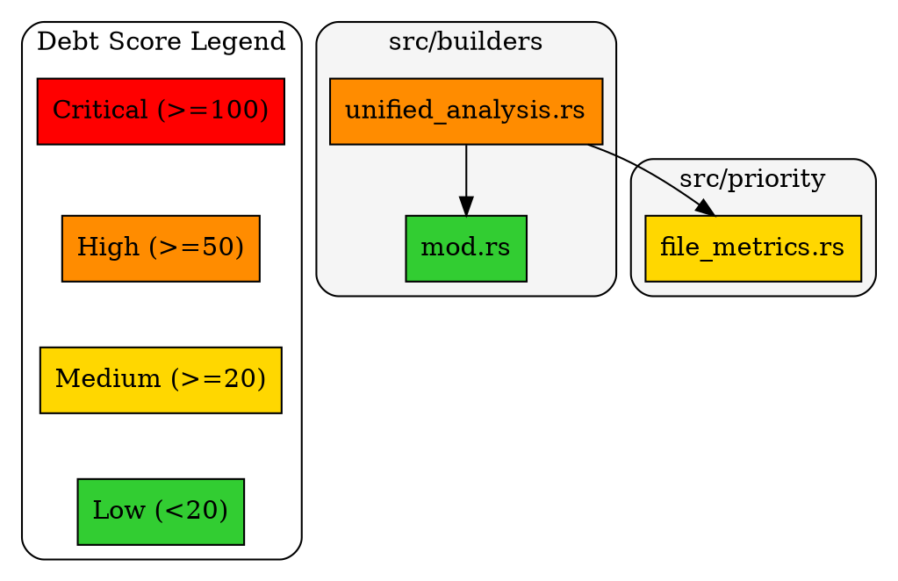

# Specification 204: DOT/Graphviz Export Format

**Category**: compatibility
**Priority**: medium
**Status**: draft
**Dependencies**: [201 - File-Level Dependency Metrics]

## Context

Many developers use Graphviz for visualizing dependency graphs. Currently, debtmap only outputs JSON, text, and markdown formats. Adding DOT format export enables:

1. **Visual graph rendering**: `dot -Tsvg deps.dot -o deps.svg`
2. **Integration with existing workflows**: Many tools consume DOT
3. **Documentation generation**: Embed graphs in architecture docs
4. **Large graph exploration**: Graphviz handles thousands of nodes

**Desired usage**:
```bash
# Generate dependency graph
debtmap analyze . --format dot > deps.dot

# Render to SVG
dot -Tsvg deps.dot -o deps.svg

# Render to PNG
dot -Tpng deps.dot -o deps.png

# Interactive exploration (with xdot)
xdot deps.dot
```

## Objective

Add `--format dot` output option that generates a Graphviz DOT file representing:
1. File-to-file dependencies
2. Module-level clustering
3. Debt score coloring (red=high, green=low)
4. Coupling direction arrows

## Requirements

### Functional Requirements

1. **New Output Format**
   - Add `--format dot` CLI option
   - Output valid DOT syntax to stdout
   - Generate directed graph (digraph)

2. **Node Representation**
   - Each file becomes a node
   - Node label: filename (short form)
   - Node tooltip: full path + debt score
   - Node color: gradient based on debt score
   - Node shape: box for files, ellipse for modules

3. **Edge Representation**
   - Edge from A → B means "A depends on B"
   - Edge label: optional (can show import count)
   - Edge style: solid for direct, dashed for transitive

4. **Clustering by Module**
   - Group files by directory/module into subgraphs
   - Cluster label: module name
   - Cluster style: rounded rectangle

5. **Score-Based Coloring**
   - Critical (score >= 100): Red (#FF0000)
   - High (score >= 50): Orange (#FF8C00)
   - Medium (score >= 20): Yellow (#FFD700)
   - Low (score < 20): Green (#32CD32)

6. **Filtering Options**
   - `--dot-min-score N`: Only include files with score >= N
   - `--dot-max-depth N`: Limit dependency depth
   - `--dot-include-external`: Include external crate edges
   - `--dot-cluster-by-module`: Enable/disable clustering

7. **Layout Hints**
   - `rankdir=LR` for left-to-right layout
   - `rankdir=TB` for top-to-bottom (default)
   - Proper rank constraints for layered view

### Non-Functional Requirements

1. **Validity**: Output must be parseable by Graphviz
2. **Scalability**: Handle 500+ files without timeout
3. **Readability**: Generated DOT should be human-readable (formatted)

## Acceptance Criteria

- [ ] `--format dot` produces valid DOT output
- [ ] Output renders correctly with `dot -Tsvg`
- [ ] Files are colored by debt score
- [ ] Edges show dependency direction correctly
- [ ] Module clustering groups related files
- [ ] Filtering options reduce graph size
- [ ] External dependencies shown when enabled
- [ ] Output includes legend/key for colors

## Technical Details

### Implementation Approach

**Add DOT writer module**:

```rust
// src/io/writers/dot.rs

use std::io::Write;

pub struct DotWriter {
    min_score: Option<f64>,
    max_depth: Option<usize>,
    include_external: bool,
    cluster_by_module: bool,
    rankdir: RankDir,
}

#[derive(Default)]
pub enum RankDir {
    #[default]
    TopBottom,
    LeftRight,
}

impl DotWriter {
    pub fn write<W: Write>(&self, items: &[UnifiedDebtItemOutput], out: &mut W) -> io::Result<()> {
        writeln!(out, "digraph debtmap {{")?;
        writeln!(out, "  rankdir={};", self.rankdir_str())?;
        writeln!(out, "  node [shape=box, style=filled];")?;
        writeln!(out)?;

        // Write legend
        self.write_legend(out)?;

        // Group files by module
        let modules = self.group_by_module(items);

        // Write clusters
        for (module, files) in &modules {
            self.write_cluster(out, module, files)?;
        }

        // Write edges
        self.write_edges(out, items)?;

        writeln!(out, "}}")?;
        Ok(())
    }

    fn score_to_color(score: f64) -> &'static str {
        if score >= 100.0 {
            "#FF0000"  // Red
        } else if score >= 50.0 {
            "#FF8C00"  // Orange
        } else if score >= 20.0 {
            "#FFD700"  // Yellow
        } else {
            "#32CD32"  // Green
        }
    }

    fn write_node<W: Write>(&self, out: &mut W, file: &FileDebtItemOutput) -> io::Result<()> {
        let id = self.path_to_id(&file.location.file);
        let label = self.path_to_label(&file.location.file);
        let color = Self::score_to_color(file.score);
        let tooltip = format!("{}\nScore: {:.1}", file.location.file, file.score);

        writeln!(
            out,
            "    \"{}\" [label=\"{}\", fillcolor=\"{}\", tooltip=\"{}\"];",
            id, label, color, tooltip
        )
    }

    fn write_edge<W: Write>(&self, out: &mut W, from: &str, to: &str) -> io::Result<()> {
        writeln!(out, "  \"{}\" -> \"{}\";", from, to)
    }

    fn write_cluster<W: Write>(
        &self,
        out: &mut W,
        module: &str,
        files: &[&FileDebtItemOutput],
    ) -> io::Result<()> {
        let cluster_id = module.replace('/', "_").replace('.', "_");
        writeln!(out, "  subgraph cluster_{} {{", cluster_id)?;
        writeln!(out, "    label=\"{}\";", module)?;
        writeln!(out, "    style=rounded;")?;
        writeln!(out, "    bgcolor=\"#F5F5F5\";")?;

        for file in files {
            self.write_node(out, file)?;
        }

        writeln!(out, "  }}")?;
        Ok(())
    }

    fn write_legend<W: Write>(&self, out: &mut W) -> io::Result<()> {
        writeln!(out, "  subgraph cluster_legend {{")?;
        writeln!(out, "    label=\"Debt Score Legend\";")?;
        writeln!(out, "    style=rounded;")?;
        writeln!(out, "    legend_critical [label=\"Critical (>=100)\", fillcolor=\"#FF0000\"];")?;
        writeln!(out, "    legend_high [label=\"High (>=50)\", fillcolor=\"#FF8C00\"];")?;
        writeln!(out, "    legend_medium [label=\"Medium (>=20)\", fillcolor=\"#FFD700\"];")?;
        writeln!(out, "    legend_low [label=\"Low (<20)\", fillcolor=\"#32CD32\"];")?;
        writeln!(out, "    legend_critical -> legend_high -> legend_medium -> legend_low [style=invis];")?;
        writeln!(out, "  }}")?;
        Ok(())
    }
}
```

**CLI Integration**:

```rust
// In src/commands/analyze.rs

#[derive(ValueEnum, Clone)]
pub enum OutputFormat {
    Json,
    Markdown,
    Text,
    Dot,  // New
}

// Add options
#[arg(long, help = "Minimum score for DOT output")]
dot_min_score: Option<f64>,

#[arg(long, help = "Include external dependencies in DOT")]
dot_include_external: bool,

#[arg(long, help = "Cluster files by module in DOT")]
dot_cluster_by_module: bool,
```

### Output Example



### Affected Components

- `src/io/writers/mod.rs` - Add dot module
- `src/io/writers/dot.rs` - New file
- `src/commands/analyze.rs` - Add format option
- `Cargo.toml` - No new dependencies needed

## Dependencies

- **Prerequisites**: Spec 201 (dependency data)
- **Affected Components**: Output system, CLI
- **External Dependencies**: None (generates text that Graphviz consumes)

## Testing Strategy

- **Unit Tests**: Test DOT syntax generation, color mapping
- **Validation Tests**: Parse output with `dot -Tsvg` in CI
- **Snapshot Tests**: Compare DOT output against expected samples

## Documentation Requirements

- **User Documentation**: Add section on DOT export usage
- **Examples**: Show common workflows (DOT → SVG → embed in docs)

## Implementation Notes

1. Escape special characters in node IDs and labels
2. Handle circular dependencies (Graphviz handles cycles)
3. Consider memory for very large graphs (streaming output)
4. Test with both `dot` and `neato` layouts

## Migration and Compatibility

- New feature, no breaking changes
- Output is standard DOT format compatible with all Graphviz tools
