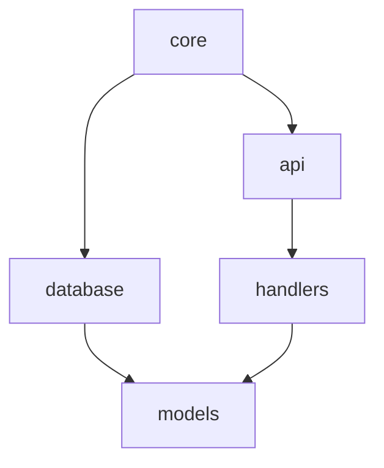

# Specification 68: Enhanced Markdown Output Format

**Category**: optimization
**Priority**: medium
**Status**: draft
**Dependencies**: None

## Context

Currently, the markdown and terminal output formats in debtmap share significant overlap in content and structure. While the terminal output has been optimized for command-line viewing with colored text and ASCII art headers, the markdown output essentially mirrors the same content structure with markdown formatting. This represents a missed opportunity to leverage markdown's rich formatting capabilities for comprehensive documentation, reporting, and team collaboration.

The markdown format should serve different use cases than the terminal output:
- **Terminal**: Quick scans, immediate feedback, actionable summaries
- **Markdown**: Comprehensive reports, documentation, pull request integration, team collaboration

## Objective

Transform the markdown output format into a comprehensive, documentation-ready format that maximizes markdown's capabilities while maintaining clarity and usability. The enhanced format should provide progressive disclosure of information, embedded visualizations, and integration-ready content for modern development workflows.

## Requirements

### Functional Requirements

1. **Table of Contents Generation**
   - Auto-generated TOC with links to all major sections
   - Hierarchical structure reflecting report organization
   - Optional depth configuration

2. **Progressive Disclosure**
   - Executive summary with key metrics at the top
   - Expandable `<details>` sections for verbose information
   - Collapsible code snippets showing problematic areas
   - Tiered information architecture (summary → details → raw data)

3. **Enhanced Visualizations**
   - Mermaid diagrams for dependency graphs
   - ASCII charts for metric distributions
   - Sparklines for trend visualization (when historical data available)
   - Risk heat maps using markdown tables with color coding

4. **Code Context Integration**
   - Inline code snippets showing problematic code sections
   - Before/after examples for refactoring recommendations
   - Syntax highlighting with language detection
   - Line number references with GitHub/GitLab-compatible links

5. **Repository Integration Features**
   - Relative file links that work in GitHub/GitLab viewers
   - Commit hash references when available
   - PR-ready checklists for debt items
   - Issue template generation for high-priority items

6. **Comprehensive Metrics Reporting**
   - Statistical analysis section with percentiles and distributions
   - Trend analysis when historical data is available
   - Comparative metrics against baseline thresholds
   - Module-level and file-level breakdowns

7. **Team Collaboration Features**
   - Assignee sections for debt items
   - Priority matrix for planning sessions
   - Effort estimation tables
   - Technical debt burndown tracking

### Non-Functional Requirements

1. **Performance**
   - Markdown generation should not exceed 10% overhead vs current implementation
   - Support for large reports (1000+ debt items) without degradation
   - Incremental generation for partial updates

2. **Compatibility**
   - Valid CommonMark specification compliance
   - GitHub Flavored Markdown (GFM) compatibility
   - GitLab Flavored Markdown compatibility
   - Pandoc conversion support for other formats

3. **Usability**
   - Clear visual hierarchy
   - Responsive table formatting
   - Print-friendly layout
   - Accessibility considerations (screen reader compatible)

## Acceptance Criteria

- [ ] Table of contents is automatically generated with working internal links
- [ ] Executive summary provides one-page overview of codebase health
- [ ] Detailed sections use `<details>` tags for collapsible content
- [ ] Dependency graphs render as Mermaid diagrams in GitHub/GitLab
- [ ] Code snippets include syntax highlighting and line numbers
- [ ] File paths are clickable links in repository viewers
- [ ] Priority items are formatted as actionable checklists
- [ ] Statistical analysis section includes distribution charts
- [ ] Risk heat map visualizes high-risk areas effectively
- [ ] Generated markdown passes CommonMark validation
- [ ] Output file size remains reasonable for large codebases
- [ ] Documentation examples demonstrate all new features

## Technical Details

### Implementation Approach

1. **Modular Section Generators**
   - Create separate generator functions for each report section
   - Use builder pattern for composing complex markdown structures
   - Implement progressive detail levels based on verbosity flags

2. **Template System**
   - Define reusable markdown templates for common structures
   - Support variable substitution and conditional sections
   - Enable custom template overrides via configuration

3. **Visualization Integration**
   - Generate Mermaid diagram syntax for dependency graphs
   - Create ASCII charts using box-drawing characters
   - Implement markdown table-based heat maps

4. **Link Generation**
   - Detect repository type (Git, GitHub, GitLab, Bitbucket)
   - Generate appropriate file links based on repository structure
   - Support configurable base URLs for enterprise installations

### Architecture Changes

1. **Enhanced MarkdownWriter**
   - Extend current MarkdownWriter with new section generators
   - Add configuration for detail levels and feature toggles
   - Implement caching for expensive computations

2. **Section Generators**
   ```rust
   trait MarkdownSection {
       fn generate(&self, data: &AnalysisResults, config: &MarkdownConfig) -> String;
       fn priority(&self) -> u32;
       fn should_include(&self, config: &MarkdownConfig) -> bool;
   }
   ```

3. **Visualization Builders**
   ```rust
   trait VisualizationBuilder {
       fn build_dependency_graph(&self, deps: &DependencyReport) -> String;
       fn build_risk_heatmap(&self, risks: &RiskInsight) -> String;
       fn build_distribution_chart(&self, metrics: &[FunctionMetrics]) -> String;
   }
   ```

### Data Structures

```rust
pub struct MarkdownConfig {
    pub include_toc: bool,
    pub toc_depth: usize,
    pub include_visualizations: bool,
    pub include_code_snippets: bool,
    pub snippet_context_lines: usize,
    pub repository_type: RepositoryType,
    pub base_url: Option<String>,
    pub detail_level: DetailLevel,
    pub include_statistics: bool,
    pub collapsible_sections: bool,
}

pub enum DetailLevel {
    Summary,    // Executive summary only
    Standard,   // Default level with key sections
    Detailed,   // All sections with expanded information
    Complete,   // Everything including raw data
}

pub enum RepositoryType {
    Git,
    GitHub,
    GitLab,
    Bitbucket,
    Custom(String),
}
```

### APIs and Interfaces

```rust
impl EnhancedMarkdownWriter {
    pub fn with_config(writer: W, config: MarkdownConfig) -> Self;
    pub fn write_table_of_contents(&mut self) -> Result<()>;
    pub fn write_executive_summary(&mut self, results: &AnalysisResults) -> Result<()>;
    pub fn write_visualizations(&mut self, results: &AnalysisResults) -> Result<()>;
    pub fn write_code_context(&mut self, item: &DebtItem) -> Result<()>;
    pub fn write_statistics(&mut self, results: &AnalysisResults) -> Result<()>;
    pub fn write_collaboration_section(&mut self, results: &AnalysisResults) -> Result<()>;
}
```

## Dependencies

- **Prerequisites**: None
- **Affected Components**: 
  - `src/io/writers/markdown.rs` - Main implementation file
  - `src/io/output.rs` - Output trait definitions
  - `src/cli.rs` - CLI configuration for markdown options
- **External Dependencies**: 
  - No new external crates required
  - Optional: `comrak` for enhanced markdown parsing/validation

## Testing Strategy

- **Unit Tests**: 
  - Test each section generator independently
  - Validate markdown syntax generation
  - Test link generation for different repository types
  - Verify visualization syntax correctness

- **Integration Tests**: 
  - Generate complete reports for sample codebases
  - Validate output against CommonMark specification
  - Test rendering in GitHub/GitLab preview
  - Verify large report generation performance

- **Performance Tests**: 
  - Benchmark against current implementation
  - Test with codebases of varying sizes
  - Measure memory usage for large reports

- **User Acceptance**: 
  - Render sample reports in different markdown viewers
  - Test integration with CI/CD pipelines
  - Validate usability with development teams

## Documentation Requirements

- **Code Documentation**: 
  - Document all new public APIs
  - Add examples for each visualization type
  - Include configuration option descriptions

- **User Documentation**: 
  - Update README with new markdown features
  - Add examples of generated reports
  - Create guide for CI/CD integration
  - Document repository-specific features

- **Architecture Updates**: 
  - Update ARCHITECTURE.md with new components
  - Document section generator pattern
  - Add visualization builder documentation

## Implementation Notes

### Phased Implementation

1. **Phase 1: Core Structure**
   - Table of contents generation
   - Section reorganization
   - Basic collapsible sections

2. **Phase 2: Visualizations**
   - Mermaid diagram generation
   - ASCII charts
   - Heat maps

3. **Phase 3: Integration Features**
   - Repository links
   - Code snippets
   - PR checklists

4. **Phase 4: Advanced Features**
   - Statistical analysis
   - Trend visualization
   - Collaboration sections

### Backward Compatibility

- Maintain current markdown output as "classic" mode
- New features enabled via configuration flags
- Default to enhanced mode in next major version

### Performance Considerations

- Use lazy generation for expensive sections
- Cache computed visualizations
- Stream output for large reports
- Parallelize independent section generation

## Migration and Compatibility

During the prototype phase, we will:
- Keep the existing markdown format as default
- Enable new format via `--markdown-enhanced` flag
- Provide migration guide for CI/CD pipelines
- Support both formats during transition period

Breaking changes are acceptable for the enhanced format as it's opt-in during the prototype phase.

## Success Metrics

- Markdown output provides 3x more actionable information than terminal
- Report generation time increases by less than 10%
- 90% of generated markdown renders correctly in GitHub/GitLab
- User feedback indicates improved report usability
- Integration with CI/CD pipelines is seamless

## Example Output Structure

```markdown
# Debtmap Analysis Report

## Table of Contents
- [Executive Summary](#executive-summary)
- [Risk Analysis](#risk-analysis)
- [Complexity Hotspots](#complexity-hotspots)
- [Technical Debt](#technical-debt)
- [Dependency Analysis](#dependency-analysis)
- [Recommendations](#recommendations)

## Executive Summary

**Health Score**: 72/100 🟡

| Metric | Value | Status | Trend |
|--------|-------|--------|-------|
| Avg Complexity | 7.2 | ⚠️ Medium | ↗️ |
| Test Coverage | 65% | 🔶 Fair | → |
| Debt Items | 142 | ⚠️ High | ↘️ |

<details>
<summary>📊 View Detailed Metrics</summary>

### Complexity Distribution
```
Low (0-5):    ████████████ 45%
Medium (6-10): ████████ 30%
High (11-20):  ████ 15%
Critical (20+): ██ 10%
```

### Risk Heat Map
| Module | Complexity | Coverage | Risk |
|--------|------------|----------|------|
| core/auth | 🔴 High | 🔴 Low | 🔴 Critical |
| api/handlers | 🟡 Med | 🟡 Med | 🟡 Medium |
| utils/helpers | 🟢 Low | 🟢 High | 🟢 Low |

</details>

## Complexity Hotspots

### Critical Functions Requiring Immediate Attention

<details>
<summary>1. `process_user_request` - src/api/handlers.rs:142</summary>

**Complexity**: Cyclomatic: 28, Cognitive: 35
**Risk Score**: 8.7/10

```rust
// Lines 142-187
fn process_user_request(req: Request) -> Result<Response> {
    // ... problematic code snippet ...
}
```

**Recommended Refactoring**:
- Extract validation logic into `validate_request()` 
- Extract processing into `handle_valid_request()`
- Expected complexity reduction: 60%

</details>

## Dependency Graph



## Recommendations

### Immediate Actions
- [ ] Refactor `process_user_request` (Est: 2 hours)
- [ ] Add tests for `auth_module` (Est: 4 hours)
- [ ] Remove dead code in `utils` (Est: 1 hour)

### Short-term Goals
- [ ] Reduce average complexity below 6.0
- [ ] Increase test coverage to 75%
- [ ] Eliminate circular dependencies
```